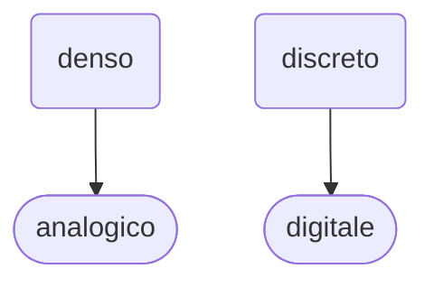

{}
<!--  -->

> ☆ **scadenza**: 30 novembre 2021

## Capitolo 2 - Numeri razionali e numeri reali

> *“If I were not a physicist, I would probably be a musician. I often think in music. I live my daydreams in music. I see my life in terms of music.”*
― Albert Einstein*
>
> ― Albert **Einstein**

---

## Frazioni

- Una frazione rappresenta il risultato di una divisione tra numeri interi.

> **esempio**:
> 
> Supponiamo di dover dividere $2$ torte tra $6$ bambini.
>
> - Sappiamo che negli insiemi $\mathbb{N}$ e $\mathbb{Z}$ la divisione $2:6$ non si può eseguire, però possiamo tagliare ciascuna delle $2$ torte in $6$ fette uguali.
> - Risulteranno $12$ fette che si potranno dividere tra i $6$ bambini, ciascuno dei quali avrà $2$ fette.
>
> - I numeri naturali e gli interi relativi **non permettono di esprimere questa semplice soluzione del nostro problema**.
> - In situazioni come questa si deve ricorrere alle frazioni o, per essere più precisi, ai **numeri razionali**.
> - In questo modo potremodire che a ogni bambino spetteranno $\dfrac{2}{6}$ di torta, cioè $\dfrac{1}{3}$ di torta.

---

### 1. Il concetto di frazione

{}
**definizione**:
una frazione è un'espressione del tipo $\dfrac{a}{b}$

$$\dfrac{a}{b} = \dfrac{\textit{numeratore}}{\textit{denominatore}}$$

- $a, b$ sono i termini della frazione $\dfrac{a}{b}$
- con $a \in \mathbb{Z}, \\; b \in \mathbb{Z}, \\; b \neq 0$
{}

{}
se $b=0 \Rightarrow$ il numero razionale $\dfrac{a}{b}$ **non esiste** in $\mathbb{Q}$

{}

I numeri $a$ e $b$ si chiamano **termini** della frazione; precisamente:

- il numero $a$, che si trova al di sopra della linea di frazione, si chiama **numeratore**; 
- il numero $b$, al di sotto della linea di frazione, si chiama **denominatore**

#### frazioni proprie e improprie

- Se il numeratore di una frazione è **minore** del denominatore si dice che la frazione è **propria**; 
- se invece il numeratore è **maggiore o uguale** al denominatore si parla di frazione **impropria**.

#### frazioni apparenti

- Se il **numeratore** è **multiplo** del **denominatore**, la frazione rappresenta il risultato di una divisione che si può eseguire nell’insieme dei **numeri interi**, $\mathbb{Z}$

- Tali frazioni si dicono perciò **apparenti**.
particolare, se il denominatore è uguale a $1$, *si usa scrivere il solo numeratore*.

 
  $\star$ Le <b>frazioni apparenti</b> sono casi particolari di frazioni improprie.

---

### 2. Frazioni equivalenti

{}
**definizione**: due frazioni $\dfrac{a}{b}$ e $\dfrac{c}{d}$ si dicono **equivalenti** se:

$$a \cdot d = b \cdot c$$

cioè se il prodotto tra il *numeratore* della prima frazione e il *denominatore* della seconda è uguale al prodotto tra il *denominatore* della prima e il *numeratore* della seconda

- I due prodotti che si devono confrontare per stabilire se due frazioni sono equivalenti sono detti anche **prodotti in croce**

- ad esempio: le frazioni $\dfrac{4}{5}$ e $\dfrac{24}{30}$ sono equivalenti, infatti:

$$a \cdot d = b \cdot c \Rightarrow 4 \cdot 30 = 24 \cdot 5 = 120$$
{}

---

#### SEGNO DI UNA FRAZIONE

---

### 3. Proprietà invariantiva

{}

**proprietà invariantiva delle frazioni**

- Moltiplicando o dividendo entrambi i termini di una frazione per uno stesso numero diverso da zero, si ottiene una frazione equivalente alla frazione data:

$$\dfrac{a}{b} = \dfrac{a \cdot c}{b \cdot c} = \dfrac{a : c}{b : c}$$

con $a, b, c \in \mathbb{Z}, \qquad$ e con $b, c \neq 0$

{}

---

### 4. Riduzione ai minimi termini e semplificazione

{}

definizione: **frazione ridotta ai minimi termini**

- Una frazione si dice ridotta ai **minimi termini** o **irriducibile** se il **MCD** dei valori assoluti dei suoi termini è $1$

*In generale, per ridurre una frazione ai minimi termini si dividono sia il numeratore sia il denominatore per il **MCD** dei loro valori assoluti.*

{}

- Di solito quando si semplifica una frazione si conviene di dividere i suoi termini per il loro MCD, in modo che la frazione equivalente che si ottiene sia ridotta ai minimi termini:

$$\dfrac{12}{30} = \dfrac{12 : 6}{30 : 6} = \dfrac{2}{5}$$

---

### 5. Riduzione al minimo comune denominatore

{}

- Per ridurre due o più frazioni al minimo comune denominatore, si procede così:

1. si riducono le frazioni ai minimi termini, se possibile;
2. si calcola il **mcm** dei denominatori delle frazioni ridotte: esso è il minimo comune denominatore;
3. si moltiplica il numeratore di ciascuna frazione ridotta per il quoziente tra il minimo comune denominatore e il corrispondente denominatore; si ottiene così il numeratore di ciascuna nuova frazione.

- Il denominatore sarà il minimo comune denominatore prima trovato.
{}

> **esempio:**
>
> - Ridurre al **minimo comune denominatore** le seguenti frazioni:
>
> $$\dfrac{7}{15}, \dfrac{6}{20}, \dfrac{12}{18}$$

---

 

## L’insieme  dei  numeri  razionali

### 6. L’insieme  dei  numeri  razionali

 

{}
Si definisce **numero razionale** l'insieme di tutte le frazioni equivalenti a una data frazione.
{}

> Data una frazione, esistono infinite altre frazioni **equivalenti**
> 
> Ad esempio:
> $$\dfrac{2}{3} = \dfrac{4}{6} = \dfrac{6}{9} = \dfrac{8}{10} = \dfrac{10}{15} = \dots$$

#### Segno di un numero razionale

>Due frazioni equivalenti hanno lo stesso segno.
>
>- Quindi le frazioni, tutte equivalenti tra loro, il cui insieme costituisce un numero razionale, sono o tutte positive o tutte negative o tutte nulle. 
>   - Nel primo caso diremo che il numero razionale è positivo, 
>   - nel secondo caso diremo che è negativo; 
>   - nel terzo caso diremo che l’insieme delle frazioni nulle è il numero razionale $0$.
>
>Si possono estendere ai numeri razionali alcune definizioni già introdotte sui numeri interi.
>
> - Ad esempio, due numeri razionali si dicono **concordi** se hanno lo stesso segno, **discordi** se hanno segni diversi.

#### Opposto e valore assoluto di un numero razionale

 

{}
DEFINIZIONE: **OPPOSTO DI UN NUMERO RAZIONALE**

- Si dice **opposto** di un numero razionale $a$, e si indica con $-a$, il numero razionale che si ottiene cambiando il segno di $a$

{}

 

{}
DEFINIZIONE: **VALORE ASSOLUTO DI UN NUMERO RAZIONALE**

- Si dice valore assoluto o *modulo* di un numero razionale $a$, e si indica con $|a|$, il numero $a$ stesso se $a$ è **positivo** o **nullo**, il suo opposto $-a$ se $a$ è **negativo.**
- In simboli:

$$
|a| = \begin{cases}
  a \qquad \quad \text{se} \\; a \ge 0\\\\
  -a \qquad \\, \text{se} \\, a < 0
\end{cases}
$$

- con $a \in \mathbb{Q}$
{}

---

### 7. Rappresentazione dei numeri razionali su una retta orientata

### 8. Confronto tra numeri razionali

- Per confrontare due numeri razionali, occorre innanzitutto esprimerli come frazioni con lo stesso denominatore positivo; 
- si confrontano quindi i loro numeratori, considerando negativi i numeratori delle frazioni negative

> **esempio:** confrontiamo i seguenti numeri razionali:
> $$\dfrac{25}{12}, \\; \dfrac{20}{9}$$
>
> - calcoliamo il minimo comune denominatore:
> - $m.c.m.(12; 9) = 36$
> 
> esprimiamo quindi i due numeri razionali come frazioni con lo stesso denominatore $36$
> $$\dfrac{25}{12} = \dfrac{25 \cdot 3}{12 \cdot 3} = \dfrac{75}{36}$$
> $$\dfrac{20}{9} = \dfrac{20 \cdot 4}{9 \cdot 4} = \dfrac{80}{36}$$
>
> - Confrontiamo ora i rispettivi **numeratori**:
> $$75 < 80 \\; \Rightarrow \dfrac{25}{12} < \dfrac{20}{9}$$
> 
> ---
> 
> **esempio:** confrontiamo i seguenti numeri razionali:
> 
> $$-\dfrac{9}{20}, \\; -\dfrac{7}{15}; \qquad \qquad \dfrac{14}{9}, \\; -\dfrac{9}{14}$$

### 9. Proprietà dell’insieme dei numeri razionali

- L’insieme dei numeri razionali gode delle seguenti proprietà:

  - L’insieme dei numeri razionali è **infinito.**
  - L’insieme dei numeri razionali **non ha un elemento minimo.**
  - L’insieme dei numeri razionali **non ha un elemento massimo**.
  - L’insieme $\mathbb{Q}$ è **denso**: tra due numeri razionali sono compresi infiniti numeri razionali.

{}

Osserviamo che, rispetto alle proprietà degli insiemi dei numeri naturali e dei numeri interi, c’è un’importante  differenza: i concetti di «precedente» e  di «successivo», introdotti per gli insiemi discreti $\mathbb{N}$ e $\mathbb{Z}$, non hanno senso nell’insieme denso $\mathbb{Q}$.

{}

#### $\star$ analogico Vs digitale

---

## operazioni  con  i  numeri  razionali

> Le operazioni, nell’insieme $\mathbb{Q}$, godono delle stesse proprietà valide in $\mathbb{N}$ e in $\mathbb{Z}$: 
>
> - ad esempio, la proprietà commutativa dell’addizione e della moltiplicazione, la proprietà invariantiva della sottrazione e della divisione, e così via

### 10. addizione

{}

**DEFINIZIONE**: SOMMA DI FRAZIONI

- La somma di due frazioni con lo stesso denominatore positivo è la frazione che ha per denominatore lo stesso denominatore delle frazioni date e per numeratore la somma algebrica dei numeratori:

$$\dfrac{a}{b} + \dfrac{c}{b} = \dfrac{a+c}{b} \qquad  b\neq 0$$

> Quando le frazioni addende non hanno lo stesso denominatore, si sceglie come denominatore comune il **minimo comune multiplo** dei denominatori, dopo averle eventualmente ridotte ai minimi termini.

{}

### 11. sottrazione

{}

**DEFINIZIONE**: SOTTRAZIONE TRA FRAZIONI

- La differenza di due frazioni è la somma della prima con l’opposta della seconda:

$$\dfrac{a}{b} - \dfrac{c}{d} = \dfrac{a}{b} + \left( - \dfrac{c}{d} \right) \qquad  b,d \neq 0$$

> Quando le frazioni addende non hanno lo stesso denominatore, si sceglie come denominatore comune il **minimo comune multiplo** dei denominatori, dopo averle eventualmente ridotte ai minimi termini.

{}

### 12. addizione algebrica

- Come abbiamo visto, una sottrazione tra numeri razionali si può ricondurre a un’addizione. 
- Possiamo perciò estendere ai numeri razionali il concetto di **addizione algebrica**, introdotto per i numeri interi relativi

### 13. moltiplicazione

{}

**DEFINIZIONE**: PRODOTTO DI FRAZIONI

- Il prodotto di due frazioni è la frazione che ha per numeratore il prodotto dei numeratori e per denominatore il prodotto dei denominatori:

$$\dfrac{a}{b} \cdot \dfrac{c}{d} = \dfrac{a \cdot c}{b \cdot d} \qquad  b,d \neq 0$$

con $b, d \neq 0$, e $a, b, c, d \in \mathbb{Z}$

{}

- Il segno del prodotto è determinato dalla consueta **regola dei segni**, che si può estendere al caso di tre o più fattori

{}

**REGOLA**

- Per calcolare il prodotto di due o più frazioni, si può procedere così:

1. si riducono ai minimi termini quelle frazioni che eventualmente non lo siano;
2. si determina il segno del prodotto con la regola dei segni: se il numero delle frazioni negative è **pari** il prodotto è **positivo**, se è **dispari** il prodotto è **negativo**; 
   - la frazione prodotto ha per segno il segno così determinato, per numeratore il prodotto dei numeratori e per denominatore il prodotto dei denominatori;
3. se possibile, si semplifica il risultato riducendolo ai minimi termini.

{}

- Nella pratica è possibile, in molti casi, eseguire le **semplificazioni in croce** prima di calcolare il prodotto dei numeratori e quello dei denominatori.
- In tal modo è possibile ottenere il risultato già ridotto ai minimi termini
- Per moltiplicare un numero intero per una frazione si moltiplica il solo numeratore per quel numero intero:

$$n \cdot \dfrac{p}{q} = \dfrac{n \cdot p}{q}$$

{}

**DEFINIZIONE**: numeri razionali **reciproci**

- Il prodotto di due frazioni è la frazione che ha per numeratore il prodotto dei numeratori e per denominatore il prodotto dei denominatori:

$$ a \cdot b =1$$

{}

### 14. divisione

{}

**DEFINIZIONE**: DIVISIONE DI FRAZIONI

- Il quoziente di due numeri razionali, il secondo dei quali diverso da zero, è il **prodotto** del primo per il **reciproco** del secondo:

$$\dfrac{a}{b} : \dfrac{c}{d} = \dfrac{a}{b} \cdot \dfrac{d}{c} \qquad  b,d \neq 0$$

con $b \neq 0, \\; c \neq 0, \\; d \neq 0, \qquad$ e con $a, b, c, d \in \mathbb{Z}$

> Il segno del risultato di una divisione si determina, come al solito, con la **regola dei segni**
{}

- Anche in $\mathbb{Q}$ non è possibile dividere per $0$;
- nell’insieme $\mathbb{Q}$  dei numeri razionali sono possibili tutte le divisioni con divisore diverso da $0$: 
  - la divisione è un’operazione interna all’insieme $\mathbb{Q}$ dei numeri razionali diversi da zero.
- Il quoziente di una divisione tra numeri interi può essere rappresentato da un numero razionale

---

## potenze in $\mathbb{Q}$

{}

**REGOLA**

- La potenza di una frazione è la frazione i cui termini sono le potenze dei termini della base.
  - Se la base ha segno $+$, anche la potenza ha segno $+$.
  - Se la base ha segno $+$ e l’esponente è **pari**, la potenza ha segno $+$.
  - Se  la base ha segno $-$ e l’esponente è **dispari**, la potenza ha segno $-$.

{}

### 15. Potenza con esponente naturale

{}

**definizione**: POTENZA DI UN NUMERO RAZIONALE CON ESPONENTE NATURALE

- La potenza che ha per base il numero razionale $a$ e per esponente il numero naturale $n$ si indica con $a^n$ ed è uguale al prodotto di $n$ fattori uguali ad $a$
$$a^{n} = \underbrace{a \cdot a \cdot \dots \cdot a}_{n \\; fattori}$$

{}

### 16. Potenza con esponente intero negativo

{}

**definizione**: POTENZA CON ESPONENTE INTERO NEGATIVO

- La potenza che ha per base il numero razionale $a \neq 0$ e per esponente il numero intero negativo $-n$ è uguale al reciproco della potenza che ha per base $a$ e per esponente il numero naturale $n$:

$$a^{-n} = \dfrac{1}{a^n} \qquad a \neq 0$$

{}

---

## Frazioni  e  numeri  decimali

### 17. Numeri decimali e frazioni decimali

>A tutti sono noti i numeri decimali, ossia quei numeri rappresentati mediante due successioni di cifre, separate da una virgola.
>
>La successione di cifre a sinistra della virgola si chiama **parte intera** del numero, quella a destra della virgola si chiama **parte frazionaria**.

$$\underbrace{123,}_{parte \\, intera} \overbrace{4567}^{parte \\, frazionaria}$$

Per comprendere pienamente tale tipo di rappresentazione, detta **rappresentazione decimale**, è necessario introdurre il concetto di frazione decimale.

{}

**definizione**: FRAZIONE DECIMALE

- Si dice **frazione decimale** ogni frazione che ha per denominatore una potenza di $10$ con **esponente positivo**.

{}

### 18. Dalla frazione al numero decimale

{}

DEFINIZIONE: NUMERO DECIMALE PERIODICO

Si dice che un numero decimale è **periodico** se le sue cifre decimali dopo la virgola si ripetono a gruppi a partire da una certa posizione.

- Il gruppo di cifre che si ripetono si chiama **periodo**.
- Se il periodo inizia subito dopo la virgola, la rappresentazione si dice **periodica semplice**; 
- se invece inizia in una posizione successiva, la rappresentazione si dice **periodica mista** e il gruppo di cifre che seguono la virgola e precedono il periodo si chiama **antiperiodo**.

{}

### 19. Dal numero decimale finito alla frazione

{}

**REGOLA**

- Per determinare la frazione generatrice di un numero decimale finito, al numeratore si scrivono le cifre del numero, senza la virgola, e al denominatore si scrive $1$ seguito da tanti zeri quante sono le cifre che seguono la virgola.

Si può anche ricordare in un altro modo:

- al numeratore si scrivono le cifre del numero, senza la virgola, e al denominatore si scrive la potenza di $10$ con esponente uguale al numero di cifre che compongono la **parte frazionaria**

{}

### 20. Dal numero decimale periodico alla frazione

{}

**REGOLA**:
La frazione generatrice di un numero decimale periodico è la frazione che ha:

- al numeratore la differenza tra il numero dato, scritto senza virgola, e il numero formato dalle cifre che precedono il periodo, anch’esso scritto senzavirgola;
- al denominatore tanti $9$ quante sono le cifre del periodo, seguiti da tanti zeri quante sono le eventuali cifre dell’antiperiodo.

{}

#### Il periodo 9

$$0, \overline{9}=\frac{9-0}{9}=1 \quad \longrightarrow \quad 1=0,9999 \ldots$$

- Giungiamo così a un apparente paradosso: il numero intero $1$ è uguale a un numero decimale periodico, cioè a un numero decimale con infinite cifre dopo la virgola!

{}

**REGOLA**

- Un numero periodico con periodo $9$ è uguale al numero decimale finito che si ottiene da quello dato eliminando il periodo $9$ e aumentando di una unità l’ultima cifra che precede il periodo.

{}

---

> #### qualche esercizio
>
> - risolvere la seguente espressione con i **numeri razionali**:
>$$\left\\{\dfrac{\left[-\dfrac{5}{8} \cdot\left(-4+\dfrac{1}{2}\right) \cdot(-7)^{-2}+(-2)^{-4}+\dfrac{3}{4} \cdot 7^{-1}\right] \cdot\left(-6-\dfrac{2}{3}\right)}{4^{-1} \cdot\left(\dfrac{1}{2}-\dfrac{1}{3}\right):(-5)^{-1}:\left[\left(-\dfrac{3}{2}\right)^{2}+(-2)^{-3}\right]}-\dfrac{109}{7}\right\\}^{19}$$
>
> - trasformare le seguenti frazioni in numeri decimali finiti, periodici semplici o misti:
> $$\dfrac{11}{4}= \dots; \quad \dfrac{19}{11}= \dots; \quad \dfrac{37}{6}= \dots;$$
>
> - determinare la **frazione generatrice** dei seguenti numeri decimali:
> 
> $$2,008= \dots; \quad 0,0004= \dots; \quad 2,\overline{3}= \dots; \quad 2,3\overline{3}= \dots; \quad 5,\overline{367}= \dots $$
---

### 21. Notazione esponenziale e notazione scientifica

#### Notazione esponenziale

#### Notazione scientifica

---

### 22. Proporzioni

{}

#### definizione: proporzione

Si definisce **proporzione** l'*uguaglianza* tra due **rapporti**:

$$a:b = c: d \quad \text{con} \\; b \neq 0, \\; d \neq 0$$

{}

#### proprietà delle proporzioni:

> I quattro numeri che formano una proporzione si dicono **termini della proporzione**.
>
> - Il **primo** e il **quarto** termine si dicono **estremi**, il **secondo** e il **terzo** si dicono **medi**; 
> - il **primo** e il **terzo** si dicono **antecedenti**, il **secondo** e il **quarto** si dicono **conseguenti.**

### 23. Percentuali

## L’insieme  dei  numeri  reali $\mathbb{R}$

## Calcolo  approssimato

---
