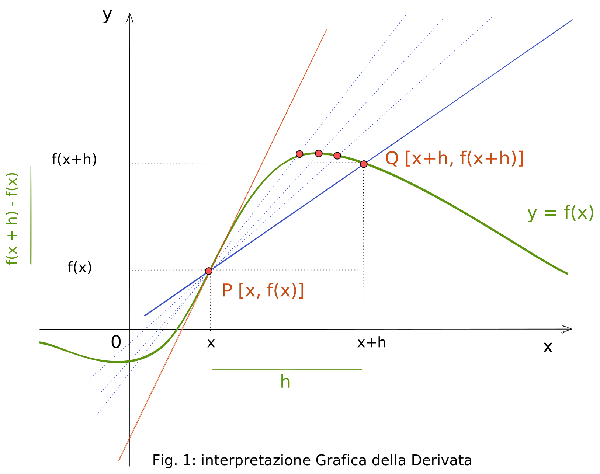
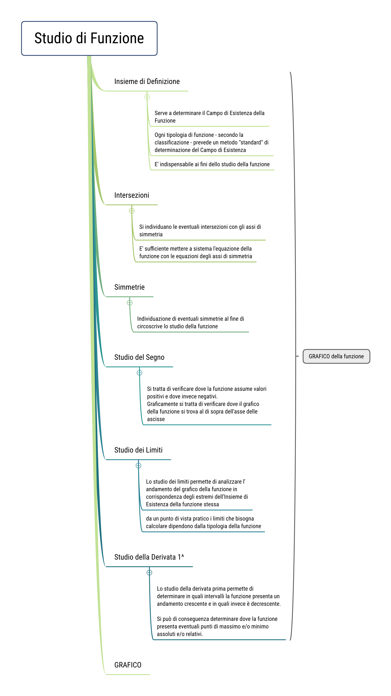



{}
### Monte ore annuali disponibili: 
  - **99 ore annuali** per tutte le classi (terze quarte e quinte).

### Libri di Testo

|   classe   | TESTO                                                       | Vol | ISDN code | DAW code |
|:----------| ----------------------------------------------------------- |:---:| --------- | -------- |
| **TERZE**  | COLORI DELLA MATEMATICA edizione BIANCA Vol.1 - Petrini, Sasso, Fragni - ed. |  1  |           |          |
| **QUARTE** | COLORI DELLA MATEMATICA edizione BIANCA Vol.1 - Petrini, Sasso, Fragni - ed. |  2  |           |          |
| **QUINTE** | COLORI DELLA MATEMATICA edizione BIANCA Vol.1 - Petrini, Sasso, Fragni - ed. |  4  |           |          |

### Strumenti e Materiali Didattici

- LIBRO DI TESTO
- DISPENSE
- APPUNTI
- LAVAGNA/LIM
- LABORATORIO DI INFORMATICA
{}

{}
## Obiettivi Generali della Disciplina

>- Sviluppare capacità logiche e deduttive.
>- Esprimersi e saper comunicare in un linguaggio che diventi sempre più chiaro e preciso, usando simboli e formule.
>- Saper utilizzare consapevolmente tecniche e strumenti di calcolo e applicarli in situazioni concrete.
>- Saper matematizzare problemi di varia natura e quindi saper interpretare e rappresentare dati.
{}

---

##### Competenze
  
  | codice | competenze                                                                                                                                                                                                                                               |
  |:------:|:-------------------------------------------------------------------------------------------------------------------------------------------------------------------------------------------------------------------------------------------------------- |
  |   A1   | Utilizzare le tecniche e le procedure del calcolo aritmetico rappresentandole anche sotto forma grafica.                                                                                                                                                 |
  |   A2   | Individuare le strategie appropriate per risolvere i problemi.                                                                                                                                                                                           |
  |   A3   | Analizzare dati e interpretarli sviluppando deduzioni e ragionamenti sugli stessi anche con l’ausilio di rappresentazioni grafiche, usando consapevolmente strumenti di calcolo e le potenzialità offerte da applicazioni specifiche di tipo informatico |
  |   B1   | Utilizzare il linguaggio e i metodi propri della matematica per organizzare e valutare adeguatamente informazioni qualitative e quantitative                                                                                                             |
  |   B2   | Utilizzare le strategie del pensiero razionale negli aspetti dialettici e algoritmici per affrontare situazioni problematiche, elaborando opportune soluzioni                                                                                            |
  |   B3   | Utilizzare i concetti e i modelli delle scienze sperimentali per investigare fenomeni sociali e naturali e per interpretare i dati.                                                                                                                      | 

---

## Programmazione Classi Terze - SE

### Tema 1 - Insiemi numerici
> periodo: **Settembre - Ottobre**

- **conoscenze**:
  - Insiemi numerici: naturali, interi, razionali; ordinamento e loro rappresentazione su una retta.
  - Le operazioni con i numeri interi e razionali e loro proprietà.
  - Proprietà delle potenze.
  - Rapporti, proporzioni e percentuali.

- **abilità**
  - Utilizzare le procedure del calcolo aritmetico (a mente, per iscritto, a macchina) per calcolare espressioni aritmetiche e risolvere semplici problemi.
  - Utilizzare le diverse notazioni e saper convertire da una all’altra (da frazioni a decimali, da frazioni apparenti ad interi, da percentuali a frazioni…)
  - Operare in $\mathbb{N,\, Z,\, Q}.$
  - Comprendere il significato di potenza; calcolare potenze e applicarne le proprietà.
  - Risolvere espressioni nei diversi insiemi numerici; rappresentare la soluzione di un problema con un’espressione e calcolarne il valore.
  - Impostare uguaglianze di rapporti e risolvere problemi di proporzionalità e percentuale.

>- **competenza**: 
>- **A1**
>- **A2**

---

### Tema 2 - Calcolo letterale
> periodo: **Novembre**

- **conoscenze**:    
  - Definizione e significato di monomio; operazioni con i monomi.

- **abilità**
  - Padroneggiare l’uso della lettera come mero simbolo e come variabile.
  - Eseguire le operazioni con i monomi, utilizzando opportunamente le proprietà delle potenze.

>- **competenza**:
> - **A1**

### Tema 3 - operazioni con i polinomi
>periodo: **Dicembre - Gennaio**

- **conoscenze**:
  - Definizione e caratteristiche di un polinomio; operazioni con i polinomi.
  - Prodotti notevoli (differenza di quadrati, quadrato di binomio, quadrato di trinomio, cubo di binomio)

- **abilità**:
  - Eseguire le operazioni con i polinomi e i prodotti notevoli.

> **competenza**:
>- **A1**

### Tema 4 - Equazioni di primo grado e fattorizzazione
>periodo: **Febbraio - Marzo - Aprile**

- **conoscenze**:
  - Equazioni numeriche di primo grado intere.
  - Problemi con equazioni.
  - Concetto di **fattorizzazione**.
  - Vari metodi di fattorizzazione (raccoglimento parziale e totale, riconoscimento dei prodotti notevoli, trinomio particolare).

- **abilità**
  - Risolvere equazioni di primo grado e verificare la correttezza dei procedimenti utilizzati.
  - Utilizzo dell’algebra per risolvere problemi numerici e geometrici.
  - Fattorizzare un polinomio.
  - Utilizzo dell’algebra per risolvere problemi numerici ed algebrici.

>**competenza**:
>- **A1**

### Tema 5: Disequazioni di primo grado
> periodo: **Maggio - Giugno**
- **conoscenze**:
  - Di sequazioni numeriche intere di primo grado.
- abilità
  - Risolvere disequazioni di primo grado e verificare la correttezza dei procedimenti utilizzati.
>**competenza**:
> - **A1**

## Programmazione Classi Quarte SE
 
### Tema 0 - Ripasso
>periodo: 20 settembre

- Disequazioni numeriche intere di primo grado. 
- Risolvere disequazioni di primo grado e verificare la correttezza dei procedimenti utilizzati. 

### Tema 1 - Equazioni di primo grado frazionarie o fratte
>periodo: 

- Frazioni algebriche: semplificazioni e operazioni con le frazioni algebriche (moltiplicazione e divisione)
- Equazioni numeriche di primo grado fratte.
- Tecniche risolutive di un problema, anche utilizzando equazioni di primo grado. 
- Risolvere espressioni con le frazioni algebriche.
- Risolvere equazioni di primo grado e verificare la correttezza dei procedimenti utilizzati.
- Utilizzo dell’algebra per risolvere problemi numerici. 

### Tema 2 - Radicali ed equazioni di II Grado
>periodo: 

- Definizione di radicale e le sue condizioni di esistenza
- La proprietà invariantiva
- Operazioni con i radicali
- Regole risolutive delle equazioni di secondo grado, complete e incomplete.
- Significato e discussione del  discriminante di un’equazione di 2° grado.
- Equazioni di secondo grado intere e  fratte. 
- Semplificare espressioni utilizzando le operazioni con i radicali.
- Risolvere equazioni di secondo grado numeriche intere e fratte e verificare la correttezza dei procedimenti utilizzati.
- Risolvere semplici problemi di secondo grado

### Tema 3 - Geometria analitica - Retta
>periodo: 

- Il **piano cartesiano**: distanza tra due punti, punto medio di un segmento.
- La retta nel piano cartesiano: retta passante per l’origine, retta in posizione generica, significato geometrico del coefficiente angolare e di ordinata all’origine, rette parallele e perpendicolari, intersezione tra rette, equazione di retta passante per due punti. 
- Saper rappresentare nel piano cartesiano una retta nota la sua equazione e determinare l’equazione di una retta note alcune condizioni.

### Tema 4 - Sistemi di equazioni e problemi
>periodo: 

- Sistemi di equazioni di primo grado.
- Interpretazione geometrica dei sistemi di equazioni.
- Conoscere le regole per risolvere un problema con equazioni o sistemi di primo grado.
- Saper risolvere un sistema di primo grado con diversi metodi: sostituzione, addizione e sottrazione, metodo grafico.
- Risolvere problemi che implicano l’uso di funzioni, di equazioni e di sistemi di equazioni anche per via grafica, collegati con altre discipline e situazioni di vita ordinaria, come primo passo verso la modellizzazione matematica. 

### Tema 5 - Geometria Analitica - Parabola
>periodo: 

- La parabola nel piano cartesiano: parabola con asse di simmetria parallelo all’asse y, studio dell’equazione $$y=ax^2+bx+c$$ con casi particolari, formule del vertice e dell’asse di simmetria.
- Disegnare il grafico della parabola dopo aver determinato: 
	- vertice, 
	- asse di simmetria, 
	- intersezioni con gli assi.

- Stabilire algebricamente e graficamente posizione retta-parabola.
- Saper rappresentare graficamente nel piano cartesiano la parabola nota l’equazione.
- Saper determinare le intersezioni tra retta e parabola.

### Tema 6 - Disequazioni di $2^{\circ}$ Grado
>periodo: 

- Disequazioni di 2°grado intere e fratte (risoluzione grafica).
- Sistemi di disequazioni di secondo grado
- Acquisire le tecniche per la risoluzione grafica di disequazioni di 2° grado.

{}
### Obiettivo Finale - competenze

>- competenze finali:
>- Saper utilizzare le tecniche di calcolo per risolvere le equazioni di 1° grado fratte,  quelle di 2° grado ed i sistemi di equazioni lineari.
>- Saper risolvere problemi di geometria analitica sulla retta.
>- Saper risolvere problemi di geometria analitica sulla  parabola .
>- Saper risolvere disequazioni di 1° e 2°  facendo uso della retta e della parabola.
{}

## Programmazione Classi Quinte SE

### Tema 1 - Definizione e classificazione di funzione reale di variabile reale  
- Definizioni di: 
  - dominio
  - codominio 
  - funzioni crescenti, 
  - funzioni decrescenti, 
  - funzioni pari e  dispari, 
  - funzioni limitate 
  - massimo-minimo relativi e assoluti.

### Tema 2 - Definizione di **grafico** di una funzione.

- Lettura di **dominio** e **codominio** e segno della funzione da grafico.
- Calcolo algebrico del **dominio** di f. **razionali** e **irrazionali** **intere** e **fratte**).
- Studio algebrico del **segno**, 
- **simmetrie** 
- **intersezioni** con gli assi (di funzioni razionali fratte).

#### Concetto intuitivo da grafico di:  
-   limite **finito** di una funzione per $x$ che tende a un valore **finito**
-   limite **destro** e **sinistro**
-   limite **finito** di una funzione per $x$ che tende all’**infinito**
-   limite **infinito** di una funzione per $x$ che tende ad un valore **finito**
-   limite **infinito** di una funzione per $x$ che tende all’**infinito**
-   **Asintoti** verticali ed orizzontali.

##### Definizione di **funzione continua**.  

### Tema 3 - Algebra dei limiti:
-  **regole di calcolo** (somme, prodotti, quozienti) nel caso di limiti **finiti**;
-  **regole di calcolo** (somme, prodotti, quozienti) nel caso in cui qualcuno dei limiti sia infinito e non si presentino ==forme di indecisione==;

##### regole di calcolo dei Limiti:

$$\lim_{x \rightarrow x_{0}}[f(x) \cdot g(x)]=l_{1} \cdot l_{2}$$
$$\lim_{x \rightarrow x_{0}}[f(x)]^{n}=l^{n} \quad(n \in \mathbb{R})$$
$$\lim_{x \rightarrow x_{0}} k \cdot f(x)=k \cdot l $$
$$\lim_{x \rightarrow x_{0}} f(x)=l \neq 0 \Rightarrow \lim_{x \rightarrow x_{0}} \frac{1}{f(x)}=\frac{1}{l} $$
$$\lim_{x \rightarrow x_{0}} f(x)=\pm \infty \Rightarrow \lim_{x \rightarrow x_{0}} \frac{1}{f(x)}=0 $$
$$\lim_{x \rightarrow x_{0}} \frac{f(x)}{g(x)}=\frac{l_{1}}{l_{2}}, \text { con } g(x) \neq 0 \wedge l \neq 0 $$

### Tema 4 - Il concetto di **derivata**:  
-   Limite del **rapporto incrementale**;
-   definizione di **derivata** e suo significato geometrico;

#### Le **derivate fondamentali**: 
-   della funzione costante, 
-   della funzione $f(x)=x$;
-   i teoremi sul calcolo delle derivata;
-   la derivata della somma di funzioni;
- $$D[f(x)+g(x)]=f^{\prime}(x)+g^{\prime}(x)$$
-   la derivata del prodotto di funzioni;
-  $$D[f(x) \cdot g(x)]=f^{\prime}(x)\cdot g(x)+f(x) \cdot g^{\prime}(x)$$
-   la derivata della potenza di una funzione;
-   la derivata del quoziente di due funzioni;
-   $$D[\dfrac{f(x)}{g(x)}]=\dfrac{f^{\prime}(x) g(x)-f(x) g^{\prime}(x)}{[g(x)]^{2}}$$
      
#### Definizione di:
- **massimi** e **minimi** **relativi** ed **assoluti**.
- $y' = f'(x) = 0$
#### Definizione di:
- funzioni **crescenti** e **decrescenti** in un intervallo.
- $y' = f'(x) \ge 0$

#### Definizione di:
- **flesso** di una funzione

#### Definizione di:
- funzioni **concave** e **convesse** in un intervallo.
- Criterio di **monotonia** per le funzioni derivabili.
---

### Tema 6 - studio del grafico di una funzione.

