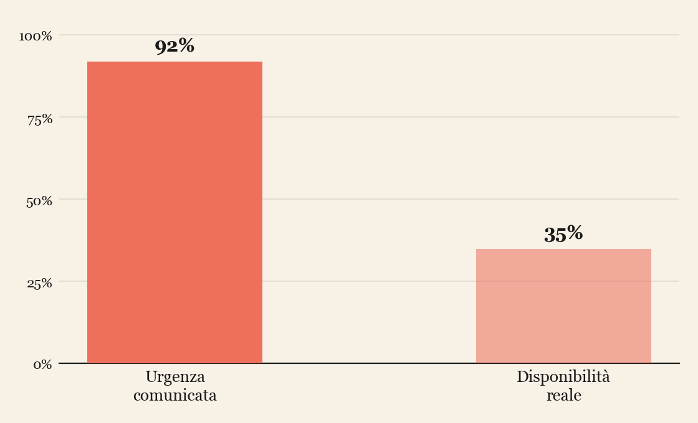
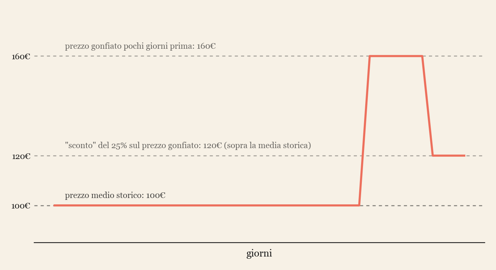
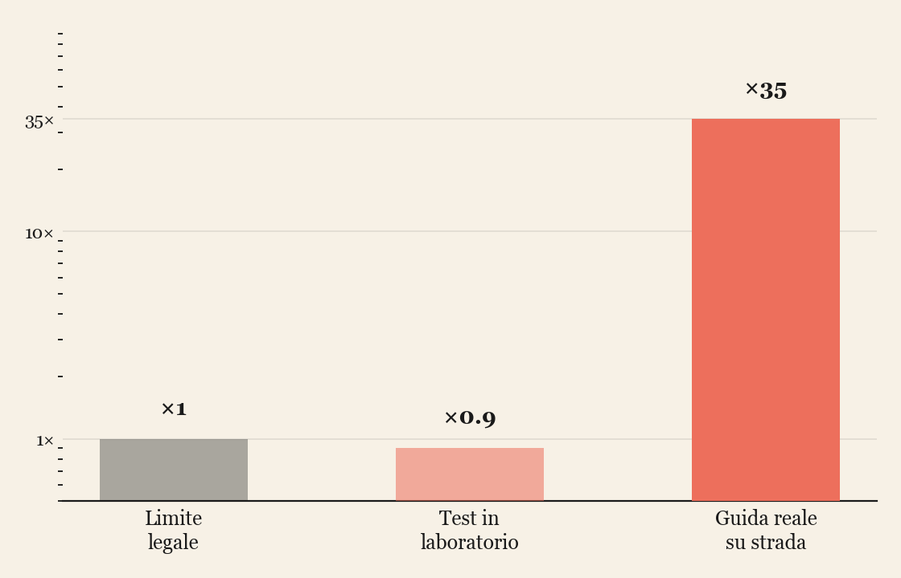

><i class="fa-solid fa-quote-left"></i> There are three kinds of lies: lies, damned lies, and statistics. <i class="fa-solid fa-quote-right"></i>
> &mdash; <cite>attribuita a Mark Twain / Benjamin Disraeli</cite>

## Il marketing scommette che tu non controlli i conti

Ogni volta che vediamo un prezzo scontato, un countdown che segna "solo 2 posti rimasti", o una percentuale enorme scritta in rosso, qualcuno ha già fatto dei calcoli — non per aiutarci a decidere meglio, ma per farci decidere **più in fretta**. Il marketing, quando gioca sporco, quasi mai mente apertamente: sfrutta il fatto che la maggior parte delle persone non verifica i numeri, e si fida dell'impressione a colpo d'occhio.

La buona notizia è che bastano pochi strumenti matematici — percentuali, ordini di grandezza, un po' di probabilità — per smontare questi trucchi uno per uno. Vediamo cinque casi realmente accaduti, con tanto di nomi, sentenze e multe.

## Caso 1: Booking.com e la falsa scarsità

Nel 2019 l'**Autorità Garante della Concorrenza e del Mercato (AGCM)** italiana ha sanzionato **Booking.com** per **3.900.000 euro** per pratiche commerciali scorrette. Tra le accuse: messaggi del tipo *"solo 1 camera rimasta a questo prezzo!"* o *"12 persone stanno guardando questo hotel in questo momento"*, presentati come dati oggettivi e urgenti, senza che l'azienda fornisse prove verificabili che fossero effettivamente veri, aggiornati e riferiti in modo corretto al contesto (a volte quella "unica camera rimasta" era riferita a una specifica tipologia di stanza, non all'intera disponibilità dell'hotel).

Il punto matematico è semplice ma potente: **un'affermazione di scarsità è un'affermazione probabilistica sul futuro** ("se non prenoti ora, rischi di non trovare più questo prezzo"), e come tale andrebbe accompagnata da un dato verificabile, non da un numero generato apposta per creare ansia da decisione.

## Caso 2: gli sconti finti — il caso Unieuro

Nel 2022 l'AGCM ha sanzionato **Unieuro** (insieme ad altre catene di elettronica) per pratiche di **sconti ingannevoli**: il prezzo "barrato" da cui partiva lo sconto non era quello effettivamente praticato nei giorni o nelle settimane precedenti, ma un prezzo più alto, mai realmente applicato o applicato solo per pochissimo tempo prima della promozione — una tecnica nota come *sconto fantasma*.

È un trucco puramente aritmetico: uno sconto del **50%** sembra enorme, ma se il prezzo di partenza è stato gonfiato del 60% pochi giorni prima, lo sconto "vero" rispetto al prezzo di mercato reale è molto più modesto — a volte nullo, a volte addirittura negativo:

$$
\text{Sconto percepito} = \frac{P_{\text{gonfiato}} - P_{\text{finale}}}{P_{\text{gonfiato}}} \qquad \neq \qquad \text{Sconto reale} = \frac{P_{\text{medio storico}} - P_{\text{finale}}}{P_{\text{medio storico}}} \tag{S}
$$

Proprio per contrastare questa pratica, dal 2022 la **direttiva europea Omnibus** obbliga gli e-commerce a mostrare, insieme al prezzo scontato, il **prezzo più basso applicato negli ultimi 30 giorni** — una regola nata esattamente per rendere impossibile gonfiare artificialmente il prezzo di riferimento della formula $(S)$.

## Caso 3: il "dark pattern" di Amazon Prime

Nel 2023 la **Federal Trade Commission (FTC)** americana ha citato in giudizio **Amazon**, sostenendo che l'azienda avesse deliberatamente reso il processo di disdetta di **Amazon Prime** artificiosamente complicato — un percorso soprannominato internamente, secondo i documenti resi pubblici dalla causa, con il nome in codice **"Iliad"** (come l'*Iliade*: una guerra lunghissima), che richiedeva fino a 4 clic e diverse pagine di tentativi di persuasione prima di riuscire a disdire, contro il singolo clic necessario per iscriversi.

Qui il numero ingannevole non è un prezzo, ma la **probabilità di completare un'azione**: ogni passaggio aggiuntivo nel percorso di disdetta è un punto in cui una frazione degli utenti abbandona, non perché ha cambiato idea, ma per stanchezza. È lo stesso principio — usato però in senso opposto, a fin di bene — con cui un progettista di siti ottimizza un funnel di vendita: ogni step in più nel processo di acquisto fa perdere una percentuale di clienti. Applicato al contrario, nella disdetta, diventa uno strumento per trattenere involontariamente gli utenti.

## Caso 4: Dieselgate — quando il campione viene truccato alla radice

Il caso più clamoroso, e quello con le conseguenze più gravi, è il cosiddetto **Dieselgate**. Nel settembre 2015 l'agenzia ambientale americana (**EPA**) scoprì che **Volkswagen** aveva installato su milioni di veicoli diesel un software — un *defeat device* — capace di riconoscere quando l'auto era sottoposta a un test di laboratorio (dai movimenti tipici del volante, dalla velocità costante, dalla posizione dei pedali) e di attivare, solo in quelle condizioni, un funzionamento del motore con emissioni ridotte, molto diverso da quello reale su strada.

Nei test ufficiali le emissioni di ossidi di azoto risultavano regolari; su strada, a seconda del modello e delle condizioni di guida, sono state misurate fino a diverse decine di volte superiori ai limiti legali. Circa 11 milioni di veicoli coinvolti nel mondo, tra multe e risarcimenti per Volkswagen stimati in oltre **30 miliardi di dollari** complessivamente.

Qui non si tratta di un trucco psicologico sui prezzi, ma di qualcosa di più profondo e istruttivo dal punto di vista matematico: **un campione truccato non rappresenta la popolazione**. Tutta la statistica si fonda sull'idea che misurare un campione (il test in laboratorio) ci dica qualcosa di affidabile sulla popolazione intera (la guida reale su strada). Se il campione viene manipolato per comportarsi diversamente dal resto della popolazione, ogni conclusione statistica costruita su di esso è invalidata alla radice — non è un problema di calcolo, è un problema di dati falsati prima ancora di iniziare a calcolare.

## Caso 5: le loot box nei videogiochi

L'ultimo caso è probabilmente il più vicino alla vita quotidiana di chi sta leggendo: le **loot box**, quelle "casse" o "pacchetti misteriosi" che in tantissimi videogiochi — da *FIFA* a *Genshin Impact*, passando per decine di giochi mobile — si possono comprare con soldi veri per ottenere, a caso, un oggetto o un personaggio raro.

Il gioco dichiara sempre una probabilità: *"5% di possibilità di ottenere un oggetto leggendario"*. Il numero è vero, ma quasi nessuno lo interpreta correttamente. Un 5% per singola estrazione non significa affatto che dopo 20 tentativi l'oggetto sia garantito: le estrazioni sono eventi indipendenti, quindi la probabilità di *non* ottenerlo mai in $n$ tentativi è $(0{,}95)^n$, e con $n = 20$ resta comunque intorno al **36%** — più di una possibilità su tre di restare a mani vuote anche dopo venti acquisti. Il numero medio di tentativi necessari per ottenere l'oggetto, in una distribuzione di questo tipo (geometrica), è $\frac{1}{p}$: con $p = 0{,}05$, in media servono **20 estrazioni**, ma la varianza è alta, e c'è chi ne farà molte di più prima di avere fortuna. È lo stesso principio che regola le slot machine, applicato a un pubblico enormemente più giovane.

Proprio per questo, dal 2017 la Cina ha introdotto l'obbligo legale di dichiarare le probabilità esatte di ogni oggetto; il Belgio, nel 2018, ha classificato le loot box come una forma di **gioco d'azzardo** e ne ha vietato la vendita ai minori; altri paesi (tra cui i Paesi Bassi) hanno seguito ipotesi simili, mentre l'industria videoludica ha spesso preferito adottare forme di autoregolamentazione — come la dichiarazione volontaria delle probabilità, oggi comune anche su App Store e Google Play — piuttosto che subire normative più stringenti.

## Il filo comune: la matematica come vaccino

Tutti e cinque i casi condividono la stessa struttura: qualcuno presenta un **numero** — una percentuale di sconto, un contatore di disponibilità, un numero di clic, un valore di emissioni, una probabilità di estrazione — sapendo che la maggior parte delle persone non lo metterà in discussione. E in tutti e cinque i casi, gli strumenti per smascherare l'inganno sono elementari:

- **percentuali**: rispetto a cosa è calcolata questa percentuale? Qual è il valore di riferimento, ed è quello giusto?
- **serie temporali**: il valore mostrato ora è confrontabile con l'andamento storico, o è un dato isolato scelto ad arte?
- **probabilità e campionamento**: il dato che vedo — un test, un campione, una recensione, una singola estrazione — rappresenta davvero la situazione reale, o è stato selezionato, alterato o frainteso per sembrare diverso?

La matematica, in questi casi, non è un esercizio astratto da fare a scuola: è letteralmente lo strumento che ci impedisce di essere trattati da stupidi.
