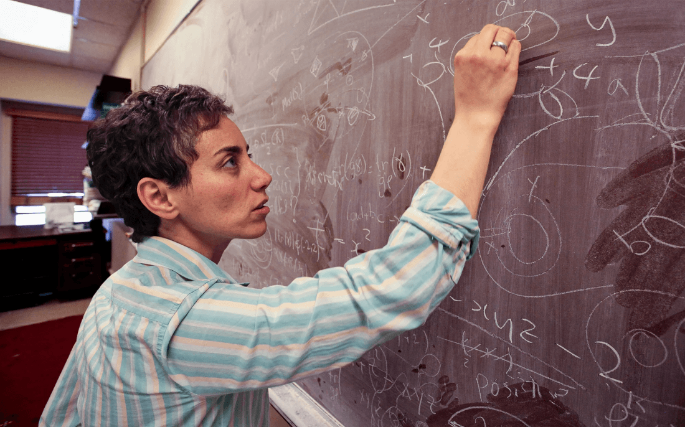
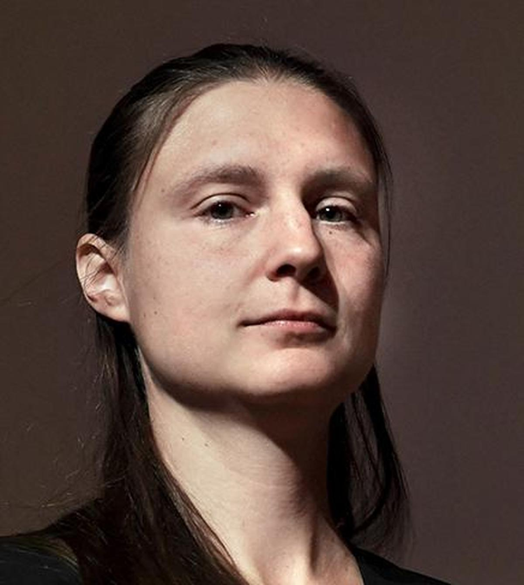

### Un premio che si assegna quattro persone alla volta, ogni quattro anni

In classe, quando è capitato di parlare di Alessio Figalli o di Giorgio Parisi, la domanda che torna sempre è: ma cos'è esattamente questa Medaglia Fields? È il "Nobel della matematica"? Non proprio — Alfred Nobel non previde mai un premio per la matematica nel suo testamento (le ragioni sono materia da aneddoto più che da fisica, e restano incerte), e la Fields Medal, istituita nel 1936 dal matematico canadese John Charles Fields, ha regole tutte sue, più severe: viene assegnata ogni quattro anni, in occasione del Congresso Internazionale dei Matematici, a **non più di quattro persone alla volta**, e solo a chi ha **meno di 40 anni** al 1° gennaio dell'anno del congresso. Non è un premio alla carriera: è un riconoscimento a chi, prima dei 40 anni, ha già cambiato la direzione di un intero campo della matematica.

Dal 1936 a oggi sono state assegnate **64 medaglie in totale**. Di queste, **solo due sono andate a una donna** — le altre 62, tutte a uomini. Vale la pena raccontare chi erano queste due donne, e cosa hanno risolto.

### Maryam Mirzakhani: la geometria delle forme impossibili da immaginare

Maryam Mirzakhani è nata a Teheran nel 1977. Da ragazza vinse due medaglie d'oro alle Olimpiadi Internazionali di Matematica, con un punteggio perfetto nel 1995 — un dettaglio che raccontiamo spesso in classe, perché smonta l'idea che i grandi matematici "nascano" già formati: Mirzakhani stessa raccontò di essere stata, alle medie, una studentessa mediocre in matematica, prima di innamorarsene davvero al liceo.

Il suo lavoro riguarda oggetti difficili anche solo da immaginare: le **superfici di Riemann** e i loro **spazi dei moduli**. Per farsene un'idea: immaginiamo tutte le possibili forme "curve" che si possono dare a una ciambella con un certo numero di buchi, mantenendo però fissata la topologia (il numero di buchi non cambia, cambia solo la geometria — quanto è "schiacciata" o "allungata" la superficie). L'insieme di tutte queste forme possibili è a sua volta uno spazio geometrico: lo spazio dei moduli. Mirzakhani trovò un modo per calcolarne il volume, risolvendo un problema aperto da decenni, e usò questo risultato per dimostrare in modo del tutto nuovo e inaspettato una congettura di Edward Witten sulla struttura di questi spazi.

Uno dei suoi risultati più citati riguarda il conteggio delle *geodetiche chiuse semplici* su una superficie iperbolica — in parole povere, i percorsi più brevi che si chiudono su sé stessi senza mai incrociarsi. Mirzakhani dimostrò che il loro numero, al crescere della lunghezza massima $L$ consentita, cresce secondo una legge di potenza precisa:

$$N(L) \sim c_g \cdot L^{6g-6} \tag{M}$$

dove $g$ è il genere della superficie (il numero di "buchi") e $c_g$ una costante che dipende dalla geometria dello spazio dei moduli stesso. Una formula che sembra tecnica, ma che in realtà mette ordine in un caos apparente: dice esattamente quanto velocemente si moltiplicano questi percorsi, e lo fa con una precisione che nessuno era riuscito a raggiungere prima.

Nel 2014 Mirzakhani divenne la prima donna, e la prima persona di nazionalità iraniana, a vincere la Fields Medal. Morì tre anni dopo, nel 2017, per un cancro al seno diagnosticato nel 2013: aveva 40 anni. Oggi il suo nome è legato a premi e iniziative dedicate a incoraggiare le ragazze a intraprendere la ricerca matematica, tra cui il *Maryam Mirzakhani New Frontiers Prize*.

### Maryna Viazovska: il problema delle arance, risolto in otto dimensioni

Il secondo nome è quello di **Maryna Viazovska**, nata a Kyiv nel 1984, oggi professoressa ordinaria e titolare della cattedra di Teoria dei Numeri all'EPFL di Losanna, in Svizzera.

Il problema che ha risolto ha un'origine sorprendentemente concreta, e si può raccontare bene anche a chi non ha basi di matematica avanzata: **qual è il modo più efficiente di impacchettare delle sfere nello spazio, in modo da riempire il maggior volume possibile?** È il problema che si pone chiunque debba impilare arance al mercato, o palle di cannone in un deposito — e infatti è noto come *sphere packing problem*, formulato esplicitamente da Keplero nel 1611 e rimasto una congettura per quasi quattro secoli, fino a una dimostrazione rigorosa (per lo spazio a tre dimensioni) solo nel 1998.

Viazovska ha affrontato lo stesso problema non in tre dimensioni, ma **in otto e in ventiquattro**. Può sembrare un esercizio di astrazione fine a sé stesso, ma in dimensioni particolari — 8 e 24, appunto — il problema nasconde una struttura eccezionalmente elegante, legata a due configurazioni geometriche note come reticolo $E_8$ e reticolo di Leech. Nel 2016 Viazovska dimostrò che il reticolo $E_8$ fornisce davvero l'impacchettamento più denso possibile in otto dimensioni, trovando una connessione sorprendente con le *forme modulari*, un ramo della teoria dei numeri apparentemente lontanissimo dalla geometria dello spazio. La densità massima raggiungibile in otto dimensioni, che la sua dimostrazione ha reso un fatto certo e non più solo una congettura, vale:

$$\Delta_8 = \frac{\pi^4}{384} \approx 0{,}25367 \tag{V}$$

Poche settimane dopo, insieme a un gruppo di collaboratori, estese lo stesso metodo alla dimensione 24, risolvendo anche quel caso attraverso il reticolo di Leech. Nel 2022 le è stata conferita la Medaglia Fields — la seconda donna nella storia del premio, dopo Mirzakhani.

### Perché raccontarlo in classe

Non è solo una questione di quote o di rappresentanza, anche se il dato — due donne su 64 medaglie, in ottantasei anni di storia del premio — resta un dato, e i dati non si aggirano con le buone intenzioni. È che le storie di Mirzakhani e Viazovska raccontano bene cosa significa fare ricerca matematica davvero: non "essere bravi con i numeri", ma inseguire per anni una domanda che sembra irrisolvibile, e trovare, a volte, una connessione che nessuno aveva visto — tra la geometria e la teoria dei numeri, tra un problema di ottica e uno di impacchettamento di sfere.

È lo stesso motivo per cui vale la pena raccontare Figalli o Parisi: la matematica e la fisica non sono un elenco di formule da applicare, sono il resoconto di persone che hanno inseguito una domanda più a lungo di chiunque altro. Che a inseguirla sia stata una donna, così raramente nella storia di questo premio, è un motivo in più per raccontarlo — e per ricordare alle ragazze in classe che quella porta, oggi, è aperta anche per loro.

Sources:
- [The Work of Maryam Mirzakhani — International Mathematical Union](https://www.mathunion.org/fileadmin/IMU/Prizes/Fields/2014/news_release_mirzakhani.pdf)
- [Maryam Mirzakhani — MacTutor History of Mathematics](https://mathshistory.st-andrews.ac.uk/Biographies/Mirzakhani/)
- [A Tenacious Explorer of Abstract Surfaces — Quanta Magazine](https://www.quantamagazine.org/maryam-mirzakhani-is-first-woman-fields-medalist-20140812/)
- [The work of Maryna Viazovska — Henry Cohn, International Mathematical Union](https://www.mathunion.org/fileadmin/IMU/Prizes/Fields/2022/laudatio-mv.pdf)
- [Maryna Viazovska — MacTutor History of Mathematics](https://mathshistory.st-andrews.ac.uk/Biographies/Viazovska/)
- [Maryna Viazovska, explorer of mathematical dimensions — EPFL](https://actu.epfl.ch/news/maryna-viazovska-explorer-of-mathematical-dimensio/)

---

Questo articolo è stato scritto con l'indispensabile contributo di Claude <svg viewBox="0 0 24 24" fill="currentColor" width="17" height="17" style="display:inline-block;vertical-align:-3px;margin:0 2px;color:#ed6f5c;"><path fill-rule="evenodd" clip-rule="evenodd" d="M12 2.5C16 2.5 19 6 19 11C19 16 16.5 21 12 21C7.5 21 5 16 5 11C5 6 8 2.5 12 2.5ZM8.7 6.6C10.4 6.6 11.6 8.2 11.6 10.2C11.6 12.2 10.4 13.4 8.7 13.4C7 13.4 6 12 6 10.2C6 8.2 7 6.6 8.7 6.6ZM15.3 6.6C17 6.6 18 8.2 18 10.2C18 12 17 13.4 15.3 13.4C13.6 13.4 12.4 12.2 12.4 10.2C12.4 8.2 13.6 6.6 15.3 6.6Z"/></svg> — la quale, va detto, non ha chiesto nulla in cambio. Per ora.

