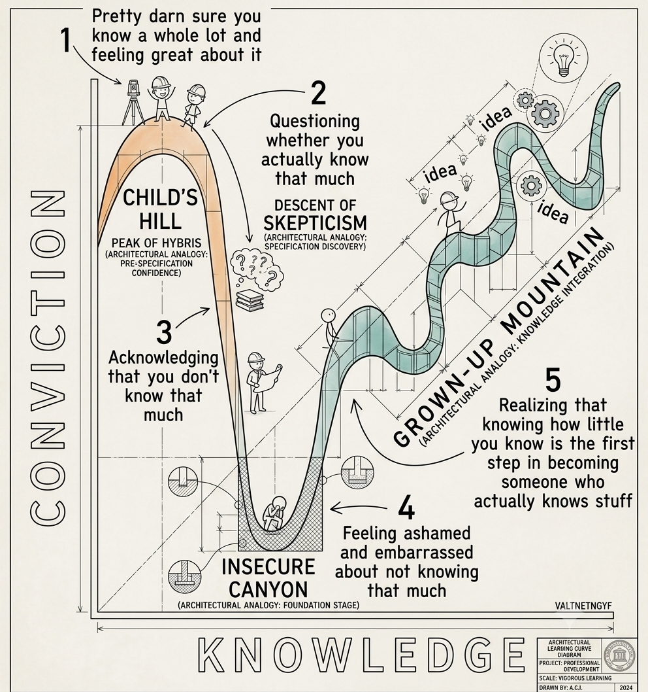

> "So di non sapere", si dice sia stato il motto di Socrate. Peccato che nessun testo antico riporti questa frase esattamente così: è una sintesi, coniata secoli dopo, di un discorso molto più lungo che Platone mette in bocca al suo maestro nell'*Apologia*. Il che è già, di per sé, una piccola dimostrazione pratica di quanto sia facile essere sicuri di sapere qualcosa — una citazione, in questo caso — che in realtà non si sa affatto.

## Il fatto

Il 19 aprile 1995, un uomo di nome McArthur Wheeler entrò in due banche di Pittsburgh a viso scoperto, si fece riprendere serenamente dalle telecamere di sicurezza e rapinò entrambe senza la minima cautela. Quando la polizia bussò a casa sua, poche ore dopo, la sua reazione fu genuina incredulità: "Ma... avevo il succo di limone!"

Wheeler era convinto — sinceramente, non per scusarsi — che spalmarsi il succo di limone sul viso lo rendesse invisibile alle telecamere. Il ragionamento, a suo modo, aveva persino una logica: il succo di limone si usa come inchiostro simpatico, invisibile finché non lo si scalda. Se funziona per scrivere messaggi segreti, avrà pensato, funzionerà anche per il mio viso. Aveva persino fatto un test: si era scattato una polaroid dopo essersi cosparso di limone, e non essendo apparso nella foto (probabilmente per un difetto della macchina, o perché aveva sbagliato a puntarla) si era convinto definitivamente della bontà del metodo.

Il caso arrivò all'attenzione di due psicologi della Cornell University, David Dunning e Justin Kruger, che ci videro qualcosa di più interessante di un semplice aneddoto da telegiornale. Non era stupidità pura: era una forma specifica, quasi elegante nella sua perversità, di autoinganno. Wheeler non sapeva abbastanza di ottica, chimica o funzionamento delle telecamere da rendersi conto di *quanto poco* ne sapesse. Gli mancavano, in altre parole, proprio le competenze necessarie per accorgersi della propria incompetenza.

Nel 1999 Dunning e Kruger pubblicarono lo studio che avrebbe dato il nome a tutto questo: *"Unskilled and Unaware of It"*. Sottoposero un gruppo di studenti a test di grammatica, logica e — con un tocco quasi sadico — senso dell'umorismo, chiedendo loro di stimare quanto bene pensassero di aver fatto rispetto agli altri. Il risultato: chi si piazzava nel quartile più basso (i peggiori) sovrastimava sistematicamente la propria prestazione, collocandosi in media attorno al 60° percentile. Chi era davvero bravo, al contrario, tendeva leggermente a sottostimarsi — probabilmente perché, sapendone di più, era anche più consapevole di quanto ci fosse ancora da sapere.

## La curva (quella vera, e quella da meme)

Se sui social hai incontrato il grafico a "montagne russe" — un picco iniziale di sicumera seguito da un crollo nella valle della disperazione e poi da una lenta risalita verso la competenza — sappi che è un'illustrazione divulgativa nata *dopo* lo studio originale, non il risultato di un esperimento. È efficace, e coglie bene l'intuizione, ma non fu Dunning-Kruger a disegnarla: nell'articolo del 1999 compaiono soltanto rette, non curve a montagna russa.

L'idea di fondo, però, regge bene anche senza il grafico da infografica:

- Quando si comincia qualcosa di nuovo, si sa così poco da non riuscire nemmeno a intuire quanto sia grande l'argomento. Ogni piccola nozione acquisita sembra completare il quadro, e la fiducia sale rapidissima — è la fase che qualcuno chiama, con un certo affetto, il "picco della stupidità felice".
- Poi si comincia a scoprire quanto sia in realtà vasto e complicato il campo, e la fiducia crolla più rapidamente di quanto sia salita. È la fase in cui uno studente smette di alzare la mano in classe non perché sappia meno di prima, ma perché per la prima volta si rende conto di *cosa* non sa.
- Chi si ferma qui, scoraggiato, resta convinto di non aver imparato nulla. Chi continua, lentamente, ricostruisce sia la competenza sia la fiducia — ma questa seconda volta la fiducia è più lenta, più cauta, e soprattutto più giustificata.

Un modo pratico per riconoscerlo: in un dibattito tra un principiante sicuro di sé, uno studente a metà del percorso e un esperto vero, spesso a vincere il pubblico è il primo. Il principiante non ha dubbi, e i dubbi si vedono; lo studente intermedio ha appena scoperto quanto sia complicato l'argomento e per questo parla con cautela, magari troppa; l'esperto conosce abbastanza da mettere ogni affermazione tra virgolette mentali — "dipende", "in generale", "nella maggior parte dei casi". Ed è un fatto documentato, non solo un'impressione da bar: le persone tendono a fidarsi di chi parla con sicurezza molto più che di chi parla con precisione. Sono due cose diverse, e confonderle è probabilmente il modo più comune ed efficace per farsi ingannare da un ciarlatano competente nella recitazione della certezza.

## Esempi che (quasi) tutti riconoscono

L'effetto Dunning-Kruger non vive solo nei laboratori di psicologia o nelle rapine finite male. Compare ogni volta che qualcuno passa dal "non so nulla, quindi sto zitto" al "so qualcosa, quindi so tutto" nel giro di un weekend:

- **La guida.** Il sondaggio più citato (e più divertente) sull'argomento chiede alle persone di valutare la propria abilità alla guida rispetto alla media. Risultato tipico: negli Stati Uniti circa il 93% degli intervistati si colloca sopra la media — statisticamente impossibile, a meno che la "media" americana non sia composta perlopiù da automobilisti pessimi che però non lo sanno. In Svezia la percentuale scende, ma resta comunque sopra il 50% che la matematica imporrebbe.
- **La cucina di casa.** Chiunque abbia visto un parente guardare tre puntate di un programma di cucina e poi improvvisarsi giudice delle scelte di uno chef professionista conosce già l'effetto Dunning-Kruger, anche senza saperne il nome.
- **Il debug del codice.** Ogni programmatore alle prime armi attraversa la fase in cui, dopo aver imparato a stampare "Hello, world!", è convinto di poter riscrivere il sistema operativo. Segue, con puntualità quasi rassicurante, la fase in cui — dopo aver capito cosa sia davvero un puntatore, o una race condition — non è più sicuro di saper scrivere nemmeno quel primo "Hello, world!" senza controllare la sintassi tre volte.
- **La classe.** Anche l'aula, va detto con un po' di autoironia da chi ci lavora dentro, non fa eccezione: capita che lo studente più silenzioso a una verifica orale sia quello che ha studiato di più (e quindi ha scoperto quante sfumature avrebbe potuto aggiungere), mentre chi ha ripassato distrattamente il giorno prima risponde con un aplomb che a volte convince persino l'insegnante, per qualche secondo.

Nessuno di questi esempi implica che le persone sicure di sé abbiano sempre torto, o che i dubbiosi abbiano sempre ragione — sarebbe un pregiudizio uguale e contrario, altrettanto ingiustificato. Implica solo che la sicurezza percepita, da sola, non è un buon indicatore di competenza reale. E questo, in un mondo pieno di persone sicurissime davanti a un microfono, è già un'informazione preziosa.

## Un avvertimento onesto (perché serve rigore anche parlando di rigore)

Va detto, per correttezza — ed è un po' l'ironia finale della storia: negli ultimi anni diversi statistici hanno criticato duramente il modo in cui l'effetto Dunning-Kruger viene solitamente presentato. L'obiezione più seria (sollevata da autori come Nuhfer e collaboratori, e ripresa con forza dal blogger e statistico Cosma Shalizi) è che un pattern del tutto simile a quello osservato da Dunning e Kruger emerge automaticamente da un fenomeno statistico chiamato **regressione verso la media**, anche partendo da dati completamente casuali e privi di qualunque "effetto psicologico" reale: se confronti una stima soggettiva rumorosa con un punteggio oggettivo, chi ottiene i punteggi più bassi tenderà quasi sempre a sovrastimarsi nel confronto, semplicemente per come è costruita la matematica del confronto, non necessariamente perché "gli incompetenti sono ciechi alla propria incompetenza".

Non significa che l'effetto Dunning-Kruger sia falso, né che l'aneddoto di Wheeler sia inventato — quello resta un fatto di cronaca, verificabile. Significa che la versione da meme, quella con la curva a montagne russe netta e universale, va presa con più di un pizzico di sale statistico. Il che, a pensarci bene, è la morale più coerente possibile per un articolo su questo argomento: anche la spiegazione della propria ignoranza può nascondere, essa stessa, un angolo cieco di ignoranza — e riconoscerlo, invece di ignorarlo per amore della citazione a effetto, è già un piccolo passo fuori dalla Insecure Canyon.

