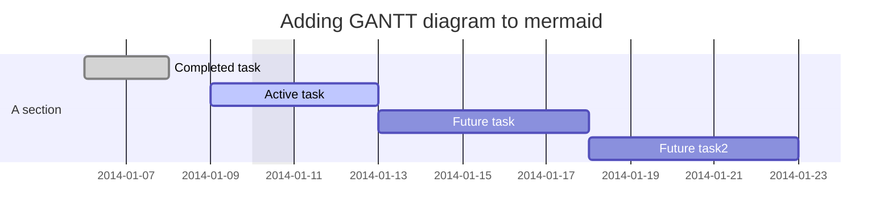



## Saluti e presentazioni

## comunicazioni ufficiali

- **test d'ingresso di matematica**:

> Il giorno `giovedì 16/09/2021,` nella mia ora, si terrà il `test d'ingresso di matematica`:
>
> - **argomenti**: il programma dello scorso anno scolastico.
>   - calcolo
>   - proprietà delle potenze
>   - operazioni con le frazioni
>   - geometria
>   - proporzioni, percentuali
>   - semplici problemi

- **piano estate - terza fase**:
  - si tratta di uno sportello pomeridiano con incontri settimanali, di 1,5 ore ciascuno.
    - durerà fino a dicembre
    - verrà proposto agli studenti sulla base dei risultati del test d'ingresso
    - è aperto a tutti coloro che dovessero sentirne il bisogno
    - avrete un prof. diverso da me: ci scambiamo le classi
    - prossimamente riceverete tutti i dettagli

---

## materiali didattici

- `Google Classroom`:
- `codice classe`: [Google Classroom corsi](https://classroom.google.com/u/0/h)
  - comunicazioni
  - assegnazione compiti (eventualmente anche sul Registro El.)
  - post di varia natura:
    - per consigliare un video su YouTube
    - suggerimenti
    - **materiale didattico**: dispense, video, esercizi,

- Registro elettronico: `Classeviva Spaggiari`:
  - comunicazioni ufficiali, verifiche e interrogazioni, note, voti.

- Libro di testo: **`MultiMath Verde`** - `M. Baroncini, R. Manfredi - vol. 1 - ed. *Ghisetti&Corvi*`
  - `non strettamente indispensabile in classe`
  - versione digitale su iPad? *parliamone*...

- Appunti dalle lezioni:
  - quaderno, suddiviso in 2 parti (o 2 quaderni, oppure uno ad anelli, etc.)
     1. appunti dalle lezioni
     2. esercizi

## La lezione

- Le `regole` del *gioco*
- gli `strumenti didattici`

## attività in autonomia

- prevalentemente si tratterà di:
  - revisione degli appunti
  - approfondimenti sul testo
  - esercizi (...pochi)

**`Q:`** - quanto tempo è bene dedicare allo studio della matematica per rimanere al passo, senza fare troppa fatica?

**`A:`** - La risposta è piuttosto soggettiva, ma... ho qualche consiglio per voi.

---

## La verifica delle competenze

>- Le **abilità** rappresentano le capacità di applicare le **conoscenze** apprese, con lo scopo di risolvere problemi e portare a termini compiti.
>- Le **competenze** rappresentano la *capacità di unire conoscenze, abilità e capacità personali, sociali e metodologiche e utilizzarle nello studio e nello sviluppo personale*.

- Nel corso dell'anno verranno effettuate le seguenti **valutazioni** delle abilità-competenze-conoscenze:

1. **`verifica scritta`**:

> - [esempio verifica](./first-math-lesson.pdf)

- verrà effettuata una verifica per ogni modulo/argomento

**`Q:`** - come viene calcolato il punteggio e come si trasforma nel **voto finale**?

**`A:`** - Si tratta di un **algoritmo** che tiene conto di diverse variabili:

- livello di assimilazione dell'argomento
- capacità di ragionamento
- capacità di calcolo
- ordine
- etc.

1. **`verifica orale`**:

- la verifica orale potrà avvenire con modalità diverse, a seconda dei `livelli` e dai `ritmi` espressi dalla classe.

  - interrogazione classica: volontaria e/o *a sorpresa*
  - correzione di esercizi alla lavagna degli esercizi assegnati: non concordata
  - test su `Google Moduli`

1. **`controllo quaderni`**:

- l'attività di controllo dei quaderni serve a garantire una continuità di impegno anche nelle attività svolte in autonomia.

- `i voti raccolti nel corso del quadrimestre confluiranno in un ulteriore voto valido per l'orale - a fine quadrimestre.`

1. eventuali **`prove pratiche`**:

   - **Flipped-Classroom**: o altre attività da svolgere in coppie o piccoli gruppi
   - Solo a determinate `condizioni`

## Lezioni private

- collaboriamo...

## domande?

---

{}
This homepage section is an example of adding [elements](https://sourcethemes.com/academic/docs/writing-markdown-latex/) to the [*Blank* widget](https://sourcethemes.com/academic/docs/widgets/).

$$x^2 - 2x + 1$$

Backgrounds can be applied to any section. Here, the *background* option is set give a *color gradient*.

**To remove this section, delete `content/home/demo.md`.**
{}

