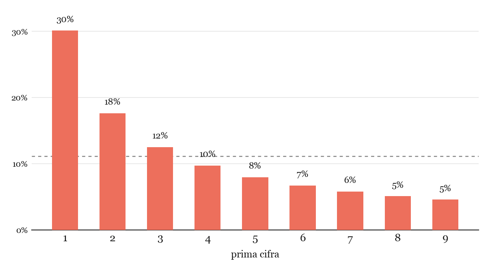

## Le pagine consumate di un libro di logaritmi

Nel 1938 il fisico americano **Frank Benford** lavorava ai General Electric Research Laboratories. Come tutti gli scienziati della sua epoca, per fare i calcoli usava tavole di logaritmi stampate su carta: libri spessi, fitti di numeri, consultati ogni giorno da chiunque avesse bisogno di moltiplicare o dividere qualcosa di complicato.

Un dettaglio gli saltò all'occhio — uno di quei dettagli che chiunque altro avrebbe ignorato distrattamente per anni: **le prime pagine della tavola erano molto più consumate, sporche e sgualcite delle ultime**. Le pagine iniziali contenevano i logaritmi dei numeri che cominciano con la cifra 1; le ultime, quelli dei numeri che cominciano con 9.

Possibile che le persone avessero davvero bisogno di calcolare più spesso logaritmi di numeri che iniziano per 1 piuttosto che per 9? A prima vista sembra assurdo: se i numeri "capitano" nei calcoli in modo casuale, ogni prima cifra da 1 a 9 dovrebbe comparire più o meno con la stessa frequenza, circa una volta su nove.

Benford non si limitò a intuire qualcosa: raccolse dati. Tantissimi dati, di ogni tipo — aree di fiumi, popolazioni di città, costanti fisiche, numeri tratti da riviste, indirizzi di case, pesi atomici. Oltre 20.000 numeri in totale. E scoprì che **non era affatto un caso**: in moltissimi insiemi di dati reali, il numero 1 compare come prima cifra circa il 30% delle volte, il 2 circa il 18%, e così via, in una distribuzione decrescente fino al 9, che compare solo il 4,6% delle volte.

## La formula

La legge — in realtà già osservata nel 1881 dall'astronomo Simon Newcomb, per lo stesso identico motivo (le pagine consumate delle tavole logaritmiche) ma poi dimenticata per quasi sessant'anni — afferma che la probabilità che la prima cifra significativa di un numero sia $d$ (con $d = 1, 2, \dots, 9$) è:

$$
P(d) = \log_{10}\left(1 + \frac{1}{d}\right) \tag{B}
$$

Da cui:

| $d$ | $P(d)$ |
|---|---|
| 1 | 30,1% |
| 2 | 17,6% |
| 3 | 12,5% |
| 4 | 9,7% |
| 5 | 7,9% |
| 6 | 6,7% |
| 7 | 5,8% |
| 8 | 5,1% |
| 9 | 4,6% |

Il grafico mostra bene quello che la tabella lascia solo intuire: la curva non è affatto piatta come ci si aspetterebbe da cifre "equiprobabili" (la linea tratteggiata all'11,1%), ma **crolla rapidamente** dal primo all'ultimo digit. Il numero 1 è più di sei volte più frequente del 9.

## Perché funziona: l'invarianza di scala

L'intuizione chiave è questa: se una legge sulla distribuzione delle cifre esiste davvero in natura, **non può dipendere dall'unità di misura** che scegliamo di usare. La lunghezza di un fiume espressa in chilometri o in miglia deve seguire la stessa legge sulle prime cifre — altrimenti la "legge" sarebbe solo un artefatto del sistema metrico scelto, non una proprietà dei numeri in sé.

Si può dimostrare che l'**unica** distribuzione di probabilità sulle prime cifre che resta invariata cambiando unità di misura — cioè moltiplicando tutti i dati per una costante qualsiasi — è proprio quella logaritmica di Benford. È una conseguenza elegante, e per nulla ovvia, della struttura del logaritmo: la proprietà $\log(ab) = \log a + \log b$ trasla semplicemente la distribuzione, e l'unica distribuzione "stabile" per traslazione su una scala ciclica — le cifre da 1 a 9 si ripetono a ogni ordine di grandezza — è proprio quella logaritmica stessa.

Detto in modo più semplice: la legge di Benford emerge quando i dati **spaziano su più ordini di grandezza**, come le popolazioni dei paesi (da poche migliaia a centinaia di milioni) o gli importi di fatture (da pochi euro a milioni di euro). Non funziona invece su insiemi "vincolati" a un intervallo stretto — per esempio le altezze delle persone in centimetri, che stanno quasi tutte tra 140 e 200 e non attraversano ordini di grandezza diversi.

## Come si scovano le frodi

Ed è qui che la storia diventa avvincente. Se i numeri "onesti" — bilanci reali, dati di censimento, importi di transazioni legittime — seguono la legge di Benford, allora **i numeri inventati da una persona non la seguono**, perché nessuno, quando falsifica cifre per un bilancio o una dichiarazione dei redditi, pensa istintivamente "devo far cominciare il maggior numero possibile di cifre con 1".

Negli anni Novanta il ricercatore **Mark Nigrini** trasformò questa osservazione in uno strumento reale di *forensic accounting*: applicando la legge di Benford ai bilanci aziendali, ai rimborsi spese, alle dichiarazioni fiscali, è possibile individuare in modo statistico gli insiemi di numeri "sospetti" — quelli che si discostano troppo dalla distribuzione attesa — e concentrare lì i controlli. Il metodo è oggi usato realmente da revisori contabili e agenzie fiscali, incluso l'IRS statunitense, ed è stato impiegato anche per analizzare anomalie in alcuni set di risultati elettorali (con tutte le cautele metodologiche del caso: la legge di Benford è un indizio statistico, non una prova, e va applicata solo a dati che ne rispettano le condizioni — range ampio, nessun limite artificiale ai valori). Proprio perché i dati manipolati "a mano" tradiscono quasi sempre una firma statistica diversa da quella dei dati genuini, un discostamento marcato è un buon punto da cui partire a indagare, non una condanna.

## Dai logaritmi al detective: portarla in classe

Questa storia è un ponte perfetto tra due mondi che a scuola sembrano lontanissimi: i **logaritmi**, spesso percepiti come pura tecnica di calcolo senza vita, e la **probabilità e statistica** applicate a un problema quasi investigativo.

Un'attività efficace in classe:

- far raccogliere agli studenti un insieme di dati reali con ampio range di ordini di grandezza (popolazione dei comuni italiani, numeri civici, valori di bilancio di un'azienda quotata, persino il numero di "mi piace" sotto dei post social)
- contare le prime cifre e confrontare la distribuzione osservata con quella teorica prevista dalla formula $(B)$
- discutere perché la legge funziona (invarianza di scala) e perché no su altri insiemi di dati, vincolati in un range stretto

È un esempio raro in cui uno **strumento puramente matematico**, nato da un'osservazione quasi aneddotica su pagine di carta consumate, diventa concretamente uno strumento investigativo usato ancora oggi.
