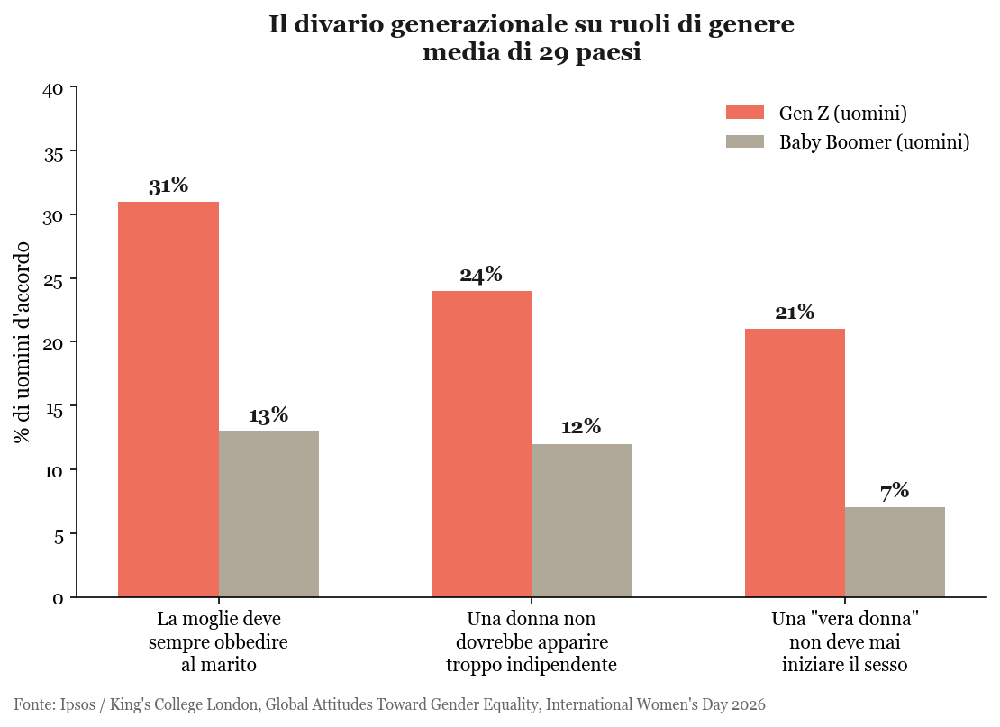
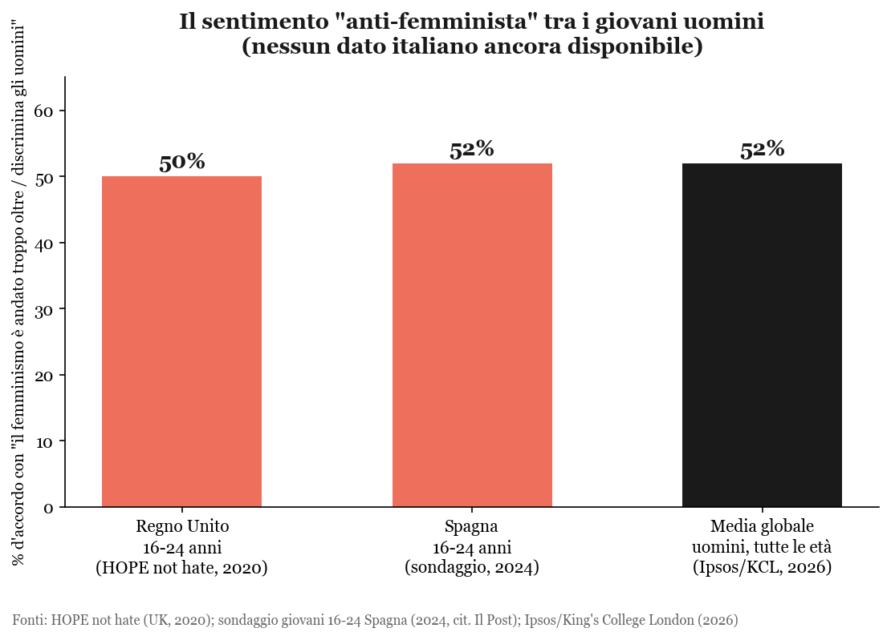

## Di cosa si tratta

Il fenomeno di cui si parla sempre più spesso — anche in TV, anche a scuola — si chiama **manosfera** (in inglese *manosphere*). È il nome collettivo per un insieme eterogeneo di community online, siti, forum, canali YouTube/TikTok e influencer che promuovono una visione reazionaria della mascolinità, spesso in aperta opposizione al femminismo e ai movimenti per la parità di genere.

Il termine indica un ecosistema, non un singolo movimento organizzato: raccoglie gruppi diversi che condividono un nucleo ideologico comune, ma con toni e obiettivi molto diversi tra loro.

### I protagonisti: chi sono i gruppi, chi sono le figure

- **Incel** ("involuntary celibate") — uomini che vivono la mancanza di relazioni sessuali/affettive come un'ingiustizia sistemica; è il sottogruppo più studiato per i legami con episodi di violenza reale (tra cui l'attacco di Toronto del 2018)
- **MGTOW** ("Men Going Their Own Way") — uomini che scelgono il ritiro dalle relazioni con le donne, ritenute uno svantaggio evolutivo/economico per il maschio
- **MRA** (Men's Rights Activists) — attivismo per i "diritti degli uomini", spesso costruito appropriandosi del linguaggio dei diritti civili e della discriminazione per rappresentare gli uomini come vittime
- **PUA** (Pick-Up Artists) — insegnano tecniche di manipolazione psicologica per ottenere sesso, arrivando a deridere apertamente il concetto stesso di consenso
- **Looksmaxxing** — community centrate sull'"ottimizzazione" estetica del corpo maschile, dove gli utenti vengono valutati con punteggi di attrattività e, secondo una ricerca della Dalhousie University, sottoposti a una vera e propria **demoralizzazione mascolina** ("sei un uomo fallito"), che in alcuni casi arriva a incoraggiare l'autolesionismo
- **Influencer e "coach di mascolinità"** — figure come **Andrew Tate**, che uniscono culto del corpo, ostentazione di ricchezza e disprezzo esplicito per le donne, spesso monetizzando corsi a pagamento

## Il nucleo ideologico: perché richiama gli anni '50

Il tratto più riconoscibile è il richiamo a un virilismo "vecchio stile": l'uomo "vincente" misurato in base a successo economico, dominanza sociale e conquiste sessuali, esibiti costantemente sui social. Un'estetica che l'immagine di apertura — l'uomo in giacca, braccia alzate verso i grattacieli — riassume bene: è esattamente il tipo di immaginario patinato che i "coach di mascolinità" costruiscono e vendono.

## La psicologia: perché funziona, e su chi funziona

La domanda più importante, per chi lavora con adolescenti, non è "cosa dice la manosfera" ma **perché attecchisce**. La letteratura psicologica e sociologica converge su alcuni meccanismi ricorrenti:

- **"Aggrieved entitlement"** (il sociologo Michael Kimmel) — non è la semplice rabbia di chi ha perso qualcosa, ma la sensazione di essere stato privato di un privilegio che si riteneva dovuto per nascita. È un cocktail specifico di perdita e rivendicazione che si presta perfettamente alla radicalizzazione: il problema non sono io, sono "loro" che mi hanno tolto ciò che mi spettava
- **Radicalizzazione lenta del disagio emotivo** — solitudine, frustrazione, insicurezza corporea o relazionale vengono prima ascoltate (le community della manosfera spesso sono il primo posto dove un ragazzo si sente "capito"), poi progressivamente reindirizzate verso una spiegazione ideologica e un bersaglio esterno: donne, femminismo, minoranze
- **Post-ironia** — la studiosa Angela Nagle ha descritto come il linguaggio online mescoli scherzo e serietà "con cuciture invisibili": una battuta misogina o razzista può sempre essere derubricata a "era solo un meme", il che abbassa la soglia di allarme sia in chi la dice sia in chi la legge
- **Incentivo algoritmico** — le piattaforme non promuovono questi contenuti per convinzione ideologica, ma perché sensazionalismo e conflitto generano più tempo di visione: l'engagement, non la misoginia in sé, è il motore economico che amplifica la "conveyor belt"

### Una violenza che non è solo fisica, e non è solo verso le donne

Qui serve un chiarimento importante, perché il rischio è di pensare alla manosfera solo come "l'anticamera del femminicidio". Le ricerche descrivono almeno tre livelli di violenza, spesso sottovalutati proprio perché non lasciano segni visibili:

1. **Violenza psicologica verso le donne** — i corsi PUA insegnano esplicitamente tecniche di **manipolazione e controllo coercitivo** (isolamento, svalutazione sistematica, gestione delle insicurezze altrui), non solo "tecniche di seduzione": è violenza psicologica anche quando non sfocia mai in un contatto fisico
2. **Violenza verso sé stessi** — nelle community *looksmaxxing* e incel, la pressione a corrispondere a uno standard di "mascolinità riuscita" produce dismorfismo corporeo, autolesionismo, isolamento sociale; diversi studi collegano l'adesione a modelli di mascolinità rigida a più alti tassi di depressione, abuso di sostanze e ideazione suicidaria negli uomini stessi — la manosfera, in questo senso, fa male anche a chi la abita, non solo a chi ne subisce le conseguenze esterne
3. **Violenza indiretta sulle istituzioni** — una ricerca citata dal Center for Countering Digital Hate ha rilevato che il livello di adesione degli studenti maschi alla manosfera, all'interno di una scuola, **predice i sintomi depressivi e lo stress lavorativo delle insegnanti** di quella stessa scuola: un effetto di clima, non di singoli episodi

Tenere insieme questi tre livelli — verso le altre, verso sé stessi, verso il contesto — è probabilmente il modo più corretto, e più utile a scuola, di spiegare perché la manosfera è un problema serio anche prima che produca una vittima in senso stretto.

## I numeri: cosa sappiamo (e cosa no)

Da insegnante di matematica, la prima domanda che mi sono fatto è: **i dati confermano l'impressione**, o è solo un fenomeno amplificato dal ciclo delle notizie? La risposta, con onestà, è duplice: **i dati internazionali sì, i dati italiani quasi per niente**.

### Il divario generazionale è reale — a livello globale

Il sondaggio Ipsos, condotto con il Global Institute for Women's Leadership del King's College London in 29 paesi per l'8 marzo 2026, misura un divario netto tra generazioni sulle stesse identiche domande:

Il salto tra generazioni non è un dettaglio statistico: sulla domanda se "una vera donna non debba mai prendere l'iniziativa nel sesso", gli uomini Gen Z sono **tre volte più d'accordo** dei Baby Boomer (21% contro 7%). Un'inversione di tendenza rispetto a quello che ci si aspetterebbe da un processo lineare di progresso sociale.

### Il sentimento "anti-femminista" tra i giovani uomini

Altri due sondaggi, uno britannico e uno spagnolo, condotti su giovani 16-24 anni, misurano quanto le idee della manosfera abbiano attecchito:

- **Regno Unito** (HOPE not hate, 2020, campione 2.076 persone 16-24 anni): il **50%** dei ragazzi ritiene che il femminismo abbia reso la vita più difficile agli uomini.
- **Spagna** (2024, giovani 16-24 anni): il **52%** ritiene che il femminismo abbia "esagerato" al punto da discriminare ora gli uomini.
- **Media globale** (Ipsos/KCL, 2026, uomini di tutte le età, 29 paesi): **52%** concorda con l'idea che si sia "andati troppo oltre" nel promuovere l'uguaglianza di genere, arrivando a discriminare gli uomini.

### E in Italia?

Qui viene la parte più interessante dal punto di vista statistico — e la più scomoda. **Non esiste, ad oggi, un sondaggio italiano che misuri specificamente l'adesione dei giovani alle idee della manosfera.** Lo confermano sia le testate che hanno seguito da vicino il fenomeno (Il Post, marzo 2026: *"mancano dati di questo tipo in Italia"*), sia le grandi ricerche internazionali, che pubblicano medie sui 29 paesi ma raramente disaggregano il dato Italia sui singoli item.

Quello che invece l'Italia misura con precisione — perché lo fa da anni, con metodo consolidato — è **l'esito estremo** della stessa cultura: femminicidi, violenza domestica e sessuale. I dati Istat sono chiari (6,8 milioni di donne, il 31,5% tra 16 e 70 anni, ha subito violenza fisica o sessuale almeno una volta nella vita) e verranno ripresi in dettaglio nella presentazione collegata. Quello che manca è l'anello intermedio: **quanto le idee della manosfera circolino tra i ragazzi italiani prima che si traducano in comportamento**. È esattamente il tipo di "buco nei dati" che, da insegnante, trovo più preoccupante di un numero alto: non sapere dove si è, in una fase in cui si potrebbe ancora intervenire per tempo.

## Il legame con l'estrema destra

Non è un collegamento casuale, ma una traiettoria documentata:

- La manosfera nasce online attorno al 2009, durante la Grande Recessione, in un clima di crisi economica e disorientamento maschile
- Nel corso degli anni 2010 si è progressivamente saldata con il **populismo di destra e movimenti neofascisti**, che trovano nel "maschio forte" un simbolo funzionale alla propria retorica identitaria
- Gli algoritmi delle piattaforme social (in particolare YouTube e TikTok) tendono ad amplificare questi contenuti, creando percorsi di radicalizzazione progressiva — spesso descritti come una "conveyor belt" che porta ragazzi giovani da contenuti apparentemente innocui (fitness, self-help) fino a contenuti esplicitamente misogini o di estrema destra
- Nel dibattito pubblico (anche negli Stati Uniti, con audizioni al Congresso) la manosfera è ormai considerata un vettore di radicalizzazione giovanile, al pari di altri fenomeni estremisti online

## Origine del termine "mascolinità tossica"

Curiosamente, l'espressione "mascolinità tossica" non nasce in ambito femminista, ma negli anni '80 all'interno del **movimento mitopoietico maschile** (mythopoetic men's movement), che la usava per descrivere modelli di virilità dannosi anche per gli uomini stessi. Il termine è stato poi ripreso e diffuso con un significato più ampio dal dibattito su genere e femminismo.

## Per approfondire

- Mental Health Commission of Canada, ["The Manosphere and Mental Health"](https://mentalhealthcommission.ca/fact-sheets/public/the-manosphere-and-mental-health/)
- inGenere, ["Manosfera, la rivolta dei maschi umiliati"](https://www.ingenere.it/articoli/uomosfera-rivolta-maschi-umiliati)
- Center for Countering Digital Hate, ["Inside the manosphere: understanding extreme misogyny online"](https://counterhate.com/blog/inside-the-manosphere-understanding-extreme-misogyny-online/)
- Università Cattolica del Sacro Cuore — Polidemos, ["Viaggio nella manosfera: la condizione maschile nell'era digitale"](https://centridiricerca.unicatt.it/polidemos-notizie-viaggio-nella-manosfera-la-condizione-maschile-nell-era-digitale)
- Ipsos / King's College London, ["Mind the Gaps: Global Attitudes Toward Gender Equality in 2026"](https://www.ipsos.com/en/international-womens-day-2026)
- Terre des Hommes Italia, ["Manosfera e violenza di genere: la cultura tossica online"](https://terredeshommes.it/news/manosfera/)
- Kritica.it, ["Misogynistic violence from the 'supreme gentleman' to the manosphere"](https://kritica.it/en/society/la-violenza-misogina-dal-gentiluomo-supremo-alla-manosphere/)
- APA Blog, ["Becoming Hard: The Manosphere as Radicalization Conveyer Belt for the Neofascist Far Right"](https://blog.apaonline.org/2026/06/19/becoming-hard-the-manosphere-as-radicalisation-conveyer-belt-for-the-neofascist-far-right/)
- The Conversation, ["How boys get sucked into the manosphere"](https://stories.theconversation.com/how-boys-get-sucked-into-the-manosphere/)
- Il Post, ["La 'manosfera' è sempre più visibile"](https://www.ilpost.it/2025/03/27/definizione-fenomeno-manosfera/)
- Congresso USA, [audizione sulla manosfera oltre Andrew Tate](https://www.congress.gov/118/meeting/house/115561/documents/HHRG-118-IF16-20230328-SD033.pdf)
