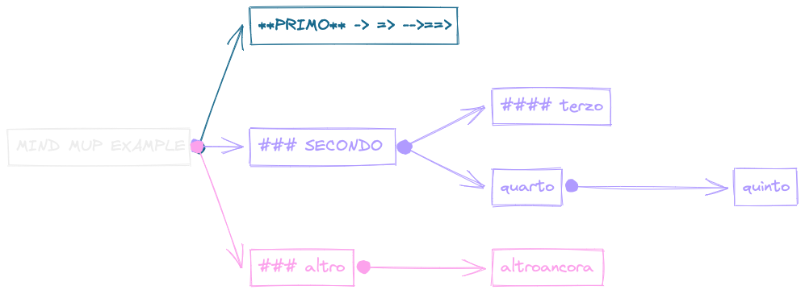

<!--  -->

> - references:
>   - [The Cornell Note Taking System](https://lsc.cornell.edu/how-to-study/taking-notes/cornell-note-taking-system/)
<!--   - [versione pdf](./metodo-Cornell.pdf) -->

---

## Il Metodo Cornell

>Ideato quasi 80 anni fa dal prof. Walter Pauk della Cornell University di New York, **il metodo Cornell** è un sistema efficace per prendere appunti.

- Nonostante la sua semplicità – alla fine si tratta di un foglio diviso in 3 parti – il metodo Cornell ti permette di seguire una lezione, una conferenza, una riunione di lavoro:

- Mantenendo la `concentrazione` ai massimi livelli;
- Aumentando `comprensione` e `coinvolgimento`;
- Fornendo materiale di sudio `chiaro` e `ordinato`, pronto (o quasi) per essere memorizzato

Vediamo innanzi tutto, che cosa non funziona nella maniera in cui, normalmente, si prendono gli appunti.

## Metodo tradizionale vs Metodo Cornell

- La maggior parte delle persone, quando prende appunti, si limita a cercare di `trascrivere` le informazioni $\rightarrow$ input che riceve.

- **Si ascolta passivamente**, ed altrettanto passivamente si trasferiscono sul quaderno quello che si ascolta.

- Nel farlo, il cervello lavora in modo **poco efficiente**.

- La concentrazione si abbassa, subentra la noia e ovviamente la **qualità** totale del lavoro cerebrale crolla.

- Il flusso di informazioni rimane **a uno stato di analisi e manipolazione superficiale**: quello in cui ci si limita a trasformare i suoni in parole di senso compiuto e a metterle su carta.

- Se poi, mentre si ascolta, ci si preoccupa soprattutto di trascrivere tutto, ciò non fa altro che aggiungere inefficienza a inefficienza.

  - Non rimane tempo per pensare, e quindi scompare ogni coinvolgimento intellettuale rispetto a quello che si ascolta.

  - Poiché è difficile scrivere tutto, il livello di attenzione e comprensione si abbassa ulteriormente: Si è infatti troppo impegnati a non farsi sfuggire neanche una parola.

  - Si ha solo **l’illusione di ascoltare**; ma in realtà si sta lavorando più o meno come un *registratore*, ma non altrettanto veloce.

- Il metodo Cornell invece, prescrivendo delle regole precise di compilazione degli appunti, **costringe** ad intervenire, fin da subito, sulle informazioni che si ricevono.

>In particolare, si tratta di:
>
>- `Selezionare`, secondo priorità, le informazioni che vengono date
>- `Concettualizzarle`
>- `Comprimerle` in maniera che siano più sintetiche
>- `Organizzarle`
>- `Prepararle` per un ripasso efficace

`Q - Ma come funziona nella pratica?`

## Le tre sezioni del foglio nel Metodo Cornell

### 1. Sezione di destra degli appunti Cornell (area A)

- E’ quella in cui vengono presi gli appunti veri e propri.

- In alto, intesta il foglio con quelli che potremmo definire i dati anagrafici della lezione `data, tema, relatore`, etc).
- Sotto ad essi, scrivi gli appunti veri e propri, utilizzando:
  - **parole tue**, aiuta a concettualizzare
  - **liste con elenchi** puntati e/o numerati: aiuta a dare ordine e gerarchia alle informazioni
  - `Sintesi`, come su twitter: aiuta a cogliere l’essenza
  - `Abbreviazioni`: come in un sms; aiuta a ponderare le parole;
  - `Frecce` e collegamenti, per evidenziare i rapporti logici
  - `Disegni` esplicativi: stimolano la parte *visiva* e creativa della  corteccia cerebrale;
  - `Commenti`con **note “emotive”** (“Che schifo!” “Interessante!” “Bello!”): aiutano il processo di memorizzazione;
  - `Caratteri`: usando *corsivo*, **grassetto**, MAIUSCOLO, minuscolo, sottolineato etc.

### 2. Sezione di sinistra degli appunti Cornell (Area B)

E’ la sezione dedicata alle **parole chiave**, che devono essere:

1. **Poche**: il meno possibile, anche perché lo spazio a disposizione è volutamente ridotto
2. **Sintetiche**: cioè non frasi, ma singoli sostantivi/aggettivi
3. **Evocative:** devono ricordare il contenuto della sezione di destra sia a livello concettuale che mnemonico

>Sono proprio questo tipo di limiti, non facili da rispettare, a rendere efficace il Metodo Cornell.

### 3. Sezione inferiore degli appunti Cornell (Area C)

- `riassunto` del contenuto delle pagina.
  - annotare domande, fare brevi considerazioni, appuntarsi promemoria, impressioni, collegamenti, o tutto ciò che si ritiene possa essere utile.
    - Per es. *Quanto detto mi ricorda che …. Come mai capita X … Vai a rivedere il testo Z … etc.*
    - An che questa parte può essere iniziata durante la lezione, ma viene per lo più svolta dopo.

## Perché il metodo Cornell è efficace

L’efficacia del metodo Cornell si basa su due fatti principali:

1. **Durante la lezione**, costringe all’`ascolto attivo`, e lo rende ancora più performante poiché dev'essere trasferito su carta, chiudendo così il *loop* cerebrale `ascolto-rielaborazione-azione`.

- L’informazione che dev'essere acquisita compie in questa maniera un ciclo completo e diventa molto più stabile anche da un punto di vista mnemonico.

1. **Dopo la lezione**, costringe a *rielaborare il materiale* in maniera **analitica e sintetica**, e permette poi il **ripasso a tre livelli** di dettaglio differenti:

   - quello dei riassunti (sezione inferiore),
   - quello delle parole chiave (sezione sinistra),
   - quello del totale degli appunti (sezione destra), con ciascun livello che può essere ripassato separatamente o insieme agli altri.

>Non solo quindi **si impara di più mentre si prendono gli appunti**, ma si ha anche a disposizione uno strumento di studio/ripasso più **strutturato e veloce.**

## Conclusioni sul Metodo Cornell

- Molte persone, quando prendono appunti oppure scrivono schemi, sottolineano, fanno mappe, leggono un libro, commettendo un errore fondamentale: **si mette tutto sullo stesso piano.**

  - Ci si concentra cioè sulla quantità delle informazioni, cercando di non farsene sfuggire nessuna.
  - Purtroppo, però, l’ansia di non perdersi nulla, alla fine diventa solo un esercizio di trascrizione *meccanico*, per non dire inutile.

- Il risultato, paradossale, è che dopo pochi minuti già non ci si ricorda quasi nulla di ciò che si è scritto, e gli appunti o schemi prendono l’aspetto di **muri impenetrabili** di parole.

- Il giusto approccio, invece, è dedicarsi agli aspetti **qualitativi**, cominciando fin da subito a `valutare`, `analizzare` e soprattutto `scegliere` quello su cui vale la pena concentrarsi.
- In questa maniera, grazie allo sforzo mentale che richiedono queste operazioni, il processo di apprendimento inizierà già da subito.

- Quando ci si sforza a revisionare il materiale di studio secondo alcune regole precise, riesci ad aumentare:
  - la **velocità** con cui viene `processato` il materiale;
  - la **memorizzazione**;
  - la **comprensione**, come quando si rielabora il materiale di studio.

- Al contrario, quando ci si comporta in **maniera passiva**, sperando che, a forza di ripeterlo, il materiale si trasferisca - come per osmsosi - al cervello, i risultati sono piuttosto deludenti, soprattutto per le materie tecnico-scientifiche.

>`anche quando si utilizza il metodo Cornell si possono perdere delle informazioni: se essa è davvero importante potrà essere integrata in un secondo momento poiché sarà presente in molte fonti: web, YouTube, libri di testo, etc.`

- Una volta invece che si investe del tempo nel prendere degli appunti dei quali non si ricorderà praticamente nulla: *quel tempo è perso per sempre.*



<!--  -->
