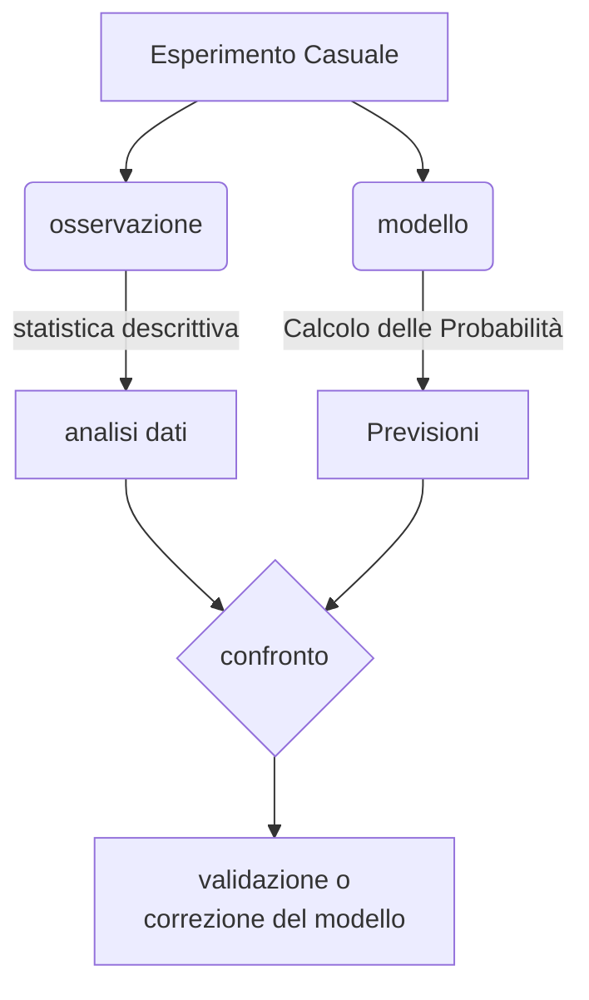

<!--  -->

# Il concetto di modello matematico

>### Probabilità e particelle
>
> Nel 1820 Pierre Simon de Laplace, nel suo Théorie analytique des probabilités, scriveva:
>	"Noi dobbiamo dunque considerare lo stato presente dell'universo come effetto del suo stato anteriore e come causa del suo stato futuro. Un'intelligenza che, per un dato istante, conoscesse tutte le forze di cui è animata la natura $[\ldots]$ abbraccerebbe nella stessa formula i movimenti dei più grandi corpi dell'universo e dell'atomo più leggero: nulla sarebbe incerto presente ai suoi occhi" 
> 
>Laplace riteneva che il calcolo delle probabilità fosse utile in tutte quelle situazioni in cui è difficile ottenere informazioni molto precise sulle grandezze in gioco, ma che sarebbe possibile conoscere con esattezza posizione e velocità di ogni singola particella dell'universo.
> 
>Nel 1927 Werner Heisenberg enunciava il principio di indeterminazione, affermando che il prodotto delle incertezze di due grandezze coniugate (per esempio, posizione e quantità di moto) non può essere minore del rapporto fra la costante di Planck e $2 \pi$.
> 
>- Nel mondo macroscopico gli effetti di questo principio sono irrilevanti, perché la costante di Planck è molto piccola. 
>- Nel mondo atomico e subatomico, invece, le conseguenze sono significative e sorprendenti. 
>	- Per esempio, affermare che non è possibile conoscere con la precisione voluta sia la quantità di moto sia la posizione di una particella, implica che perde significato il concetto di traiettoria.
> 
>Non ha quindi senso parlare di traiettoria di un elettrone, ma solo di probabilità di trovare l'elettrone in una determinata posizione. A differenza di ciò che affermava Laplace, l'approccio probabilistico non è allora un utile stratagemma per ovviare alla nostra ignoranza, ma una necessità per comprendere la natura del mondo.

>Nei casi concreti, l'analisi e la modellizzazione di un fenomeno casuale avviene solitamente secondo le fasi sintetizzate nel seguente schema.

- La costruzione del modello del fenomeno casuale consiste nel definire alcune `variabili aleatorie` che descrivono il fenomeno in esame e assegnare a tali variabili aleatorie una distribuzione di probabilità. 
  - Questa fase è la più delicata perché comporta un certo grado di <mark class="hltr-yellow">arbitrarietà</mark> nella scelta della distribuzione più adeguata.
- Naturalmente, nella costruzione del modello non si procede arbitrariamente, ma si cerca di descrivere nel miglior modo possibile gli aspetti d'interesse del fenomeno che si sta studiando. 
- Tuttavia, dopo aver trovato un modello che, almeno a priori, sembra ragionevole, esso dovrà essere _messo alla prova_, **confrontando** le previsioni che consente di effettuare con i dati empirici. 
  - Nel caso si riscontrino delle significative discrepanze con i dati reali, occorre cercare di **modificare** il modello per renderlo più aderente alla realtà; 
  - nel caso in cui, invece, si abbia **conferma** di aver trovato un buon modello, non è tuttavia detto che esso sia necessariamente l'unico valido o che non sia ulteriormente migliorabile. 

>Si intravede così la moderna concezione di modello matematico come **rappresentazione formale di un fenomeno**, che non pretende di spiegarlo o di scoprirne l'intima essenza, ma solo di darne un'immagine che descriva bene alcuni suoi aspetti. 

- Un modello va dunque valutato soltanto in base alla sua **efficacia** e un buon modello non è detto che sia l'unico possibile. 
Si tratta di un approccio opposto a quello della fisica classica: 
  - per Newton l'obiettivo fondamentale non era l'utilità ma la <mark class="hltr-cyan">ricerca della verità</mark>, la scoperta delle cause di un fenomeno, la loro spiegazione, fino a giungere alla causa prima. 
  - Non è un caso, quindi, che la moderna modellistica matematica e la diffusione dei modelli matematici anche nell'ambito di discipline diverse dalla fisica abbiano avuto origine proprio con la crisi di uno dei principi fondamentali della fisica classica: quello del <mark class="hltr-cyan">determinismo</mark>, secondo cui *la conoscenza della posizione e della velocità di un punto materiale, nonché della legge del suo moto, determinano in modo univoco la sua evoluzione*.

- A scardinare questo principio fu principalmente la scoperta, da parte di Werner Karl Heisenberg (1927), che <mark class="hltr-yellow">a livello microscopico la *posizione* e la *velocità* di una particella non possono essere determinate simultaneamente</mark>; si può soltanto determinare la **probabilità** che la particella si trovi in un punto anziché in un altro, oppure che abbia una velocità piuttosto che un'altra. 

>- Il comportamento della particella non può dunque essere previsto in modo certo, come normalmente accadeva nella fisica classica.

- Ne seguì una progressiva crisi della concezione puramente deterministica, che lasciò gradualmente spazio a un approccio nuovo ai problemi, di tipo <mark class="hltr-green">**modellistico e probabilistico**</mark>, ben sintetizzato dalle parole di uno dei massimi scienziati del novecento, John von Neumann (1903-1957):
  
> "Le scienze non cercano di spiegare, a malapena tentano di interpretare, ma fanno soprattutto dei modelli. Per modello si intende un costrutto matematico che, con l'aggiunta di certe interpretazioni verbali, descrive dei fenomeni osservati. La giustificazione di un siffatto costrutto matematico è soltanto e precisamente che ci si aspetta che funzioni, cioè che descriva correttamente i fenomeni di un'area ragionevolmente ampia".