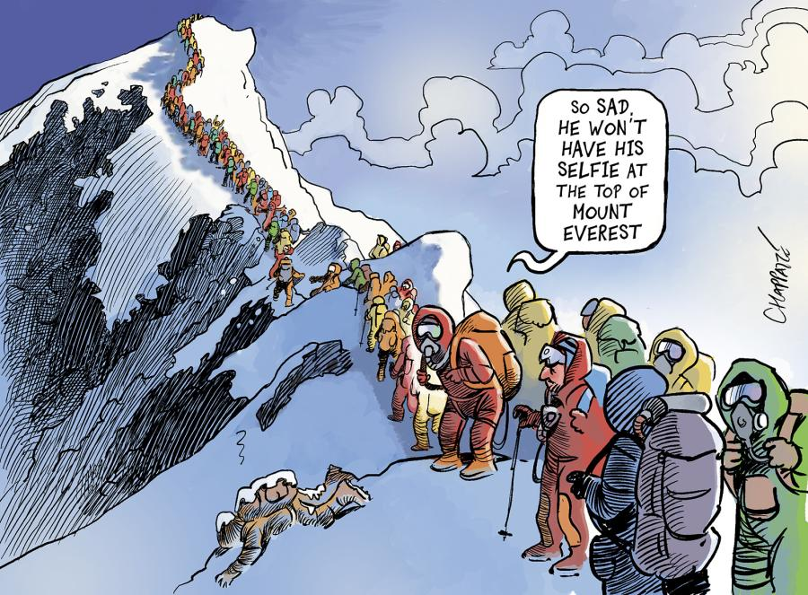
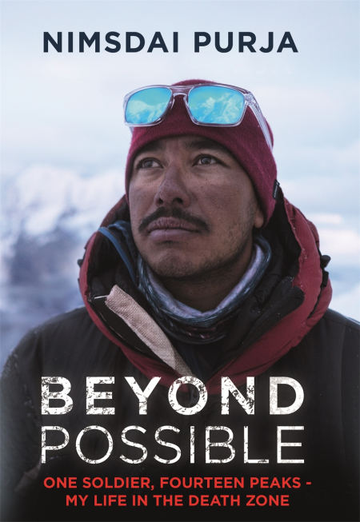

## Una valanga, dieci nomi

Il 30 luglio 2026 una valanga si è staccata sul Broad Peak, 8047 metri, catena del Karakoram, Pakistan. Ha travolto dieci alpinisti, impegnati in una spedizione in quota. Non ci sono stati sopravvissuti.

Tra le vittime, cinque erano guide nepalesi: Pur Bahadur Gurung, detto "Yukta", Kili Pemba Sherpa, detto "Kilu", Gyalu Sherpa, Nima Sherpa e Nawang Thindu Sherpa. E poi c'era lui: **Nirmal Purja**, per tutti "Nims Dai", 42 anni, ex Gurkha ed ex membro delle forze speciali britanniche, diventato — nel giro di pochi anni — la figura che più di ogni altra ha cambiato il modo in cui il mondo guarda agli sherpa e alle guide himalayane.

Per i più, un nome sconosciuto. Per chi segue l'alpinismo d'alta quota, il *GOAT* — "the Greatest Of All Time". Questo articolo non è una cronaca della tragedia: quella spetta ai reporter e alle agenzie che seguono le spedizioni sul campo. È, piuttosto, un tentativo di raccontare perché quel soprannome non fosse esagerato — con gli strumenti che so usare meglio, cioè i numeri.

## Chi era Nims Dai, in tre righe

Nato in Nepal nel 1983, Purja entra giovanissimo nei Gurkha dell'esercito britannico e poi nelle forze speciali. Scopre l'alpinismo d'alta quota relativamente tardi, dopo i trent'anni. In pochi anni passa da alpinista sconosciuto a protagonista assoluto della scena himalayana, ridefinendo cosa significhi "velocità" quando si parla di ottomila metri — le quattordici montagne della Terra che superano quella soglia, l'unico luogo dove il corpo umano smette progressivamente di rigenerarsi anche da fermo: la cosiddetta *death zone*.

La sua impresa più nota si chiama **Project Possible**: scalare tutti e 14 gli ottomila del pianeta nel tempo più breve mai registrato. Ci è riuscito. Vediamo di cosa parliamo, in cifre.

## Il record, prima di Purja

Il primo uomo a completare la collezione dei 14 ottomila fu Reinhold Messner, che ci mise **16 anni, 3 mesi e 19 giorni** (1970-1986). Un'impresa leggendaria, diventata per decenni il metro di paragone dell'alpinismo estremo.

Il record di velocità più recente prima di Purja apparteneva al sudcoreano Kim Chang-ho: **7 anni, 10 mesi e 6 giorni** — un dimezzamento rispetto a Messner, già di per sé notevole.

$$
\text{Messner: } 16\text{a } 3\text{m } 19\text{g} \quad\longrightarrow\quad \text{Kim Chang-ho: } 7\text{a } 10\text{m } 6\text{g}
$$

Espresso in giorni: Messner impiega circa 5.947 giorni, Kim Chang-ho circa 2.867. Un fattore di riduzione di poco più di 2 volte in trent'anni di storia dell'alpinismo.

## Project Possible: 6 mesi e 6 giorni

Tra il 23 aprile e il 29 ottobre 2019, Nirmal Purja scala tutti e 14 gli ottomila in **6 mesi e 6 giorni**, circa 190 giorni. Confrontato con Kim Chang-ho, è una riduzione di oltre **15 volte**. Confrontato con Messner, il rapporto sfiora le **31 volte**.

$$
\frac{5947 \text{ giorni (Messner)}}{190 \text{ giorni (Purja)}} \approx 31 \tag{1}
$$

Un numero che, da solo, fatica a rendere l'idea: non è un miglioramento incrementale, è un cambio di ordine di grandezza. Per capire come sia stato fisicamente possibile bisogna scendere nel dettaglio della sua tabella di marcia.

- **6 ottomila nepalesi in 31 giorni**: Annapurna, Dhaulagiri, Kangchenjunga, Everest, Lhotse, Makalu.
- **5 ottomila pakistani in 23 giorni**: Nanga Parbat, Gasherbrum I, Gasherbrum II, K2, Broad Peak — sì, la stessa montagna della valanga del 2026.
- **Everest, Lhotse e Makalu in 48 ore e 30 minuti**: tre vette sopra gli 8000 metri, separate da decine di chilometri e migliaia di metri di dislivello, in meno di due giorni.

Quest'ultimo dato merita un secondo sguardo. Tre ottomila in 48 ore e mezza significa una media di **una vetta ogni 16 ore circa**, includendo discese, spostamenti tra i campi base e il tempo di recupero fisiologico minimo indispensabile in quota. Nella *death zone*, dove ogni ora di permanenza consuma riserve che il corpo non riesce a ricostituire, è un ritmo che gli alpinisti dell'epoca di Messner avrebbero considerato incompatibile con la sopravvivenza, non solo con la performance.

## Un confronto di velocità

Proviamo a mettere i tre record sulla stessa scala, calcolando il "tempo medio per vetta":

$$
\bar t = \frac{\text{tempo totale}}{14 \text{ vette}}
$$

- Messner: $5947 / 14 \approx 425$ giorni per vetta (oltre un anno)
- Kim Chang-ho: $2867 / 14 \approx 205$ giorni per vetta
- Purja: $190 / 14 \approx 13{,}6$ giorni per vetta

Il rapporto tra il tempo medio per vetta di Messner e quello di Purja è lo stesso 31 calcolato sopra in (1): la matematica, qui, non fa che confermare per un'altra via ciò che il cronometro aveva già mostrato. Ma nei momenti di punta della spedizione — i tre ottomila in 48 ore — Purja ha lavorato a un ritmo istantaneo ancora più estremo di quello medio, comprimendo in due giorni ciò che la sua stessa media avrebbe previsto in oltre 40.

## Perché "pochi lo conoscevano"

I nomi che restano nella memoria collettiva dell'alpinismo sono quasi sempre occidentali: Messner, Hillary. Gli sherpa e le guide nepalesi che rendono possibili quelle imprese — portando i carichi, fissando le corde, aprendo la via nel ghiaccio — restano tradizionalmente sullo sfondo. Purja è stato tra i primi a rompere questo schema, rivendicando pubblicamente il ruolo delle guide nepalesi e diventando lui stesso, con Project Possible, il protagonista assoluto di un record mondiale — non il supporto di qualcun altro.

È per questo che la sua morte, insieme a quella di altri quattro colleghi nepalesi, nella stessa area dove nel 2019 aveva scalato cinque ottomila in 23 giorni, chiude un cerchio che i numeri da soli non possono raccontare fino in fondo. La montagna che lo aveva visto tra i più veloci di sempre è la stessa che, sette anni dopo, non ha lasciato scampo a lui e ad altri nove.

## L'altra faccia della medaglia: overtourism e agenzie

C'è un secondo dato, meno commemorativo e più scomodo, che vale la pena mettere in fila. Se Purja rappresenta il vertice assoluto della performance alpinistica, l'industria che lo circonda racconta una storia quasi opposta: quella di un Everest sempre più affollato da clienti paganti con poca o nessuna esperienza d'alta quota, portati in vetta da agenzie commerciali — e dagli sherpa che quelle agenzie impiegano.

<figure>
  
  <figcaption style="font-size:0.85rem;font-style:italic;color:#6b6459;text-align:center;margin-top:0.5rem;">Vignetta di Patrick Chappatte sull'overcrowding dell'Everest.</figcaption>
</figure>

Nel 2024 il Nepal ha rilasciato **421 permessi** solo per l'Everest. Nella primavera 2026 si è arrivati a un record assoluto: **274 alpinisti in vetta in un'unica finestra di 24 ore**, che supera il precedente record di 223 persone del 22 maggio 2019 — la stagione delle celebri code umane fotografate poco sotto la cima, diventate il simbolo globale dell'overtourism himalayano.

  <h3 class="mm-chart-title">Alpinisti in vetta all'Everest in una singola finestra di 24 ore</h3>
  
<canvas id="npChart1"></canvas>

  
Record di affollamento in vetta: 2019 (le celebri "code" fotografate sotto la cima) contro il nuovo record del 2026. Fonte: Today.it, maggio 2026.

Il Nepal ha risposto per la prima volta in quasi dieci anni con un aumento delle tariffe (fino a 15.000 dollari nell'alta stagione dal 1° settembre) e con l'obbligo, dal settembre 2025, di aver già scalato una delle altre vette nepalesi sopra i 7.000 metri prima di ottenere il permesso per l'Everest — un tentativo di filtrare almeno in parte l'inesperienza. Ma il nodo strutturale resta: dietro ogni cliente pagante che sale, spesso senza le competenze tecniche per farlo in autonomia, ci sono guide e portatori sherpa che aprono la via, fissano le corde fisse, trasportano l'ossigeno e — quando qualcosa va storto — intervengono per primi.

I numeri su chi paga il prezzo più alto di questo sistema sono netti. Le spedizioni commerciali sono all'origine del **70% dei decessi** sull'Everest, contro il 30% delle spedizioni non commerciali; e dentro il sottoinsieme dei decessi legati alle spedizioni commerciali, l'**80% coinvolge sherpa**, non i clienti che li hanno assoldati. Più in generale, gli sherpa costituiscono circa la metà di tutti i morti registrati sulla montagna dal 1922 a oggi, con un tasso di mortalità sul lavoro che resta tra i più alti al mondo per qualunque professione.

  <h3 class="mm-chart-title">Chi muore sull'Everest, e in quali spedizioni</h3>
  
<canvas id="npChart2"></canvas>

  
Sinistra: quota di decessi originati da spedizioni commerciali contro spedizioni non commerciali. Destra: quota di sherpa tra i decessi legati alle sole spedizioni commerciali. Fonte: Grayson Schaffer, "I proletari dell'Everest", Internazionale, ripreso da Outside Magazine.

Letta insieme alla storia di Purja, questa seconda serie di numeri restituisce un quadro più completo. Da un lato l'eccellenza assoluta di un alpinista nepalese diventato lui stesso protagonista, non più comparsa, della narrazione himalayana. Dall'altro un'industria del turismo d'alta quota che continua a scaricare il rischio più grande su chi la montagna la conosce meglio di chiunque altro, e che spesso non ha scelto di scalarla per gloria personale, ma per lavoro.

<blockquote style="text-align:center;border-left:none;margin:3rem auto;max-width:640px;padding:0 1rem;">
  
"Giving up is not in the blood, sir. It's not in the blood."

  <cite style="font-family:'JetBrains Mono',monospace;font-size:1.05rem;font-weight:600;color:#ed6f5c;font-style:normal;">— Nirmal Purja</cite>
</blockquote>

*La frase è tratta dal documentario Netflix* 14 Peaks: Nothing Is Impossible *(2021), diventata poi una sorta di firma personale di Purja, ripresa da lui stesso sui social negli anni successivi.*

## Per approfondire

Chi volesse andare oltre i numeri di questo articolo trova la voce diretta di Purja in due punti di partenza.

  
  

    <h4 class="mm-book-title">Beyond Possible</h4>
    
One Soldier, Fourteen Peaks — My Life in the Death Zone

    
L'autobiografia di Purja: dall'infanzia in un villaggio povero del Nepal all'arruolamento tra i Gurkha e poi nelle forze speciali britanniche, fino al racconto in prima persona di Project Possible. Hodder &amp; Stoughton / National Geographic, 2020.

  

**L'intervista.** La conversazione più estesa e significativa disponibile è quella con Joe Rogan, *The Joe Rogan Experience* #1790 (9 marzo 2022, 130 minuti): oltre due ore in cui Purja ripercorre nel dettaglio l'impresa dei 14 ottomila, gli anni nelle forze speciali e il suo rapporto con il rischio in alta quota.

---

Sources:
- [È morto Nirmal Purja, l'eroe dei ghiacci travolto da una valanga sul K3](https://www.quotidiano.net/esteri/morto-alpinista-nirmal-purja-valanga-k3-5b926d88)
- [Dieci morti nella valanga sul Broad Peak, addio al leggendario Nirmal Purja - ANSA](https://www.ansa.it/sito/notizie/mondo/2026/08/01/valanga-sul-broad-peak-il-noto-alpinista-nims-dai-tra-le-vittime_08e181c8-78b4-4af8-99eb-7e2f5d860a1b.html)
- [È morto Nirmal Purja, l'alpinista dei record che riportò gli sherpa al centro della scena - L'INDIPENDENTE](https://www.lindipendente.online/2026/08/01/e-morto-nirmal-purja-lalpinista-dei-record-che-riporto-gli-sherpa-al-centro-della-scena/)
- [Nirmal Purja ce l'ha fatta: ha scalato i 14 ottomila in 6 mesi e 6 giorni - SportMediaset](https://www.sportmediaset.mediaset.it/altrisport/nirmal-purja-ce-lha-fatta-ha-scalato-i-14-ottomila-in-6-mesi-e-6-giorni_10451919-201902a.shtml)
- [Nirmal Purja nella leggenda dell'alpinismo - NeveItalia](https://www.neveitalia.it/sport/alpinismo/news/nirmal-purja-nella-leggenda-dell-alpinismo-completati-i-14-ottomila-della-terra-in-sei-mesi-e-sei-giorni)
- [In 274 scalano l'Everest in un solo giorno: è record - Today.it](https://www.today.it/web/record-scalata-everest-274-alpinisti-24-ore-2026.html)
- [Everest: la giustizia nepalese limita il numero di permessi di ascensione - ilMeteo.net](https://www.ilmeteo.net/notizie/attualita/everest-giustizia-nepalese-limita-numero-permessi-ascensione-montagna.html)
- [Social, alpinisti inesperti e overtourism: le nuove regole del Nepal - L'AltraMontagna](https://www.ildolomiti.it/altra-montagna/alpinismo/2025/social-alpinisti-inesperti-e-overtourism-la-miscela-esplosiva-che-obbliga-il-nepal-a-introdurre-nuove-e-rigorose-regole-per-lascensione-delleverest)
- [I proletari dell'Everest, Grayson Schaffer - Internazionale](https://www.internazionale.it/notizie/grayson-schaffer/2023/05/26/sherpa-everest)
- [Tra gli sherpa, gli "operai" delle scalate verso la vetta dell'Everest - Altreconomia](https://altreconomia.it/sherpa-operai-everest/)
- Nirmal Purja, *Beyond Possible: One Soldier, Fourteen Peaks — My Life in the Death Zone*, Hodder & Stoughton / National Geographic, 2020 — [scheda Goodreads](https://www.goodreads.com/book/show/53290051-beyond-possible)
- [Joe Rogan Experience #1790 - Nims Purja (YouTube, 9 marzo 2022)](https://www.youtube.com/watch?v=II41I5KzJAk) — anche su [Spotify](https://open.spotify.com/episode/0JEBeXmsbltKWYuf4TqJ6k)
- [Nirmal Purja: Ex-soldier climbs 14 highest mountains in six months - BBC News](https://feeds.bbci.co.uk/news/world-asia-50217376)

Questo articolo è stato scritto con l'indispensabile contributo di Claude <svg viewBox="0 0 24 24" fill="currentColor" width="17" height="17" style="display:inline-block;vertical-align:-3px;margin:0 2px;color:#ed6f5c;"><path fill-rule="evenodd" clip-rule="evenodd" d="M12 2.5C16 2.5 19 6 19 11C19 16 16.5 21 12 21C7.5 21 5 16 5 11C5 6 8 2.5 12 2.5ZM8.7 6.6C10.4 6.6 11.6 8.2 11.6 10.2C11.6 12.2 10.4 13.4 8.7 13.4C7 13.4 6 12 6 10.2C6 8.2 7 6.6 8.7 6.6ZM15.3 6.6C17 6.6 18 8.2 18 10.2C18 12 17 13.4 15.3 13.4C13.6 13.4 12.4 12.2 12.4 10.2C12.4 8.2 13.6 6.6 15.3 6.6Z"/></svg> — la quale, va detto, non ha chiesto nulla in cambio. Per ora.

