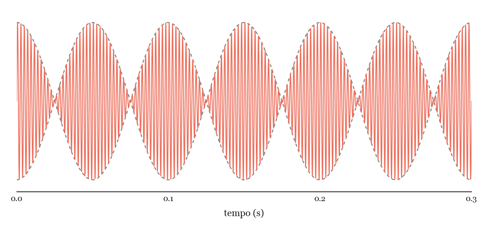

## Il sogno del diavolo violinista

Padova, primi decenni del Settecento. Il violinista e compositore **Giuseppe Tartini** racconta di aver fatto, una notte, un sogno particolarmente vivido: il diavolo in persona gli appare ai piedi del letto e comincia a suonare il suo violino, eseguendo una sonata di una bellezza e di una difficoltà tecnica sovrumane. Tartini si sveglia di scatto, afferra lo strumento e cerca disperatamente di ricostruire quello che ha appena sentito. Il risultato — che lui stesso definirà sempre "molto inferiore" a quello del sogno — è la *Sonata in sol minore*, passata alla storia come **Trillo del Diavolo**, uno dei pezzi più temuti del repertorio violinistico barocco.

È un aneddoto perfetto, forse troppo perfetto: lo racconta l'astronomo francese Jérôme Lalande, che dice di averlo sentito da Tartini stesso, ma non ne esiste alcuna conferma diretta dell'epoca. È del tutto plausibile che Tartini l'abbia costruito, o quantomeno abbellito, per dare un'aura leggendaria a un brano già di per sé fuori misura. Ma il legame tra Tartini e "cose che sembrano magia ma sono fisica" non finisce con un sogno raccontato bene — e la parte più interessante, per noi, non è quello che sentì dormendo, ma quello che scoprì restando sveglio, con l'orecchio incollato allo strumento.

## Il terzo suono che non c'è

Tartini non era solo un virtuoso: era anche un teorico attento, uno dei pochi della sua epoca a fermarsi ad ascoltare *perché* certe cose suonassero bene. Notò un fenomeno acustico sottile e riproducibile: suonando insieme, con intonazione molto precisa, due note su corde diverse del violino, si sente comparire un **terzo suono**, più grave, che nessuno dei due musicisti sta effettivamente producendo.

Lo chiamò *terzo suono* — oggi lo conosciamo come **tono di combinazione** o *tono differenziale* — e non si limitò a stupirsene: ne fece uno strumento didattico concreto. Insegnava ai suoi allievi a usarlo come verifica dell'intonazione: se, suonando una doppia corda, il terzo suono fantasma non emergeva stabile e chiaro, voleva dire che le due note non erano perfettamente accordate tra loro. Tartini aveva scoperto empiricamente, con il solo orecchio, un fenomeno che la fisica delle onde avrebbe formalizzato solo più avanti.

## La spiegazione: i battimenti

Quando due onde sonore di frequenza leggermente diversa, $f_1$ e $f_2$, si sovrappongono nell'aria, si sommano punto per punto, per il principio di sovrapposizione. Con le formule di prostaferesi si può scrivere:

$$
\sin(2\pi f_1 t) + \sin(2\pi f_2 t) = 2\cos\!\left(2\pi\,\frac{f_1-f_2}{2}\,t\right)\sin\!\left(2\pi\,\frac{f_1+f_2}{2}\,t\right) \tag{1}
$$

Il risultato è un'onda che oscilla rapidamente alla frequenza media $\frac{f_1+f_2}{2}$, ma la cui **ampiezza** è modulata lentamente da un termine di frequenza $\frac{f_1-f_2}{2}$: è il fenomeno dei **battimenti**, un suono che pulsa più o meno velocemente a seconda di quanto le due frequenze originali sono vicine. Più le note sono simili, più il battito rallenta — accordare due corde ascoltando il battito che si spegne è tecnica antica quanto la musica stessa, e resta il metodo con cui un'orchestra intona ancora oggi.

Nel grafico si vede esattamente cosa dice la formula $(1)$: l'onda rapida (in corallo) è racchiusa da un inviluppo che sale e scende — è quello il battito che si sente, non l'oscillazione veloce sottostante.

Il terzo suono di Tartini, però, è qualcosa di leggermente diverso e più sottile del semplice battito lento. È un vero **suono differenziale**, percepito a una frequenza pari a $f_1 - f_2$, e non nasce nell'aria: nasce nell'orecchio. È generato dalla risposta **non lineare** dell'apparato uditivo (e in parte dello strumento stesso) quando due note sufficientemente intense vengono elaborate insieme. In termini moderni, l'orecchio non è un sistema perfettamente lineare, e la sovrapposizione di due frequenze pure genera, nell'elaborazione meccanica e neurale del suono, componenti aggiuntive a frequenze somma e differenza — lo stesso principio, per inciso, su cui si basano i mixer di frequenza usati ancora oggi in radiotecnica. Tartini aveva sentito, con l'orecchio di un violinista del Settecento, un effetto che nel Novecento sarebbe diventato un capitolo di elettronica.

## Quando la trigonometria si mette a suonare

Questa storia è un ponte naturale tra tre mondi che a scuola raramente si parlano tra loro: la **musica**, la **trigonometria** — le formule di prostaferesi, spesso ridotte a puro esercizio di manipolazione algebrica — e la **fisica delle onde**.

Qualche spunto per portarla in classe:

- partire da un esperimento diretto: generare, con un'app o un generatore di toni, due frequenze pure vicine tra loro (per esempio 440 Hz e 444 Hz) e far ascoltare il battito risultante, poi mostrare che la formula $(1)$ lo predice esattamente
- derivare in classe la somma di due seni con frequenze diverse, collegandola in tempo reale al battito appena ascoltato: la trigonometria smette di essere astratta quando la si può sentire
- distinguere il battimento (interferenza fisica dell'onda nell'aria, lineare, prevista dalla formula) dal tono di combinazione di Tartini (fenomeno percettivo, non lineare, generato dall'orecchio): un'occasione naturale per introdurre l'idea di sistema lineare contro sistema non lineare in modo intuitivo, prima ancora di darle un nome

Un aneddoto che parte da un sogno diabolico — vero o costruito che sia — e finisce dritto in una formula di prostaferesi: difficile trovare un gancio più efficace per far sembrare viva la trigonometria.
