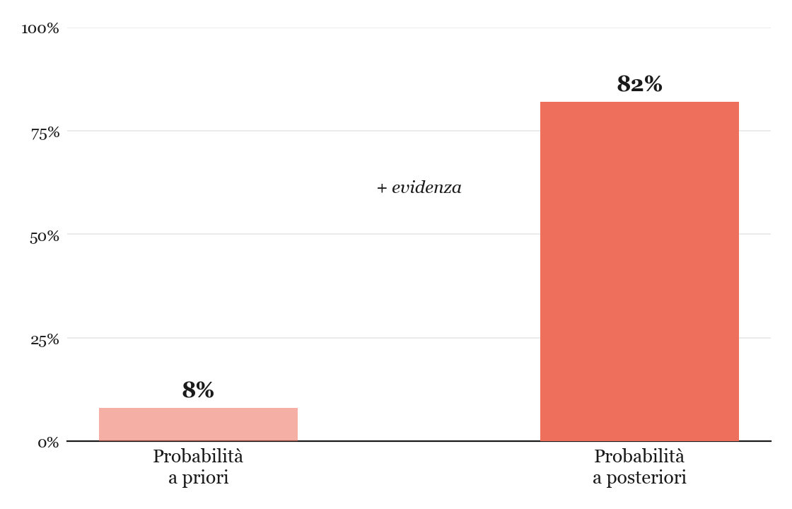

## Un bicchiere di ghiaccio, in un film

C'è una scena, in *The Imitation Game* (2014), diventata quasi iconica: Alan Turing, interpretato da Benedict Cumberbatch, versa dell'acqua ghiacciata sul suo computer elettromeccanico — la "Bomba" — per raffreddarlo e farlo ripartire in un momento cruciale. È una scena tesa, drammatica, perfetta per il grande schermo. Ed è **completamente inventata**. Non è mai successo: la vera Bombe di Bletchley Park non funzionava affatto in questo modo, e non aveva bisogno di essere raffreddata a mano con del ghiaccio.

Il film prende molte licenze narrative dello stesso tipo: Turing non ha mai chiamato la macchina "Christopher" in pubblico, non ha lavorato in solitudine contro il parere di tutti gli altri crittografi, e — il punto che ci interessa davvero — **il vero momento della svolta non fu meccanico, ma statistico**.

## Il vero problema, dopo aver rotto Enigma

Rompere il cifrario Enigma non significava affatto vincere la guerra all'istante. Ogni giorno la macchina tedesca cambiava configurazione, e ogni giorno gli analisti di Bletchley Park dovevano ritrovare la chiave del giorno: la Bombe di Turing serviva esattamente a questo, scartando meccanicamente le combinazioni impossibili in poche ore invece che in anni di calcolo manuale.

Ma una volta decifrati i messaggi, si presentava un problema nuovo, meno raccontato nei film ma altrettanto decisivo: **ogni giorno arrivavano centinaia di messaggi decifrati**. Non c'era il tempo, né le risorse, per agire su tutti. Bisognava scegliere quali fossero davvero urgenti — quale convoglio tedesco intercettare, quale attacco anticipare — e quali invece lasciar correre, anche a costo di ignorare informazioni vere, pur di non rivelare ai tedeschi che il loro cifrario era stato violato.

Era, in sostanza, un problema di **probabilità condizionata**: dato un messaggio decifrato, qual è la probabilità che sia davvero rilevante e urgente, alla luce di tutto ciò che già si sa sul contesto — rotte navali note, pattern di traffico radio, informazioni da altre fonti? E qual è il rischio, agendo su quell'informazione, di tradire il fatto che Enigma è compromessa?

## Il ragionamento bayesiano nascosto

Bletchley Park — e in particolare la sezione diretta da Turing — applicava, senza sempre chiamarlo esplicitamente così, un ragionamento **bayesiano**: aggiornare continuamente la probabilità che un'informazione fosse vera e utile, mano a mano che arrivavano nuovi indizi. È un metodo che Turing stesso contribuì a formalizzare durante la guerra, introducendo tra l'altro il concetto di *ban* e *deciban* come unità di misura del peso dell'evidenza — un'applicazione pratica e originale del ragionamento bayesiano, sviluppata proprio per le esigenze del lavoro crittanalitico.

Il teorema di Bayes formalizza esattamente questo tipo di aggiornamento:

$$
P(A \mid B) = \frac{P(B \mid A)\, P(A)}{P(B)} \tag{Ba}
$$

dove $A$ potrebbe essere "questo convoglio verrà davvero attaccato" e $B$ "abbiamo intercettato questo particolare messaggio". Non basta il singolo messaggio isolato: contano la probabilità *a priori* — quanto era plausibile l'evento prima ancora di intercettare qualcosa — e come ogni nuovo indizio la corregge.

Un esempio semplificato ma realistico rende l'idea: se prima di intercettare nulla la probabilità che un certo convoglio venga attaccato è bassa, diciamo l'8%, e poi arriva un messaggio cifrato che la rende molto più plausibile, la probabilità *a posteriori* può salire fino all'82%. Non è un salto arbitrario: è esattamente quello che la formula $(Ba)$ calcola, pesando quanto quel tipo di messaggio è tipico di un vero attacco imminente rispetto a quanto compare comunque, per altri motivi, nel traffico intercettato.

C'è un episodio storico spesso citato per rendere l'idea, sebbene la ricostruzione popolare ne semplifichi i dettagli: quando gli Alleati appresero, grazie a Enigma, di un attacco imminente su una città specifica, la decisione di **non evacuarla preventivamente** — per non insospettire i tedeschi sulla violazione del codice — è il tipo di scelta che nasce proprio da un bilanciamento tra rischi calcolati: il costo immediato contro il vantaggio strategico, per anni, di poter continuare a leggere le comunicazioni nemiche. È esattamente il tipo di calcolo costi-benefici in condizioni di incertezza che sta al cuore della teoria delle decisioni bayesiana. Vale la pena trattare questo aneddoto con cautela in classe: i dettagli esatti dell'episodio (spesso associato a Coventry, novembre 1940) sono discussi dagli storici, e alcune fonti ridimensionano fortemente il ruolo diretto di Churchill nella decisione specifica. Il valore didattico sta nella struttura del ragionamento, non nella cronaca puntuale.

## Una guerra vinta anche a colpi di probabilità

Questa storia permette di introdurre la **probabilità condizionata e il teorema di Bayes** partendo da un contesto che gli studenti spesso già conoscono — molti hanno visto il film — ma di cui ignorano il vero nocciolo matematico. Alcuni spunti:

- distinguere, guardando insieme una clip del film, tra il dramma raccontato (la scena del ghiaccio, l'isolamento romantico di Turing) e il vero problema matematico affrontato a Bletchley Park (decidere quali informazioni usare senza rivelarsi)
- costruire un piccolo esempio numerico di aggiornamento bayesiano: partire da una probabilità a priori bassa, introdurre un "indizio" (un test, un messaggio intercettato) e calcolare la probabilità a posteriori con la formula $(Ba)$ — lo stesso schema logico usato oggi nei test medici o nei filtri antispam
- discutere il paradosso, insieme morale e matematico, della decisione di non agire sempre sull'informazione migliore, quando l'atto stesso di agire rischia di distruggere il valore futuro dell'informazione

È un esempio potente di come un singolo teorema — spesso insegnato in modo asettico, come formula da applicare a palline colorate in un'urna — abbia avuto, nella storia reale, un peso paragonabile a quello di una battaglia.

## Una mela, forse due leggende

C'è un ultimo capitolo di questa storia che il film racconta appena, e che merita una precisazione, perché mischia un fatto tragicamente reale con una leggenda metropolitana molto amata ma priva di riscontri.

> Nel 1952 Turing fu condannato per "gross indecency" — l'omosessualità era reato penale nel Regno Unito — per una relazione con un uomo. Gli fu offerta una scelta tra il carcere e la **castrazione chimica** tramite iniezioni di estrogeni; scelse la seconda. Il 7 giugno 1954 fu trovato morto nella sua abitazione: la causa fu avvelenamento da cianuro, e accanto al letto c'era una mela morsicata, mai analizzata per verificare se contenesse il veleno. L'inchiesta ufficiale concluse per il suicidio, sebbene alcuni storici abbiano in seguito sollevato dubbi anche su questa ricostruzione, ipotizzando un incidente. Nel 2009 il governo britannico ha presentato scuse pubbliche, e nel 2013 Turing ha ricevuto la grazia reale postuma.
>
> Da qui nasce la leggenda: la mela morsicata sarebbe stata un omaggio nascosto di Steve Jobs, che avrebbe scelto quel simbolo per il logo Apple in memoria di Turing. È una storia che circola da decenni, ripetuta anche da fonti autorevoli — ma **non ci sono prove che sia vera**, e sia Jobs sia il designer del logo, Rob Janoff, l'hanno smentita esplicitamente più volte: Janoff ha raccontato che il morso serviva solo a evitare che, in piccolo, la mela fosse scambiata per una ciliegia, e a dare un senso di scala e di "morso", appunto, in un gioco di parole con *byte*.

Resta una leggenda perché è una storia bellissima, non perché sia documentata. Ma proprio per questo è un buon esercizio da fare in classe insieme al resto: imparare a distinguere una fonte storica verificabile — la condanna, la castrazione chimica, la morte per cianuro — da un aneddoto suggestivo che si è propagato perché *meritava* di essere vero, un po' come càpita, ironicamente, a tanti numeri che si vorrebbero veri solo perché tornano comodi. Anche qui, in fondo, si torna a fare i conti con l'evidenza — a pesarla, non a darla per buona.
