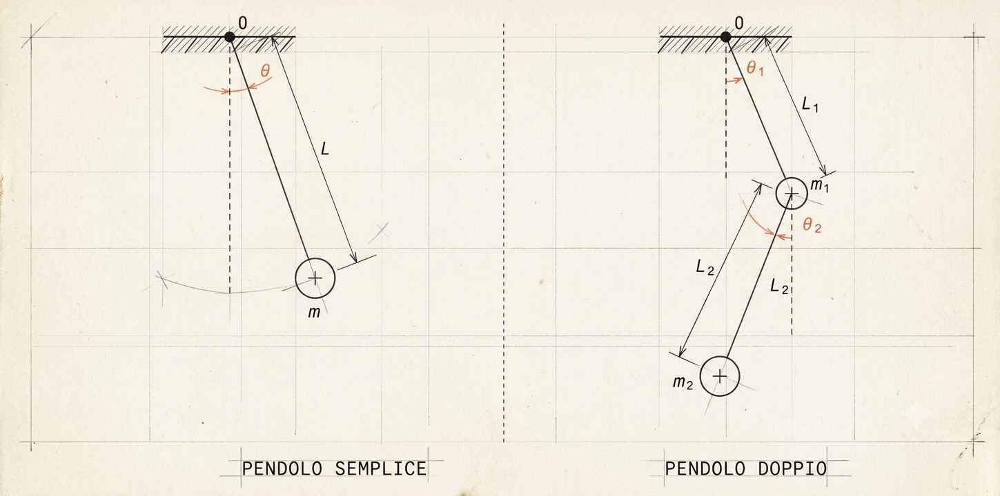

<section class="mot-hero" data-background-color="#2a2a3d" data-background-video="butterfly-home.mp4" data-background-video-loop data-background-video-muted data-background-opacity="0.32" data-transition="zoom">
  

  
conferenza serale, 2027

  <h1 style="color: white; position: relative; z-index: 10;">Il battito d'ali</h1>
  
L'Effetto Farfalla e la Teoria del Caos

  
storia (breve) di un'idea che ha rotto la <em style="color: white;">fisica classica</em>

  
prof. Diego Fantinelli &mdash; <a href="https://mathofthings.netlify.app/" target="_blank" class="mono">The Math of Things</a>

</section>

---

<!-- ATTO I — Il sogno della predicibilità (~10') -->

<section class="mot-divider" data-background-color="#2a2a3d" data-transition="zoom" style="color: white;">
  

  <h1 class="r-fit-text" style="position: relative; z-index: 10;">ATTO I &mdash; IL SOGNO DELLA PREDICIBILITÀ</h1>
</section>

<section>
  

  <!-- SFONDO SUGGERITO: incisione d'epoca di Newton, o una cometa/orbita disegnata a mano -->
  <!-- data-background-image="newton.jpg" data-background-size="cover" data-background-position="center" data-background-opacity="0.15" -->
  
1687, l'universo diventa un orologio

  <h2>Newton e la cometa <em>puntualissima</em></h2>
  
Halley usa le leggi di Newton per calcolare l'orbita di una cometa avvistata nel 1682 e prevede: <b>tornerà a fine 1758</b>.

  
Halley muore nel 1742. La cometa torna, puntuale, il 25 dicembre 1758. Da allora si chiama Cometa di Halley.

  
Un uomo prevede un appuntamento cosmico sedici anni prima, senza esserci: probabilmente il ghosting più elegante della storia della scienza.

  <aside class="notes">
    Edmond Halley, usando le leggi della gravitazione di Newton (pubblicate nei "Principia" nel 1687), si accorge che le comete osservate nel 1531, 1607 e 1682 hanno orbite talmente simili da poter essere lo stesso oggetto, e ne predice il ritorno per la fine del 1758, con i dovuti aggiustamenti per le perturbazioni gravitazionali di Giove e Saturno (calcolate poi più precisamente da Clairaut). Halley non vedrà mai la conferma: muore nel 1742. La cometa viene effettivamente riavvistata il 25 dicembre 1758. È il primo vero trionfo pubblico e spettacolare della meccanica newtoniana applicata alla previsione: da qui nasce l'idea (poi radicalizzata da Laplace) che conoscere le leggi fisiche equivalga a conoscere il futuro. Bel gancio da tenere a mente per dopo: la stessa identica logica che qui funziona magnificamente, con Lorenz nell'Atto II si romperà.
  </aside>
</section>

<section>
  

  <!-- SFONDO SUGGERITO: ritratto di Laplace (o incisione d'epoca), b/n, molto in trasparenza dietro il testo -->
  <!-- data-background-image="laplace.jpg" data-background-size="cover" data-background-position="center" data-background-opacity="0.15" -->
  
1814, un demone molto sicuro di sé

  <h2>Se conosci <em>tutto</em>, prevedi tutto</h2>
  
Laplace: dammi la posizione e la velocità <b>di ogni particella dell'universo</b>, e ti calcolo il futuro fino all'ultimo decimale &mdash; passato compreso.

  
Un'entità onnisciente e un po' pallosa: sa già come va a finire la partita di stasera.

  <aside class="notes">
    Apertura leggera: si può chiedere al pubblico "chi di voi ha già deciso cosa mangerà a cena domani sera? Ecco, Laplace lo sapeva anche per voi, nel 1814". Il "demone di Laplace" è un esperimento mentale, non un essere reale: un'intelligenza capace di conoscere posizione e quantità di moto di ogni particella dell'universo in un istante. Con le leggi di Newton, dice Laplace, per una simile intelligenza "nulla sarebbe incerto, e l'avvenire, come il passato, sarebbe presente ai suoi occhi". È il manifesto del determinismo: universo = orologio, leggi = ingranaggi, tutto il resto è questione di calcolo.
  </aside>
</section>

<section>
  

  <!-- SFONDO SUGGERITO: mappa/atlante astronomico d'epoca con orbite disegnate, molto trasparente -->
  <!-- data-background-image="nettuno.jpg" data-background-size="cover" data-background-position="center" data-background-opacity="0.15" -->
  
1846, un pianeta trovato "a tavolino"

  <h2>Il trionfo della <em>meccanica celeste</em></h2>
  
Urano non si comporta come dovrebbe. Le Verrier non punta un telescopio: <b>fa i conti</b>, prevede dove deve esserci un pianeta ancora sconosciuto.

  
Il telescopio di Berlino lo trova quella stessa notte, a meno di 1° dal punto previsto.

  
Nettuno scoperto con carta e penna: la fisica classica non aveva più bisogno di guardare il cielo, bastava saperlo prevedere.

  <aside class="notes">
    Questo è l'apice del determinismo laplaciano, e va enfatizzato come un trionfo prima del "colpo di scena" dell'Atto II. Le Verrier (e indipendentemente Adams in Inghilterra) nota anomalie nell'orbita di Urano rispetto alle previsioni newtoniane; ipotizza un pianeta ancora sconosciuto la cui gravità le spiega, ne calcola posizione e massa. Galle, all'osservatorio di Berlino, punta il telescopio la sera del 23 settembre 1846 e lo trova quasi esattamente lì. Aneddoto da citare con orgoglio scientifico un po' guascone: "abbiamo scoperto un pianeta prima di vederlo". È il picco di fiducia nel determinismo — e prepara il contrasto brutale con Lorenz nell'Atto II: da qui a un secolo dopo, lo stesso tipo di equazioni ci tradirà.
  </aside>
</section>

<section>
  

  <!-- SFONDO SUGGERITO: ritratto di Poincaré, o una pagina di calcoli/manoscritto d'epoca -->
  <!-- data-background-image="poincare.jpg" data-background-size="cover" data-background-position="center" data-background-opacity="0.15" -->
  
1889, la prima crepa (e nessuno se ne accorge)

  <h2>Poincaré e il <em>problema dei tre corpi</em></h2>
  
Il re Oscar II di Svezia mette in palio un premio per chi risolve il moto di tre corpi celesti soggetti solo alla gravità reciproca (Sole, Terra, Luna, per dire).

  
Poincaré vince. Poi, mentre il suo saggio è già in stampa, si accorge di un errore: il sistema può essere <b>sensibilissimo</b> a variazioni minime. Deve farsi ristampare tutta la tiratura della rivista, a proprie spese.

  
Il caos entra ufficialmente nella storia della scienza costando a un matematico più della cifra del premio che aveva appena vinto.

  <aside class="notes">
    Il concorso matematico per il 60° compleanno di Oscar II di Svezia (1889) chiedeva di dimostrare la stabilità del sistema solare risolvendo il problema dei tre corpi. Poincaré presenta un lavoro che vince il premio, ma un revisore (Phragmén) nota un'incongruenza nella dimostrazione mentre il saggio è già in fase di stampa sulla rivista Acta Mathematica. Poincaré scava a fondo per correggere l'errore e scopre qualcosa di molto più profondo e sconvolgente di quanto pensasse: anche in un sistema di sole 3 masse soggette solo alla gravità (niente attrito, niente turbolenza, niente "rumore" esterno), piccolissime differenze nelle condizioni iniziali possono portare a evoluzioni completamente diverse nel tempo. Deve pagare di tasca propria per far ristampare l'intera tiratura della rivista già distribuita, con la versione corretta. Questo lavoro contiene, in nuce, tutti gli ingredienti della moderna teoria del caos — settant'anni prima di Lorenz — ma resta un episodio isolato, poco compreso, sepolto in un trattato di meccanica celeste che quasi nessuno legge fino in fondo. Ottimo aneddoto per creare suspense verso l'Atto II: "la crepa c'era già, semplicemente per settant'anni nessuno ci ha ripensato".
  </aside>
</section>

---

<!-- ATTO II — Lorenz e la scoperta (~20') -->

<section class="mot-divider" data-background-color="#2a2a3d" data-transition="zoom" style="color: white;">
  

  <h1 class="r-fit-text" style="position: relative; z-index: 10;">ATTO II &mdash; LA SCOPERTA ACCIDENTALE</h1>
</section>

<section>
  

  <!-- SFONDO SUGGERITO: foto di Lorenz, o una vecchia stazione meteo/barometro -->
  <!-- data-background-image="lorenz-ritratto.jpg" data-background-size="cover" data-background-position="center" data-background-opacity="0.15" -->
  
un matematico prestato al meteo

  <h2>Chi era Edward <em>Lorenz</em></h2>
  
Matematico di formazione, durante la Seconda Guerra Mondiale fa il previsore meteo per l'aeronautica militare. Resta affascinato (e un po' deluso) da quanto sia difficile prevedere qualcosa di così quotidiano.

  
Passa il resto della carriera a costruire modelli matematici per capire perché i modelli matematici del meteo funzionano così male. Una specie di detective che indaga su se stesso.

  <aside class="notes">
    Edward Lorenz (1917-2008) si laurea in matematica ad Harvard, ma durante la Seconda Guerra Mondiale viene assegnato come previsore meteorologico per le forze aeree americane — un lavoro allora considerato più artigianale che scientifico. L'esperienza lo lascia con la sensazione che le previsioni meteo, per quanto si affinassero le tecniche, restassero intrinsecamente inaffidabili oltre pochi giorni, e questo lo incuriosisce abbastanza da dedicarci la carriera accademica al MIT. Costruisce modelli matematici semplificati dell'atmosfera (equazioni di convezione) proprio per capire, da matematico, cosa renda il sistema meteo così sfuggente. È il contesto perfetto per l'aneddoto del 1961 che segue: non uno scienziato che inciampa per caso nel caos, ma qualcuno che lo stava quasi cercando, senza saperlo.
  </aside>
</section>

<section>
  

  
1961, MIT, un pomeriggio noioso

  <h2>Edward Lorenz e la <em>scorciatoia fatale</em></h2>
  
Lorenz sta rifacendo una simulazione meteo già girata. Per risparmiare tempo digita <b>0.506</b> invece di <b>0.506127</b>: pensa che 3 decimali in meno non cambino nulla.

  
Va a farsi un caffè. Un'ora dopo torna e il "meteo" del suo computer è impazzito.

  <aside class="notes">
    Il vero nome della macchina è un Royal McBee LGP-30, lentissimo per gli standard odierni. Lorenz sta studiando un modello semplificato di convezione atmosferica (12 equazioni). Vuole riesaminare una sequenza già calcolata, ma invece di far ripartire tutto da capo la fa ripartire "a metà", ridigitando a mano i valori intermedi stampati — e la stampante arrotondava a 3 cifre decimali (0.506) mentre la memoria interna ne teneva 6 (0.506127). Lui pensa che la differenza, una parte su mille, sia completamente irrilevante: è un errore più piccolo di una folata di vento che uno starnuto potrebbe causare in un modello meteo reale. Torna dal caffè aspettandosi di vedere replicare la simulazione precedente. Invece dopo un breve tratto iniziale simile, le due curve iniziano a divergere sempre di più, fino a non avere più nulla in comune. Qui si può fare una pausa comica: "e no, non aveva sbagliato lui i calcoli. Aveva scoperto il caos".
  </aside>
</section>

<section>
  

  <!-- SFONDO SUGGERITO: nessuno, qui probabilmente meglio uno screenshot/grafico live delle due curve che divergono -->
  
stesso punto di partenza, futuro diverso

  <h2>La sensibilità alle <em>condizioni iniziali</em></h2>
  
Due simulazioni, quasi identiche all'inizio (differenza: 1 su 10.000). Dopo poche settimane simulate, sono <b>completamente diverse</b>.

  
Non è un errore del computer. Non è nemmeno un errore di Lorenz. È una proprietà <em>delle equazioni stesse</em>.

  
La prima vittima di questa scoperta è la fiducia di Lorenz nel demone di Laplace &mdash; e la seconda, qualche anno dopo, è quella di tutti i meteorologi del mondo.

  <aside class="notes">
    Concetto centrale della serata, va scandito bene: la differenza tra le due traiettorie non resta piccola, cresce esponenzialmente nel tempo (è la base di quello che oggi chiamiamo "esponente di Lyapunov positivo"). Sottolineare che il sistema è comunque perfettamente deterministico: le stesse equazioni, applicate agli stessi identici dati, danno sempre lo stesso risultato. Il problema è che "quasi identici" non è mai "identici", e in questi sistemi anche un errore piccolissimo nella misura di partenza esplode. È il momento giusto per dire la frase che regge tutto il resto della conferenza: "il caos non è assenza di leggi, è un eccesso di sensibilità alle leggi che già conosciamo".
  </aside>
</section>

<section>
  

  
1963-1972, il decennio del silenzio

  <h2>Un articolo <em>ignorato</em> per dieci anni</h2>
  
Lorenz pubblica i suoi risultati nel 1963 su una rivista di meteorologia, non di matematica o fisica. Quasi nessuno fuori dal suo campo se ne accorge.

  
Solo all'inizio degli anni '70 il matematico James Yorke lo scopre, ne intuisce la portata enorme e comincia a farlo circolare tra fisici e matematici. Sarà proprio Yorke, nel 1975, a usare per primo la parola "<b>chaos</b>" in questo contesto.

  
Una delle scoperte più importanti del Novecento ha passato un decennio scambiata per un articolo di meteorologia un po' noioso. Anche le rivoluzioni scientifiche, a volte, aspettano l'autobus giusto.

  <aside class="notes">
    Lorenz pubblica "Deterministic Nonperiodic Flow" nel 1963 sul Journal of the Atmospheric Sciences: una rivista specialistica di meteorologia, letta da pochissimi fisici o matematici puri. Il lavoro contiene già tutti gli ingredienti chiave (sensibilità alle condizioni iniziali, attrattore strano) ma resta sostanzialmente invisibile alla comunità scientifica più ampia per circa un decennio. È il matematico James Yorke (Università del Maryland) a imbattersi nel paper all'inizio degli anni '70, capirne l'importanza cruciale e iniziare a farlo conoscere a fisici e matematici, contribuendo a innescare l'esplosione di interesse per la teoria del caos negli anni '70-'80. Nel 1975 Yorke pubblica con Tien-Yien Li l'articolo "Period Three Implies Chaos", in cui compare per la prima volta il termine "chaos" nel significato tecnico moderno che usiamo oggi. Buon aneddoto sulla sociologia della scienza: le grandi scoperte non sempre vengono riconosciute subito, a volte serve la persona giusta che le trova nel posto sbagliato.
  </aside>
</section>

<section data-background-video="butterfly.mp4" data-background-video-loop data-background-video-muted data-background-opacity="0.28">
  

  
1972, un titolo di conferenza da manuale di marketing

  <h2>Nasce l'<em>effetto farfalla</em></h2>
  
Lorenz tiene un intervento con un titolo che oggi definiremmo clickbait ante litteram:

  
"Può il battito d'ali di una farfalla in Brasile scatenare un tornado in Texas?"

  
Risposta onesta: probabilmente no, quella specifica farfalla. Ma il punto non è la farfalla, è che <b>qualcosa</b> di altrettanto piccolo, prima o poi, lo farà.

  <aside class="notes">
    Il titolo del talk del 1972 all'AAAS non è di Lorenz in senso stretto — pare sia stato suggerito dal moderatore della sessione, Philip Merilees, che non riuscì a farsi mandare in tempo un titolo da Lorenz e ne inventò uno lui. Ironia da segnalare: la metafora più famosa della scienza del caos nasce, un po' caoticamente, per un titolo mancato all'ultimo minuto. Chiarire che non si intende letteralmente che UNA farfalla causi UN tornado (relazione causale isolabile e verificabile), ma che in un sistema caotico anche perturbazioni piccolissime, di qualunque origine, possono essere amplificate fino ad avere conseguenze macroscopiche enormi. È un'affermazione sulla sensibilità del sistema, non sulla causalità puntuale.
  </aside>
</section>

<section>
  

  <!-- SFONDO SUGGERITO: il grafico dell'attrattore di Lorenz (le due "ali"), reperibile libero da Wikimedia Commons, o generato al momento -->
  <!-- data-background-image="attrattore-lorenz.jpg" data-background-size="contain" data-background-position="center" data-background-opacity="0.35" -->
  
l'immagine icona del caos

  <h2>L'<em>attrattore</em> di Lorenz</h2>
  
Se disegni l'evoluzione del sistema nello spazio delle sue variabili, ottieni una forma che non si ripete mai due volte uguale &mdash; ma che assomiglia sempre a due ali di farfalla.

  
Persino il grafico ha deciso di essere in tema. A volte la matematica fa marketing da sola.

  <aside class="notes">
    L'attrattore di Lorenz è il risultato del sistema di 3 equazioni differenziali che Lorenz studiava (versione ridotta del suo modello di convezione a 12 equazioni). Il sistema non si stabilizza mai in un punto fisso né in un ciclo periodico, ma nemmeno "esplode": resta confinato in una regione dello spazio, disegnando infinite traiettorie che non si intersecano mai esattamente, avvolgendosi alternativamente attorno a due "centri" — da cui la celebre forma a farfalla (o a maschera). È il prototipo di quello che oggi si chiama "attrattore strano": deterministico, limitato, ma mai periodico e mai prevedibile a lungo termine. Ottimo momento per una demo dal vivo se si ha accesso a un notebook Python/Desmos con l'equazione già pronta, anche solo per far vedere la forma che si genera in tempo reale.
  </aside>
</section>

<section>
  

  
un nome arrivato con due anni di ritardo

  <h2>Chi ha battezzato l'<em>"attrattore strano"</em></h2>
  
Il grafico esiste dal 1963. Il nome "strange attractor" (attrattore strano) arriva solo nel 1971, coniato dai fisici matematici David Ruelle e Floris Takens.

  
Otto anni per trovare un nome. In compenso, bisogna ammetterlo: "attrattore strano" resta uno dei nomi più azzeccati di tutta la fisica &mdash; suona bene anche a chi non ha capito nulla della matematica sotto.

  <aside class="notes">
    Ruelle e Takens introducono il termine "strange attractor" in un articolo del 1971 sulla turbolenza nei fluidi, dandogli anche un significato tecnico preciso in dinamica: un attrattore (una regione dello spazio delle fasi verso cui converge il sistema) che ha struttura frattale e su cui le traiettorie non sono mai periodiche. È un buon momento per fare un piccolo recap enciclopedico se il pubblico lo gradisce: attrattore "normale" = punto fisso o ciclo (es. un pendolo che si ferma, o un'orbita periodica); attrattore "strano" = il sistema resta confinato ma senza mai ripetersi esattamente, come nel caso di Lorenz. Da notare, con un po' di ironia meta, che il nome nasce indipendentemente dal lavoro di Lorenz e viene applicato retroattivamente al suo grafico solo in seguito: un altro piccolo tassello della storia un po' "caotica" con cui questa teoria si è assemblata pezzo per pezzo.
  </aside>
</section>

---

<!-- PAUSA 10' -->

<section class="mot-divider" data-background-color="#1a1a1a" data-background-video="timer.mp4" data-background-video-loop data-background-video-muted data-background-opacity="0.45" data-transition="fade" style="color: white;">
  

  <h1 class="r-fit-text">PAUSA &mdash; 10 MINUTI</h1>
</section>

---

<!-- ATTO III — Caos ≠ casualità (~35') — sfondo a particelle -->

<section class="mot-divider" data-background-color="#2a2a3d" data-transition="zoom" style="color: white;">
  

  <h1 class="r-fit-text" style="position: relative; z-index: 10;">ATTO III &mdash; IL CAOS NON È DISORDINE</h1>
</section>

<section>
  

  
mettiamo subito le cose in chiaro

  <h2>Deterministico, ma <em>imprevedibile</em></h2>
  
Sistema <b>caotico</b> ≠ sistema <b>casuale</b>. Le equazioni sono le stesse di sempre, obbediscono a leggi rigidissime, non lanciano mai un dado.

  
Il problema è un altro: per prevedere il futuro dovresti conoscere il presente con <em>precisione infinita</em>. E la precisione infinita, semplicemente, non esiste.

  
Non è che l'universo tiri a caso. È che l'universo, alla nona cifra decimale, non ce lo dice mai.

  <aside class="notes">
    Questa è la slide "manifesto" dell'Atto III, va scandita con calma perché è il concetto più frainteso di tutta la teoria del caos (anche nella cultura pop: "effetto farfalla" viene spesso confuso con "tutto è imprevedibile e casuale", che è sbagliato). Ribadire: stesse condizioni iniziali esatte → stesso identico futuro, sempre. Il caos emerge SOLO perché nella pratica non possiamo mai misurare le condizioni iniziali con infinite cifre decimali — ogni strumento di misura, ogni sensore, ha una precisione finita. In un sistema caotico questo minuscolo margine di errore non resta piccolo, ma cresce esponenzialmente nel tempo fino a rendere la previsione a lungo termine impossibile in linea di principio, non solo in pratica.
  </aside>
</section>

<section>
  

  
quella domanda che fate sempre voi

  <h2>"Ma tra 50 anni non avremo <em>computer</em> più potenti?"</h2>
  
Certo. E allora potremo prevedere il tempo tra 11 giorni invece che 10. Poi tra 12. Poi la crescita si ferma comunque, perché il costo di ogni giorno in più aumenta <b>esponenzialmente</b>.

  
Anche un computer grande quanto l'universo, con sensori perfetti, non saprebbe prevedere il meteo di un mese esatto.

  
Il colpevole non è l'ingegnere che ha progettato il supercomputer. È la matematica stessa, e con la matematica è inutile arrabbiarsi.

  <aside class="notes">
    Punto chiave da difendere con fermezza (è il tipo di obiezione che arriva sempre dal pubblico più tecnico): il limite alla previsione meteorologica non è "abbiamo computer troppo lenti" o "i modelli sono imprecisi", ma un limite di principio legato alla crescita esponenziale degli errori. Si stima che l'orizzonte di prevedibilità pratica dell'atmosfera sia intorno ai 10-14 giorni: oltre quella soglia, anche raddoppiando la potenza di calcolo o la precisione dei sensori satellitari, si guadagnano solo pochi giorni in più, perché l'errore cresce come una potenza (esponenziale) del tempo, non linearmente. Bella battuta finale da tenere a mente: "i meteorologi non sbagliano perché sono pigri, sbagliano perché glielo abbiamo chiesto Lorenz".
  </aside>
</section>

<section>
  

  
la demo più semplice e più spettacolare di tutte

  <h2>Il <em>pendolo doppio</em></h2>
  
  

    
$$\theta'' + \frac{g}{L}\sin\theta = 0$$

    
(pendolo semplice)

  

  

    
$$\ddot\theta_1 = \frac{-g(2m_1{+}m_2)\sin\theta_1 - m_2 g \sin(\theta_1{-}2\theta_2) - 2\sin(\theta_1{-}\theta_2)\, m_2(\dot\theta_2^2 L_2 + \dot\theta_1^2 L_1\cos(\theta_1{-}\theta_2))}{L_1(2m_1{+}m_2{-}m_2\cos(2\theta_1{-}2\theta_2))}$$

    
(pendolo doppio)

  

  <aside class="notes">
    Il confronto tra le due equazioni è tutto il punto di questa slide, va lasciato "parlare da solo": basta aggiungere una seconda massa in fondo alla prima per passare da un'equazione che si insegna al liceo (oscillatore armonico smorzato/pendolo semplice, θ'' + (g/L)sinθ = 0) a un sistema di equazioni accoppiate e fortemente non lineari, con termini incrociati tra le due masse e i due angoli. Non serve spiegarla termine per termine: l'effetto comico/scenico è proprio vedere il salto di complessità a colpo d'occhio. Chi vuole approfondire: le equazioni si ricavano dal formalismo lagrangiano (L = energia cinetica - energia potenziale del sistema a due bracci), e nonostante siano equazioni deterministiche esatte, il sistema risultante è caotico per ampiezze non piccolissime.
  </aside>
</section>

<section>
  

  
stessa fisica, due destini diversi

  <h2>Guardateli <em>muoversi</em></h2>
  <video src="pendoli-animazione.mp4" autoplay loop muted playsinline style="max-width: 92%; margin: 0.3rem auto 0; display: block; border-radius: 6px; box-shadow: 0 2px 16px rgba(0,0,0,0.2);"></video>
  <aside class="notes">
    Animazione fisica reale (motore a rigid body, non un disegno a mano): a sinistra il pendolo semplice oscilla in modo regolare e perfettamente periodico, punto e basta. A destra il pendolo doppio, lanciato con un angolo iniziale ampio, genera una traiettoria del tutto irregolare — la scia blu che si vede è il percorso della seconda massa, e non si richiude mai su se stessa. Buon momento per far notare che la scia disegnata dal pendolo doppio, da sola, assomiglia già a una farfalla: la matematica continua a fare marketing per conto suo. Se rilanciato più volte con condizioni iniziali anche minimamente diverse, il pendolo doppio disegnerebbe ogni volta una scia completamente diversa: è lo stesso principio dell'attrattore di Lorenz visto nell'Atto II, qui reso in un sistema meccanico invece che in un modello meteo.
  </aside>
</section>

<section data-background-video="butterfly.mp4" data-background-video-loop data-background-video-muted data-background-opacity="0.15">
  

  
la demo più semplice e più spettacolare di tutte

  <h2>Basta <em>una massa in più</em></h2>
  
Attaccate un secondo pendolo in fondo al primo. Basta questo: un sistema meccanico semplicissimo, due sole masse, niente di esotico.

  
Fatelo partire due volte da posizioni quasi identiche (a occhio, indistinguibili). Dopo pochi secondi le due traiettorie non hanno più nulla in comune.

  
Un pendolo singolo è il simbolo della fisica prevedibile da tre secoli. Basta aggiungerne un secondo, letteralmente attaccato in fondo al primo, per costruirsi in casa un generatore di caos con due chiodi e dello spago.

  <aside class="notes">
    Il pendolo doppio (un pendolo attaccato in fondo a un altro pendolo) è probabilmente l'esempio più didattico e più "dal vivo" possibile di sistema caotico deterministico: le equazioni del moto sono complicate ma perfettamente note e deterministiche (derivano semplicemente dalla meccanica di Lagrange, viste nella slide precedente), eppure il comportamento macroscopico, oltre pochi secondi, diventa completamente imprevedibile e sensibilissimo alle condizioni di partenza. Se possibile, vale davvero la pena costruirne uno semplice (due aste rigide o anche solo due righelli imperniati) e farne una piccola dimostrazione dal vivo, o mostrare un video di due pendoli doppi lanciati da posizioni quasi identiche che divergono in pochi secondi — è di gran lunga la dimostrazione più "wow" per un pubblico non specialistico, perché è meccanica classica pura, niente di esotico, eppure genera comportamento genuinamente impredicibile. Ottimo ponte visivo prima della mappa logistica, che è la stessa idea ma in versione puramente matematica.
  </aside>
</section>

<section>
  

  
demo dal vivo (tenere pronto un notebook o un foglio di calcolo)

  <h2>La <em>mappa logistica</em>: il caos in una riga</h2>
  
Un modellino di popolazione animale, quasi ridicolo nella sua semplicità:

  
$$x_{n+1} = r \, x_n (1 - x_n) \tag{1}$$

  
Cambiate solo il numero <b>r</b>, un parametro innocuo. Per $r$ piccolo: popolazione stabile, noiosa, prevedibile. Aumentate $r$ un po' alla volta...

  
...e a un certo punto, senza preavviso, la stessa formuletta da terza superiore comincia a comportarsi come se avesse una vita propria e pessimo carattere.

  <aside class="notes">
    La mappa logistica (Robert May, anni '70) è probabilmente l'esempio più semplice e più potente da mostrare dal vivo: x rappresenta una popolazione normalizzata tra 0 e 1, r è il tasso di crescita. Per r tra 0 e 3 il sistema converge a un valore fisso stabile. Attorno a r=3 iniziano le biforcazioni: la popolazione oscilla tra 2 valori, poi 4, poi 8, raddoppiando sempre più velocemente (cascata di biforcazioni di Feigenbaum) fino a r≈3.57, oltre il quale il comportamento diventa caotico — pur restando un'equazione deterministica a una sola variabile, senza nessun elemento casuale. Se possibile, mostrare dal vivo il "diagramma di biforcazione" (r sull'asse x, valori asintotici di x sull'asse y): è visivamente scioccante quanto un frattale, e infatti gli assomiglia. Aneddoto opzionale su Feigenbaum: scoprì che il "tasso" con cui le biforcazioni si infittiscono è una costante universale (≈4.669), la stessa in moltissimi sistemi caotici diversi — una specie di "π del caos".
  </aside>
</section>

<section>
  

  
un numero che spunta ovunque, senza motivo apparente

  <h2>La costante di <em>Feigenbaum</em></h2>
  
Mitchell Feigenbaum, studiando la cascata di biforcazioni della mappa logistica, nota che ogni biforcazione arriva sempre più in fretta della precedente, secondo un rapporto fisso:

  
$$\delta \approx 4.6692016...$$

  
La stessa identica costante spunta in centinaia di sistemi caotici completamente diversi tra loro &mdash; popolazioni, circuiti elettronici, gocce d'acqua. Come se il caos avesse una propria "impronta digitale universale", uguale per tutti.

  <aside class="notes">
    Mitchell Feigenbaum, alla fine degli anni '70, studia la cascata di raddoppi di periodo che precede il caos nella mappa logistica (e in famiglie simili di mappe) e scopre che il rapporto tra le distanze successive dei punti di biforcazione tende a una costante universale, δ ≈ 4.6692016..., indipendentemente dai dettagli specifici dell'equazione di partenza (purché abbia un massimo "a campana" simile). È un risultato profondamente sorprendente: sistemi fisici completamente diversi — modelli di popolazione, circuiti elettrici non lineari, la formazione di gocce da un rubinetto che gocciola sempre più in fretta, la convezione in certi fluidi — mostrano tutti la stessa identica costante nella loro transizione verso il caos. È un po' l'equivalente, nel mondo del caos, di quello che π è per i cerchi: un numero universale che emerge dalla struttura matematica profonda del fenomeno, non dai dettagli del sistema specifico. Aneddoto simpatico: Feigenbaum scoprì questa regolarità usando una delle prime calcolatrici tascabili HP-65, letteralmente premendo tasti e osservando i numeri — non un supercomputer, una calcolatrice da 200 dollari.
  </aside>
</section>

<section>
  

  
il caos non vive solo nei laboratori

  <h2>Biliardo, cuore, <em>popolazioni di conigli</em></h2>
  
Al biliardo, dopo appena <b>9 urti</b>, per prevedere la traiettoria della palla dovresti già includere nel calcolo l'attrazione gravitazionale di una persona in piedi ai bordi del tavolo.

  
Il battito del vostro cuore, il numero di conigli in un prato, l'andamento di un'epidemia: stessa mappa logistica, stesso comportamento imprevedibile oltre una certa soglia.

  
La prossima volta che perdete a biliardo, non è mancanza di talento. È fisica statistica del caos. Usatela, funziona sempre come scusa.

  <aside class="notes">
    L'esempio del biliardo è di Michael Berry (fisico, Bristol): ha calcolato che dopo circa 9 collisioni tra le sfere, per prevedere correttamente la traiettoria bisognerebbe tenere conto anche del campo gravitazionale generato da una persona che si trova ai bordi del tavolo da biliardo — un effetto minuscolo che normalmente ignoreremmo sempre, ma che nel caos si amplifica abbastanza in fretta da diventare determinante. Aggancio a sistemi biologici: la variabilità del battito cardiaco (utile clinicamente: un battito "troppo regolare" è talvolta un segnale di rischio, controintuitivamente), modelli preda-predatore in ecologia (equazioni di Lotka-Volterra, che in certe condizioni diventano caotiche), modelli epidemiologici SIR con parametri stagionali. Il messaggio di fondo: il caos non è un fenomeno raro e di laboratorio, è probabilmente la norma per qualunque sistema con più di 2-3 variabili che interagiscono in modo non lineare.
  </aside>
</section>

<section>
  

  <!-- SFONDO SUGGERITO: immagine del sistema solare/orbite planetarie, trasparente -->
  
torniamo da dove eravamo partiti, con una brutta notizia

  <h2>Anche il <em>Sistema Solare</em> è caotico</h2>
  
Ricordate Newton e Halley, l'apice della predicibilità nell'Atto I? Nel 1988-89 Gerald Sussman e Jack Wisdom, simulando il sistema solare per centinaia di milioni di anni, scoprono che anche le orbite dei pianeti sono <b>caotiche</b> su tempi lunghissimi.

  
Non "instabili" nel senso che i pianeti voleranno via: ma la posizione precisa della Terra tra 100 milioni di anni è, in linea di principio, incalcolabile.

  
Il sistema più prevedibile della storia della fisica, quello con cui abbiamo aperto la serata, alla fine ci tradisce pure lui. Persino Newton, a lungo termine, gioca secondo le regole di Lorenz.

  <aside class="notes">
    Bellissimo momento per "chiudere il cerchio" con l'Atto I: Sussman e Wisdom, usando un computer digitale specializzato (il "Digital Orrery" al MIT) per integrare numericamente le equazioni del moto planetario su intervalli di centinaia di milioni di anni, mostrano che il moto dei pianeti del sistema solare, in particolare quello dei pianeti interni (Mercurio, Venere, Terra, Marte), è caoticamente sensibile alle condizioni iniziali, con un tempo di Lyapunov di circa 5 milioni di anni (cioè l'incertezza sulla posizione raddoppia grosso modo ogni 5 milioni di anni). Questo non significa che il sistema solare sia instabile nel senso catastrofico (i pianeti non stanno per schiantarsi tra loro nell'immediato), ma significa che è impossibile, anche in linea di principio, calcolare la posizione esatta della Terra sulla sua orbita tra, diciamo, 200 milioni di anni: piccolissime incertezze oggi (anche solo dovute a corpi minori, asteroidi, effetti relativistici trascurabili) si amplificano fino a rendere la previsione priva di senso su quelle scale. È l'ironia perfetta da riportare al pubblico: il sistema che Newton, Halley e Laplace consideravano l'esempio supremo di prevedibilità meccanica è, in realtà, caotico quanto la mappa logistica o il pendolo doppio — semplicemente su una scala temporale enormemente più lunga.
  </aside>
</section>

<section data-background-video="fractals2.mp4" data-background-video-loop data-background-video-muted data-background-opacity="0.4">
  

  
la firma visiva del caos

  <h2><em>Frattali</em>: infinito dentro il finito</h2>
  
Il set di Mandelbrot: un'equazione di 7 caratteri, $z_{n+1} = z_n^2 + c$, generatrice di un contorno che, per quanto tu zoomi, <b>non smette mai</b> di rivelare nuovi dettagli.

  
Gli attrattori strani (come quello di Lorenz visto prima) sono frattali. Il confine tra "ordinato" e "caotico", in moltissimi sistemi, ha proprio questa struttura infinitamente dettagliata.

  
È l'unico oggetto matematico che, più lo guardi da vicino, più ti fa sentire piccolo. Complimenti a $z_{n+1} = z_n^2 + c$, la formula più economica e più inquietante della matematica.

  <aside class="notes">
    Il set di Mandelbrot (Benoît Mandelbrot, 1980) nasce da un'iterazione semplicissima nel piano complesso: si parte da z=0, si applica ripetutamente z → z²+c, e si colora il punto c a seconda che la sequenza resti limitata (appartiene al set, nero) o diverga (fuori dal set, colorato secondo la velocità di divergenza — è quello che genera le sfumature nell'immagine di sfondo di questa slide). La proprietà sorprendente è l'autosimilarità a tutte le scale: zoomando sul bordo del set si trovano infinite repliche in miniatura della forma principale, mai identiche ma sempre riconoscibili, all'infinito. Collegamento diretto con l'attrattore di Lorenz visto nell'Atto II: anche quello è un frattale (dimensione non intera, circa 2.06), ed è proprio questa struttura frattale a permettere che le traiettorie restino confinate in una regione finita pur non ripetendosi mai esattamente. Se c'è tempo, bel gancio filosofico: i confini tra ordine e caos, in natura, tendono ad avere proprio questa granularità infinita — le coste, le nuvole, i vasi sanguigni, i fulmini sono tutti esempi di geometria frattale "naturale".
  </aside>
</section>

---

<!-- ATTO IV — Perché ci riguarda (~25') -->

<section class="mot-divider" data-background-color="#2a2a3d" data-transition="zoom" style="color: white;">
  

  <h1 class="r-fit-text" style="position: relative; z-index: 10;">ATTO IV &mdash; PERCHÉ CI RIGUARDA</h1>
</section>

<section>
  

  
il caos, usato bene, è utilissimo

  <h2>Crittografia: il disordine come <em>cassaforte</em></h2>
  
I generatori di numeri "casuali" nei computer non sono davvero casuali (sono deterministici, come tutto ciò che gira su un chip): ma alcuni si basano proprio su mappe caotiche, perché ne imitano benissimo l'imprevedibilità pratica.

  
La stessa proprietà che rovina le previsioni del tempo protegge il numero della vostra carta di credito. Il caos non sceglie mai da che parte stare.

  <aside class="notes">
    Distinguere numeri "veramente casuali" (da fenomeni fisici quantistici o rumore termico) da numeri "pseudocasuali" generati da algoritmi deterministici: questi ultimi sono comunissimi in crittografia e simulazioni, e alcuni generatori sfruttano proprio mappe caotiche (variazioni della mappa logistica o simili) perché producono sequenze che, pur essendo calcolabili in modo esatto conoscendo il seed iniziale, sono praticamente indistinguibili dal rumore casuale per chiunque non conosca quel seed. È lo stesso principio della sensibilità alle condizioni iniziali, ma usato "a fin di bene": rende la sequenza imprevedibile a un attaccante esterno, esattamente come rende imprevedibile il meteo a un modello che non conosce le condizioni iniziali con precisione infinita.
  </aside>
</section>

<section>
  

  <!-- SFONDO SUGGERITO: fotogramma o locandina di Jurassic Park (attenzione al copyright: meglio un'immagine generica di dinosauro/goccia d'acqua se si vuole restare royalty-free) -->
  
quella scena con il bicchiere d'acqua

  <h2>Il caos è arrivato anche a <em>Hollywood</em></h2>
  
In Jurassic Park (1993) il matematico Ian Malcolm versa una goccia d'acqua sulla mano di una ragazza e le fa scommettere da che parte scivolerà. Sbaglia ogni volta: è proprio quello il punto.

  
Malcolm passa il film a ripetere che un parco di dinosauri ingegnerizzato "alla perfezione" è comunque un sistema complesso e non lineare: prima o poi qualcosa di piccolo e imprevisto lo farà collassare.

  
Aveva ragione lui, non gli ingegneri del parco. Morale della storia: se un matematico vi avverte che il vostro sistema è caotico, fategli dare retta prima che arrivi il T-Rex, non dopo.

  <aside class="notes">
    Il personaggio di Ian Malcolm (Jeff Goldblum) in Jurassic Park è esplicitamente scritto come un "esperto di teoria del caos", e la scena della goccia d'acqua sulla mano di Ellie Sattler è un tentativo (semplificato ma efficace) di mostrare in modo tattile la sensibilità alle condizioni iniziali: la stessa goccia, versata "nello stesso punto" della mano, scivola ogni volta in una direzione diversa per via di minuscole irregolarità della pelle. È un ottimo aggancio di cultura pop per rendere concreto tutto quello che si è detto finora, e permette una battuta facile ("l'avevate già vista la teoria del caos, semplicemente non sapevate che si chiamasse così"). Michael Crichton, l'autore del romanzo, si era documentato seriamente sulla teoria del caos (anche con l'aiuto di veri matematici) prima di scrivere il libro, ed è probabilmente una delle rappresentazioni più fedeli (per quanto romanzate) del concetto nella cultura di massa. Buon momento per alleggerire dopo le slide più tecniche (Feigenbaum, sistema solare) appena viste.
  </aside>
</section>

<section>
  

  
stessa storia, posta più alta

  <h2>Clima, mercati, <em>epidemie</em></h2>
  
Modelli climatici, modelli finanziari, modelli epidemiologici: tutti sistemi non lineari con moltissime variabili che interagiscono. Tutti, in qualche misura, caotici.

  
Questo non significa "non sappiamo nulla". Significa che un buon modello dà <b>scenari e probabilità</b>, non certezze puntuali su singoli eventi lontani nel tempo.

  
Chi vi promette di sapere con certezza cosa farà la borsa tra sei mesi, o il clima tra trent'anni esatti al grado, o non ha capito il caos, o sta cercando di vendervi qualcosa.

  <aside class="notes">
    Distinzione fondamentale da chiarire bene, per non passare né da negazionisti né da catastrofisti: il fatto che il clima sia un sistema caotico NON significa che i modelli climatici siano inaffidabili in generale, significa che sono inaffidabili nel predire il tempo di un singolo giorno lontano nel futuro, mentre restano affidabilissimi nel predire tendenze statistiche e scenari probabilistici su scale più ampie (esattamente come non possiamo prevedere il singolo lancio di una moneta ma possiamo prevedere con ottima precisione che su un milione di lanci uscirà circa il 50% testa). Stesso discorso per l'economia (i modelli non predicono "il valore esatto di un titolo il 15 marzo del prossimo anno", ma possono stimare rischi e scenari) e per l'epidemiologia (curve di contagio come scenari probabilistici, non profezie esatte). È il momento per il messaggio filosofico centrale della chiusura: il vero errore non è avere un modello imperfetto, è pretendere che un modello dia certezza dove il sistema stesso, per sua natura matematica, non può darla. Chiudere ricollegando alla frase-chiave dell'Atto III: "il limite non è nostro, è delle equazioni. E sapere dove sta il limite è già una forma di conoscenza, non una sconfitta".
  </aside>
</section>

<section>
  

  
l'ultima domanda, quella vera

  <h2>Il caos ci rende più <em>liberi</em>, non meno</h2>
  
Se Laplace avesse ragione, il futuro sarebbe già scritto fin dal Big Bang: ogni vostra scelta di stasera sarebbe solo l'ingranaggio di un orologio partito 14 miliardi di anni fa.

  
Il caos non dimostra che esiste il libero arbitrio (resta un dibattito filosofico aperto), ma dimostra che il determinismo <b>non implica</b> la prevedibilità. Un universo di leggi rigide può comunque essere, nella pratica, radicalmente aperto.

  
Quindi la prossima volta che qualcuno vi dice "tanto è tutto già scritto", potete rispondere: "sì, forse, ma nemmeno l'autore sa come va a finire".

  <aside class="notes">
    Chiusura filosofica, da tenere leggera e non dogmatica: la teoria del caos non risolve il millenario dibattito filosofico sul libero arbitrio (che riguarda questioni più profonde di causalità, coscienza, responsabilità morale), ma smonta un'inferenza logica molto comune e un po' ingenua: "se l'universo è deterministico, allora il futuro è calcolabile/prevedibile, quindi non c'è spazio per la libertà". Il caos mostra che si può avere determinismo rigorosissimo (le stesse leggi, sempre) insieme a imprevedibilità pratica assoluta e permanente, anche con conoscenza e potenza di calcolo arbitrariamente grandi. Non è la stessa cosa del libero arbitrio in senso filosofico forte, ma è un'ottima base per una discussione aperta col pubblico, ed è un modo elegante per ricollegare tutta la serata (da Laplace all'ultima slide) in un unico arco narrativo prima dei saluti.
  </aside>
</section>

<section class="mot-divider" data-background-color="#2a2a3d" data-background-video="butterfly-home.mp4" data-background-video-loop data-background-video-muted data-background-opacity="0.32" data-transition="zoom" style="color: white;">
  

  <h1 class="r-fit-text" style="position: relative; z-index: 10;">GRAZIE</h1>
  
(e scusate se non riesco a prevedere le vostre domande)

  <aside class="notes">
    Chiusura leggera per stemperare la parte più filosofica appena fatta e riportare tutto al tono ironico dell'inizio. Se c'è tempo per le domande, si può rilanciare la battuta: "fatemi pure domande difficili, tanto secondo Lorenz la mia risposta di oggi dipenderà in modo sensibile da quanto caffè ho bevuto stamattina".
  </aside>
</section>

