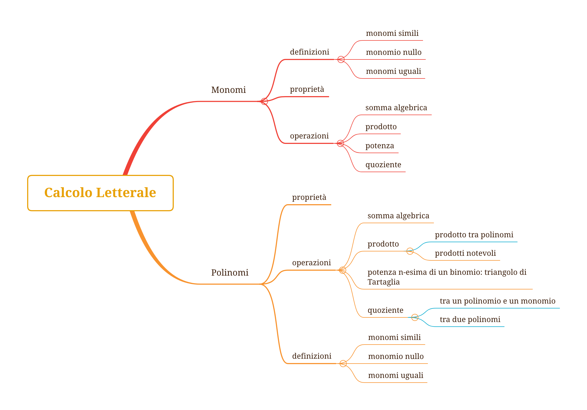

<section data-background-image="book_bkg.jpg" data-background-opacity="0.6" data-transition="convex">
  <h2 style="color:#3B2F2F">CORSO DI</h2>

  <h1 class="r-fit-text" style="color:#3B2F2F">MATEMATICA</h1>
  <h2 style="color:#3B2F2F">per le Classi Seconde</h2>
  <!-- <h2 style="color:#3B2F2F">SERALE </h2> -->
    
  <!-- <h3 style="color:#3B2F2F"><em>esercizi e ripasso</em></h3> -->
  
  <h5 style="color:#8A4117"><em>prof. diego fantinelli</em></h5>
  <h5 style="color:#8A4117">ITET "Pasini" - Schio</h5>
</section>

<section data-transition="convex" data-background-image="book_bkg.jpg" data-background-opacity="0.5">
    
  # OBIETTIVI
  ## DEL CORSO

  <a style="color:#1d91de" href="https://2023-mathofthings.netlify.app/docs/math_se/">programmazione completa </a><i class="fa-solid fa-arrow-up-right-from-square"></i>

</section>

<section data-background-image="book_bkg.jpg" data-background-opacity="0.6" data-transition="concave">

## Tema 1 - Insiemi Numerici
>periodo: **Settembre - Ottobre**
>
>**competenza**: A1

---

### conoscenze:
- Insiemi numerici: naturali, interi, razionali; ordinamento e loro rappresentazione su una retta.
- Le operazioni con i numeri interi e razionali e loro proprietà.
- Proprietà delle potenze.
- Rapporti, proporzioni e percentuali.

---

### abilità

- Utilizzare le procedure del calcolo aritmetico (a mente, per iscritto, a macchina) per calcolare espressioni aritmetiche e risolvere semplici problemi.
- Utilizzare le diverse notazioni e saper convertire da una all’altra (da frazioni a decimali, da frazioni apparenti ad interi, da percentuali a frazioni…)
- Operare in $\mathbb{N, Z, Q}.$
- Comprendere il significato di potenza; calcolare potenze e applicarne le proprietà.
- Risolvere espressioni nei diversi insiemi numerici; rappresentare la soluzione di un problema con un’espressione e calcolarne il valore.
- Impostare uguaglianze di rapporti e risolvere problemi di proporzionalità e percentuale

</section>

<section data-background-image="book_bkg.jpg" data-background-opacity="0.6" data-transition="concave">

## TEMA 2: Calcolo Letterale

>periodo: **Novembre**

>**competenza**: A1

---

### conoscenze:    
- Definizione e significato di monomio; operazioni con i monomi.
### abilità
- Padroneggiare l’uso della lettera come mero simbolo e come variabile.
- Eseguire le operazioni con i monomi, utilizzando opportunamente le proprietà delle potenze.

</section>

<section data-background-image="book_bkg.jpg" data-background-opacity="0.6" data-transition="concave">

## TEMA 3: Polinomi e prodotti notevoli
>periodo: **Dicembre - Gennaio**
>
>**competenza**: A1

---

### conoscenze:
- Definizione e caratteristiche di un polinomio; operazioni con i polinomi.
- Prodotti notevoli (differenza di quadrati, quadrato di binomio, quadrato di trinomio, cubo di binomio)

---

### abilità:
- Eseguire le operazioni con i polinomi e i prodotti notevoli.

</section>

<section data-background-image="book_bkg.jpg" data-background-opacity="0.6" data-transition="concave">

## TEMA 4: Equazioni di $1^{\circ}$ grado intere e fattorizzazione
>periodo: **Febbraio - Marzo - Aprile**
>
>**competenza**: A1

---

---

### conoscenze:
- Equazioni numeriche di primo grado intere.
- Problemi con equazioni.
- Concetto di fattorizzazione.
- Vari metodi di fattorizzazione (raccoglimento parziale e totale, riconoscimento dei prodotti notevoli, trinomio particolare).

---

### abilità
- Risolvere equazioni di primo grado e verificare la correttezza dei procedimenti utilizzati.
- Utilizzo dell’algebra per risolvere problemi numerici e geometrici.
- Fattorizzare un polinomio.
- Utilizzo dell’algebra per risolvere problemi numerici ed algebrici.

</section>

<section data-background-image="book_bkg.jpg" data-background-opacity="0.6" data-transition="concave">

## TEMA 5: Disequazioni numeriche intere di primo grado
> periodo: **Maggio - Giugno**
> 
> **competenza**: A1

---

### conoscenze:
- Disequazioni numeriche intere di primo grado.
### abilità
- Risolvere disequazioni di primo grado e verificare la correttezza dei procedimenti utilizzati.

</section>

<section data-background-image="book_bkg.jpg" data-background-opacity="0.6">

{}
## competenze finali
- Saper utilizzare le tecniche di calcolo per risolvere le equazioni di 1° grado fratte, quelle di 2° grado ed i sistemi di equazioni lineari.
- Saper risolvere problemi di geometria analitica sulla retta.
- Saper risolvere problemi di geometria analitica sulla parabola.
- Saper risolvere disequazioni di 1° e 2° facendo uso della retta e della parabola.
{}

</section>

---

<section data-background-image="calm_bkg.jpg" data-background-opacity="0.6">

# materiali didattici

</section>

<section data-background-image="class3.jpeg" data-background-opacity="0.9">

</section>

<section>

## Google Classroom

- link: [Google Classroom corsi](https://classroom.google.com/c/NTQ2MTA4NzUwMjcw?cjc=wnllzfj)

<h2 class="fragment fade-in-then-out" style="color:#aa0008"><b>3QA: &nbsp;</b><code>wnllzfj</code></h2>
<h2 class="fragment fade-in-then-out" style="color:#aa0008"><b>3QES: &nbsp;</b><code>c7ctvcv</code></h2>

  - comunicazioni **non ufficiali**, ma non per questo frivole...
  - assegnazione compiti (eventualmente anche sul Registro El.)
  - post di varia natura
  - **materiale didattico**: dispense, video, esercizi, dispense, pdf, etc.

---

## Registro elettronico: 
### Classeviva Spaggiari:

  - comunicazioni **ufficiali**: 
    - verifiche e interrogazioni
    - voti
    - Circolari

</section>

---

<section data-transition="concave" data-background-image="book1.png" data-background-opacity="0.8">
</section>

<section data-transition="concave" data-background-image="book1.png" data-background-opacity="0.1">

## Libro di testo: 
#### COLORI DELLA MATEMATICA edizione BIANCA Vol.1 - Petrini, Sasso, Fragni - ed. Petrini

  - non strettamente indispensabile in classe... pesa $780g$
  - versione digitale su iPad? 
    - *parliamone*...

</section>

<section data-background-image="calm_bkg.jpg" data-background-opacity="0.6">

## Appunti dalle lezioni
### ...non ne vado pazzo

</section>

---

<section data-transition="concave" data-background-image="book_bkg.jpg" data-background-opacity="0.4">

<h3>Mind Mapping</h3>

</section>

---

<section data-background-image="numbers.gif" data-background-opacity="0.8">

  <h2 style="color:#ffffff" class="r-fit-text">DOMANDE?</h2>

</section>

---

