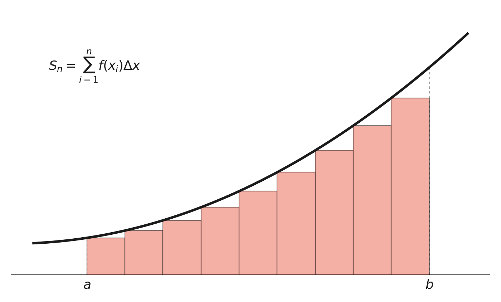
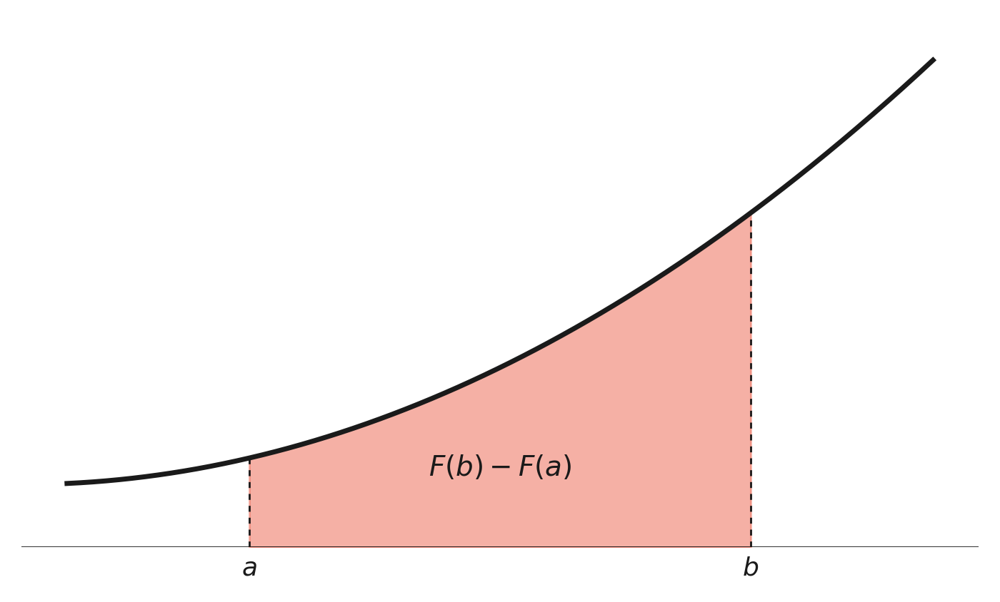

<section class="mot-hero" data-transition="zoom">
  

    <svg width="140" height="50" viewBox="0 0 140 50" aria-hidden="true">
      <defs>
        <filter id="hero-goo" x="-30" y="-30" width="200" height="110" filterUnits="userSpaceOnUse">
          <feGaussianBlur in="SourceGraphic" stdDeviation="4" result="blur" />
          <feColorMatrix in="blur" mode="matrix"
            values="1 0 0 0 0
                    0 1 0 0 0
                    0 0 1 0 0
                    0 0 0 20 -9" result="goo" />
          <feComposite in="SourceGraphic" in2="goo" operator="atop" />
        </filter>
      </defs>
      <g filter="url(#hero-goo)" fill="currentColor">
        <circle cx="70" cy="25" r="16" />
        <circle id="hero-icon-ball" cx="70" cy="25" r="6.5" />
      </g>
    </svg>
  

  
  
quinto anno · avanzato

  <h1>Il Calcolo Integrale</h1>
  
dalla domanda inversa della derivata all'<em>area sotto una curva</em>

  
prof. Diego Fantinelli &mdash; <a href="https://mathofthings.netlify.app/" target="_blank" class="mono">The Math of Things</a>

</section>

---

<section>
  <blockquote class="mot-quote">
    Chi ignora la matematica non può conoscere le altre scienze né le cose di questo mondo.
    &mdash; Ruggero Bacone
  </blockquote>
</section>

---

<section class="mot-divider" data-transition="zoom">
  <h1 class="r-fit-text">LA DOMANDA INVERSA</h1>
</section>

<section>
  
ripartiamo dalle derivate

  <h2>E se andassimo <em>all'indietro</em>?</h2>
  
Sappiamo partire da \(f(x)\) e calcolare \(f'(x)\). Ma se conoscessimo \(f'(x)\) e volessimo <b>risalire</b> a \(f(x)\)?

  
È la stessa domanda che si pone la fisica: conosco la <b>velocità</b> istante per istante, voglio ricostruire la <b>posizione</b>.

</section>

<section>
  
definizione

  <h2>La <em>primitiva</em></h2>
  
\(F(x)\) è una primitiva di \(f(x)\) se, per ogni \(x\):

  
$$F'(x) = f(x)$$

  
Esempio: se \(f(x)=2x\), allora \(F(x)=x^2\) è una primitiva, perché \((x^2)'=2x\).

</section>

<section>
  
un dettaglio cruciale

  <h2>Infinite <em>primitive</em></h2>
  
Se \(F(x)\) è una primitiva di \(f(x)\), anche \(F(x)+c\) lo è, per <b>qualunque</b> costante \(c\).

  <ul style="font-size:0.78em">
    <li class="fragment" style="margin-bottom:0.5em;">La derivata di una costante è zero: aggiungere \(c\) non cambia \(F'(x)\)</li>
    <li class="fragment" style="margin-bottom:0;">Tutte le primitive di \(f\) differiscono solo per una costante additiva</li>
  </ul>
  
infinite curve, tutte "parallele" tra loro

</section>

---

<section class="mot-divider" data-transition="zoom">
  <h1 class="r-fit-text">L'INTEGRALE INDEFINITO</h1>
</section>

<section>
  
la notazione di Leibniz

  <h2>Il simbolo \(\int\)</h2>
  
L'insieme di <b>tutte</b> le primitive di \(f(x)\) si chiama integrale indefinito:

  
$$\int f(x)\,dx = F(x)+c$$

  
La "S" allungata di \(\int\) non è un caso: ricorda una <b>somma</b>. Lo capiremo tra poco.

</section>

<section>
  
tabella essenziale

  <h2>Integrali <em>immediati</em></h2>
  

    

      
\(\displaystyle\int x^n dx = \frac{x^{n+1}}{n+1}+c\)

      
\(\displaystyle\int \frac1x dx = \ln|x|+c\)

      
\(\displaystyle\int e^x dx = e^x+c\)

    

    

      
\(\displaystyle\int \sin x\,dx = -\cos x+c\)

      
\(\displaystyle\int \cos x\,dx = \sin x+c\)

      
\(\displaystyle\int \frac{1}{1+x^2}dx = \arctan x+c\)

    

  

  
la tabella delle derivate, letta al contrario

</section>

---

<section class="mot-divider" data-transition="zoom">
  <h1 class="r-fit-text">TRE METODI</h1>
</section>

<section>
  
metodo 1

  <h2>Per <em>sostituzione</em></h2>
  
Cambiamo variabile: posto \(t=g(x)\), l'integrale complicato in \(x\) diventa immediato in \(t\).

  
$$\int f(g(x))\,g'(x)\,dx = \int f(t)\,dt$$

  
Esempio: \(\displaystyle\int x\,e^{x^2}dx\), con \(t=x^2\), diventa \(\displaystyle\frac12\int e^t dt = \frac12 e^{x^2}+c\).

</section>

<section>
  
metodo 2

  <h2>Per <em>parti</em></h2>
  
Nasce dalla derivata del prodotto: utile quando l'integrando è un prodotto di funzioni "diverse tra loro".

  
$$\int f\,g'\,dx = f\,g - \int f'\,g\,dx$$

  
Esempio: \(\displaystyle\int x\,e^x dx = x e^x - \int e^x dx = (x-1)e^x + c\).

</section>

<section>
  
metodo 3

  <h2>Funzioni razionali <em>fratte</em></h2>
  
Per \(\displaystyle\int \frac{N(x)}{ax^2+bx+c}dx\), tutto dipende dal discriminante del denominatore.

  <dl class="mot-rows fragment" style="font-size:0.68em">
    <dt>\(\Delta>0\)</dt><dd>si scompone in fratti semplici, con logaritmi</dd>
    <dt>\(\Delta=0\)</dt><dd>radice doppia: fratti semplici con potenza al denominatore</dd>
    <dt>\(\Delta<0\)</dt><dd>si riconduce alla forma dell'arcotangente</dd>
  </dl>
</section>

---

<section class="mot-divider" data-transition="zoom">
  <h1 class="r-fit-text">L'INTEGRALE DEFINITO</h1>
</section>

<section>
  
cambiamo prospettiva

  <h2>L'area sotto una <em>curva</em></h2>
  
Vogliamo l'area tra il grafico di \(f(x)\geq0\), l'asse \(x\), e le rette \(x=a\), \(x=b\).

  
Idea di Riemann: approssimare l'area con tanti rettangolini sottili, e vedere cosa succede quando il loro numero tende all'infinito.

</section>

<section>
  
la somma diventa un limite

  <h2>Le somme di <em>Riemann</em></h2>
  
Divido \([a,b]\) in \(n\) parti uguali, base \(\Delta x\), e sommo le aree dei rettangoli:

  
  
$$S_n = \sum_{i=1}^{n} f(x_i)\,\Delta x \quad\longrightarrow\quad \int_a^b f(x)\,dx$$

</section>

<section>
  
attenzione

  <h2>Area con <em>segno</em></h2>
  
Se \(f(x)<0\), i rettangoli contribuiscono <b>negativamente</b>.

  
L'integrale definito non misura un'area "assoluta", ma un'area <b>con segno</b>: positiva sopra l'asse \(x\), negativa sotto.

</section>

---

<section class="mot-divider" data-transition="zoom">
  <h1 class="r-fit-text">IL TEOREMA FONDAMENTALE</h1>
</section>

<section>
  
il ponte tra due mondi

  <h2>Derivata e <em>integrale</em>: operazioni inverse</h2>
  
Il teorema fondamentale del calcolo collega l'integrale definito alle primitive.

  
  
$$\int_a^b f(x)\,dx = F(b)-F(a)$$

</section>

<section>
  
perché funziona

  <h2>La costante che <em>si cancella</em></h2>
  
Con \(F(x)+c\) al posto di \(F(x)\): \(\big[F(b)+c\big]-\big[F(a)+c\big] = F(b)-F(a)\).

  
La costante scompare sempre: per un integrale definito basta <b>una qualsiasi</b> primitiva.

  
Torricelli e Barrow lo intuirono prima ancora di Newton e Leibniz

</section>

---

<section class="mot-divider" data-transition="zoom">
  <h1 class="r-fit-text">APPLICAZIONI</h1>
</section>

<section>
  
tra due grafici

  <h2>Area tra due <em>curve</em></h2>
  
Se \(f(x)\geq g(x)\) su \([a,b]\):

  
$$A = \int_a^b \big[f(x)-g(x)\big]\,dx$$

  
Se le curve si incrociano, si spezza l'integrale nei punti di intersezione — altrimenti le aree si cancellerebbero a vicenda.

</section>

<section>
  
dal piano allo spazio

  <h2>Volumi di <em>rotazione</em></h2>
  
Ruotando il grafico di \(f(x)\geq0\) attorno all'asse \(x\), il metodo dei dischi dà:

  
$$V = \pi\int_a^b \big[f(x)\big]^2\,dx$$

  
Ogni fettina infinitesima è un cilindro di raggio \(f(x)\): sommando tutte le fettine si ottiene il volume del solido.

</section>

<section>
  
verifica sorprendente

  <h2>Il volume della <em>sfera</em></h2>
  
Ruotando il quarto di cerchio \(f(x)=\sqrt{r^2-x^2}\) su \([0,r]\) si genera una semisfera.

  
$$V = \pi\int_0^r (r^2-x^2)\,dx = \frac23\pi r^3 \ \Rightarrow\ V_{\text{sfera}}=\frac43\pi r^3$$

  
la formula che hai sempre usato a memoria, finalmente dimostrata

</section>

---

<section class="mot-divider" data-transition="zoom">
  <h1 class="r-fit-text">DOMANDE?</h1>
  
se la risposta tende a infinito, va bene lo stesso

</section>

---

<section class="mot-hero" data-transition="zoom">
  
grazie dell'attenzione

  <h1>The Math of <em>Things</em></h1>
  
<a href="https://mathofthings.netlify.app/" target="_blank" class="mono">mathofthings.netlify.app</a>

</section>
