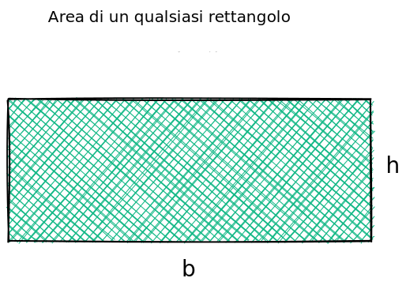

<section data-background-image="pingpong_bkg.jpg" data-background-opacity="0.5">
  <h2 style="color:#3B2F2F" class="r-fit-text">CALCOLO   LETTERALE</h2>
  <h3 style="color:#3B2F2F"><em>- Rif.: Capitolo 5 -</em></h3>
  <h5 style="color:#8A4117"><em>prof. diego fantinelli</em></h5>
  
<em>matematica per il biennio &mdash; classi prime</em>

  
ITIS "Enrico Fermi" - Bassano del Grappa

</section>

<!-- <section>

</section> -->

<!-- prerequisiti-->

<!--  -->

<section data-background-image="https://source.unsplash.com/1920x1080/?white" data-background-opacity="0.5" style="font-size:90%">
  <h2 style="color:#3B2F2F">Prerequisiti</h2>

  <ul class="fragment">
  <li class="fragment"><h3 style="color:#8A4117">insiemi numerici:</h3></li>
    <ul class="fragment">
      <li>Operazioni e nomenclatura insiemistiche</li>
      <li>Operazioni in $\mathbb{N}, \mathbb{Z}, \mathbb{Q}, \mathbb{R}$</li>
    </ul>
  

  <li class="fragment"><h3 style="color:#8A4117">teoria degli insiemi</h3></li>
    <ul class="fragment">
      <li>Rappresentazioni: estensiva, intensiva e Diagrammi di Eulero-Venn</li>
      <li>Prodotto Cartesiano: definizione e rappresentazione</li>
    </ul>
</section>

---

<!--  -->

<section data-background-image="lightbulb.jpg" data-background-opacity="0.5">
  <h3 class="fragment" style="color:#FFFFFF; font-size: 60px;">una riflessione per iniziare...</h3>
  <h3 class="fragment" style="color:#FFFFFF; font-size: 40px;"><em>“I know not with what weapons World War III will be fought, but World War IV will be fought with sticks and stones.”
   &mdash; Albert Einstein</em></h3>
</section>

---

<!--  -->

<section data-background-video="teaching.mp4" data-background-opacity="0.6" data-transition="zoom">
  <h2 style="color:#FFFFFF;" class="r-fit-text">Il Calcolo</h2>
  <h2 style="color:#FFFFFF;" class="r-fit-text">Letterale</h2>
</section>

<!-- esercizi -->

<section <section data-background-image="book_bkg.jpg" data-background-opacity="0.5">
  <h2 style="color:#3B2F2F">Esercizi</h2>
  <ul class="r-fit-text">
    <li class="fragment highlight-current-red">$-2 a^{2} s^{2}+\dfrac{7}{6} a^{2} s^{2}-\dfrac{5}{27} a^{2} s^{2}+\dfrac{11}{15} a^{2} s^{2}+\dfrac{3}{10} a^{2} s^{2}+\dfrac{5}{27} a^{2} s^{2}-\dfrac{6}{5} a^{2} s^{2}$</li>
    <li class="fragment highlight-current-red">$\left(-2 x^{2} y^{3}+\dfrac{5}{2} x^{2} y^{3}-\dfrac{1}{6} x^{2} y^{3}\right)-\left(\dfrac{13}{12} x^{2} y^{3}-\dfrac{11}{4} x^{2} y^{3}+x^{2} y^{3}\right)$</li>
    <li class="fragment highlight-current-red">$\left(-\dfrac{7}{20} a+\dfrac{11}{30} a-\dfrac{7}{12} a+\dfrac{1}{15} a\right)-\left(\dfrac{3}{8} a-\dfrac{7}{20} a-\dfrac{2}{5} a\right)$</li>
    <li class="fragment highlight-current-red">$-\dfrac{2}{5} a^{3}+\dfrac{15}{8} a^{2} b-\dfrac{8}{15} a^{2}-\dfrac{3}{5} a^{3}+\dfrac{8}{15} a^{2}+a^{3}-\dfrac{7}{8} a^{2} b$</li>
    <li class="fragment highlight-current-red">$\dfrac{11}{10} s^{3} t-\dfrac{11}{10} s t^{3}+\dfrac{3}{5} s t^{3}-\dfrac{31}{35} s^{3} t-\dfrac{3}{5} s-\dfrac{3}{14} s^{3} t+\dfrac{3}{5} s+\dfrac{3}{2} t^{3}$</li>
    <li class="fragment highlight-current-red">$-\dfrac{1}{10} x y^{2}-\dfrac{1}{9} x^{2} y+\dfrac{5}{6} x y^{2}+\dfrac{4}{3}+\dfrac{1}{9} x^{2} y-\dfrac{11}{15} x y^{2}-\dfrac{5}{6}$</li>
    <li class="fragment highlight-current-red">$\dfrac{1}{6} x y+\dfrac{5}{3} x-\left[\dfrac{1}{24} x y-\left(\dfrac{1}{12} x y-\dfrac{7}{8} x y+\dfrac{1}{6} x y\right)+2 x-\dfrac{1}{3} x\right]$</li>
  </ul>
</section>

<section>

</section>

<section data-background-video="archery.mp4" data-background-opacity="0.8" data-transition="convex">
  <h2 class="r-fit-text" style="color:#FFFFFF">Definizioni</h2>
</section>

<section data-transition="convex">
  <h2 class="fragment" style="color:#3B2F2F" class="r-fit-text">Dominio e Codominio $\mathscr{R}$</h2>
  <h4 class="fragment" style="text-align:left; color:#3B2F2F;">Dominio di una relazione $D$:</h4>
  <q class="fragment" style="color:#C04000; font-size:80%; background-color:#F3E5AB;">si dice <b>dominio</b> di una relazione $\mathscr{R}$ tra due insiemi $A$ e $B$ l'insieme degli elementi di $A$ che sono associati ad <b>almeno un</b> elemento di $B$.</q>
   
  <h4 class="fragment" style="text-align:left; color:#3B2F2F;">Codominio di una relazione $C$:</h4>
  <q class="fragment" style="color:#C04000; font-size:80%; background-color:#F3E5AB;">si dice <b>codominio</b> di una relazione $\mathscr{R}$ tra due insiemi $A$ e $B$ l'insieme degli elementi di $B$ che sono associati ad <b>almeno un</b> elemento di $A$.</q>
</section>  

<section data-transition="convex">
  <h2 class="fragment" style="color:#3B2F2F" class="r-fit-text">Immagine e Controimmagine</h2>
  <h4 class="fragment" style="text-align:left; color:#3B2F2F;">Immagine di una relazione:</h4>
  <q class="fragment" style="color:#C04000; font-size:80%; background-color:#F3E5AB;">si dice <b>immagine</b> di una relazione $\mathscr{R}$ tra due insiemi $A$ e $B$ l'insieme degli elementi di $A$ che sono associati ad <b>almeno un</b> elemento di $B$.</q>
   
  <h4 class="fragment" style="text-align:left; color:#3B2F2F;">Controimmagine di una relazione:</h4>
  <q class="fragment" style="color:#C04000; font-size:80%; background-color:#F3E5AB;">si dice <b>controimmagine</b> di una relazione $\mathscr{R}$ tra due insiemi $A$ e $B$ l'insieme degli elementi di $B$ che sono associati ad <b>almeno un</b> elemento di $A$.</q>
</section>

<section data-transition="convex">
  <h2 class="fragment" style="color:#3B2F2F" class="r-fit-text">Dominio e Codominio $\mathscr{R}$</h2>
  <h4 class="fragment" style="color:#3B2F2F" class="r-fit-text"><em>tramite le def. di <b>immagine</b> e <b>controimmagine</b></em></h4>
  <h4 class="fragment" style="text-align:left; color:#3B2F2F;">Dominio di una relazione (D):</h4>
  <q class="fragment" style="color:#C04000; font-size:80%; background-color:#F3E5AB;">si dice <b>dominio</b> di una relazione $\mathscr{R}$ tra due insiemi $A$ e $B$ l'insieme degli elementi di $A$ che hanno <b>almeno una immagine</b> in $B$.</q>
   
  <h4 class="fragment" style="text-align:left; color:#3B2F2F;">Codominio di una relazione (C):</h4>
  <q class="fragment" style="color:#C04000; font-size:80%; background-color:#F3E5AB;">si dice <b>codominio</b>di una relazione $\mathscr{R}$ tra due insiemi $A$ e $B$ l'insieme degli elementi di $B$ che hanno <b>almeno una controimmagine</b> in $A$</q>
</section>

<section data-transition="convex">
<h2 style="color:#8A4117" class="r-fit-text">proprietà delle relazioni:</h2>
<ul class="fragment" style="font-size:80%">
  <li class="fragment"><b>Riflessiva:</b> ogni elemento è in relazione con se stesso: $\forall x \in A, x \mathscr{R} y$</li>
  <li class="fragment"><b>Antiriflessiva:</b> nessun elemento è in relazione con se stesso: $\forall x \in A, x \cancel{\mathscr{R}} y$</li>
  <li class="fragment"><b>Simmetrica:</b> se $x$ è in relazione con $y$, allora $y$  è in relazione con $x$:  $(x \mathscr{R} y) \vee (y \mathscr{R} z) \longrightarrow x \mathscr{R} z$, con $x, y, z \in A$</li>
  <li class="fragment"><b>Antisimmetrica:</b> se $x$ è in relazione con $y$ e $y$ è in relazione con $x$, allora $x=y$:  $(x \mathscr{R} y) \wedge (y \mathscr{R} x) \longrightarrow x = y$, con $x, y \in A$</li>
  <li class="fragment"><b>Transitiva:</b> se $x$ è in relazione con $y$, e $y$ è in relazione con "z" allora $x$ è in relazione con $z$: $(x \mathscr{R} y) \wedge (y \mathscr{R} z) \longrightarrow x \mathscr{R} z$, con $x, y, z \in A$</li>
</ul>
</section>

<section data-transition="convex">
<h2 style="color:#8A4117">Relazioni di equivalenza</h2>
<h4 class="fragment" style="text-align:left; background-color:#F3E5AB; font-size:80%"><b>definizione:</b><em> una relazione $\mathscr{R}$ definita in un insieme $A$ è una relazione di equivalenza se gode delle proprietà riflessiva, simmetrica e transitiva. Se $\mathscr{R}$ è una relazione di equivalenza, due elementi in relazione tra loro si dicono <b>equivalenti</b> rispetto a $\mathscr{R}$</em></h4>
<ul style="font-size:85%">
  <li class="fragment" style="color:#8A4117;"><em>I sottoinsiemi di $A$ costituiti da elementi tutti equivalenti fra loro rispetto alla relazione di equivalenza $\mathscr{R}$ si dicono <b>classi di equivalenza</b> di $\mathscr{R}$.</em></li>
  <li class="fragment" style="color:#8A4117;"><em>Essi costituiscono una partizione di $A$ e l’insieme che ha per elementi le classi di equivalenza rispetto a $\mathscr{R}$ si chiama insieme <b>quoziente.</b></em></li>
</ul>
</section>

<section data-transition="convex">
  <h2 style="color:#8A4117">Relazioni d'ordine</h2>
  <h4 class="fragment" style="text-align:left; background-color:#F3E5AB; font-size:80%"><em><b>definizione:</b> relazione $\mathscr{R}$ che gode delle proprietà <b>antisimmetrica</b> e <b>transitiva</b></em></h4>
  <ul style="font-size:85%">
    <li class="fragment" style="color:#8A4117;"><em>Se $\mathscr{R}$ è anche <b>antiriflessiva</b>, essa è detta relazione <b>d’ordine stretto</b></em></li>
    <li class="fragment" style="color:#8A4117;"><em>Se $\mathscr{R}$ è anche <b>riflessiva</b>, essa è detta relazione <b>d’ordine largo</b></em></li>
    <ul style="font-size:80%">  
      <li class="fragment" style="color:#8A4117;"><em>in particolare:</em></li>
      <li class="fragment" style="color:#8A4117;"><em>se $\mathscr{R}$ è una relazione d’ordine e $x \mathscr{R} y$, si dice che $x$ precede $y$ o che $y$ segue $x$ in $\mathscr{R}$</em></li>
      <li class="fragment" style="color:#8A4117;"><em>se $\forall x\in A$ e $\forall y \in A$ tali che $x \neq y$ risulta $(x \mathscr{R} y) \wedge (y \mathscr{R} x)$, allora si dice che $\mathscr{R}$ è una relazione <b>d’ordine totale</b>.  Altrimenti $\mathscr{R}$ è detta relazione <b>d’ordine parziale</b></em></li>
  </ul>
</section>

---

<!--  -->

<section <section data-background-image="book_bkg.jpg" data-background-opacity="0.5">
<h2 style="color:#3B2F2F; font-size:120pt">Funzioni</h2>
<h3 class="fragment" style="text-align:left; color:#3B2F2F;">definizione: $f: X \longrightarrow Y$</h3>
<q class="fragment" style="color:#C04000; font-size:90%; background-color:#F3E5AB;">Dati due insiemi non vuoti $X$ e $Y$, si dice <b>funzione</b> tra $X$ e $Y$, una <b>legge</b> che associa <b>ad ogni</b> elemento $x$ dell’insieme $X$
<b>uno e uno solo</b> elemento $y$ dell’insieme $Y$</q>
<ul style="font-size:85%">
  <li class="fragment"><h4>si scrive: $f: x \in X \longrightarrow y \in Y$</h4></li>
  <li class="fragment"><h4>oppure, nella forma più compatta: $y=f(x)$</h4></li>
</ul>
</section>

<section data-transition="convex">
  <h2 style="color:#3B2F2F" class="r-fit-text">definizioni importanti</h2>
  
<em><b>Dominio:</b> In una funzione il <b>dominio</b> coincide - a meno di punti particolari - con l'insieme di partenza;</em>

  
<em><b>Codominio:</b> In una funzione il <b>dominio</b> coincide - a meno di punti particolari - con l'insieme di partenza;</em>

  
<em><b>Immagine:</b> In una funzione il <b>dominio</b> coincide - a meno di punti particolari - con l'insieme di partenza;</em>

  
<em><b>Contro-Immagine:</b> In una funzione il <b>dominio</b> coincide - a meno di punti particolari - con l'insieme di partenza;</em>

</section>

---
<section>
  ## esercizi ripasso monomi e polinomi
  
   Eseguiamo, se possibile, le seguenti divisioni:
  
  1. $\left(12 x^{4} y^{3}-3 x^{3} y^{4}+2 x^{2} y\right):\left(2 x^{2} y\right)$;

</section>

---

<section>
  - La divisione $\left(12 x^{4} y^{3}-3 x^{3} y^{4}+2 x^{2} y\right):\left(2 x^{2} y\right)$ è possibile, perché ogni termine del dividendo contiene le variabili del divisore, con esponente maggiore o uguale.
  
  > Non è necessario, invece, che i coefficienti dei termini del dividendo siano multipli del coefficiente del divisore.
  
- Dividiamo per $2 x^{2} y$ ogni termine del polinomio dividendo:

  $$
  \begin{aligned}
  &12 x^{4} y^{3}:\left(2 x^{2} y\right)=6 x^{4-2} y^{3-1}=6 x^{2} y^{2} \
  &-3 x^{3} y^{4}:\left(2 x^{2} y\right)=-\frac{3}{2} x^{3-2} y^{4-1}=-\frac{3}{2} x y^{3} \
  &2 x^{2} y:\left(2 x^{2} y\right)=1 .
  \end{aligned}
  $$

</section>

<section>
  Il risultato è quindi:
  $$
  \left(12 x^{4} y^{3}-3 x^{3} y^{4}+2 x^{2} y\right):\left(2 x^{2} y\right)=6 x^{2} y^{2}-\frac{3}{2} x y^{3}+1 .
  $$
  <mark class="hltr-green">Verifica</mark> :
  $$
  \underbrace{\left(6 x^{2} y^{2}-\frac{3}{2} x y^{3}+1\right)}_{\text {quoziente }} \cdot \underbrace{2 x^{2} y}_{\text {divisore }}=\underbrace{12 x^{4} y^{3}-3 x^{3} y^{4}+2 x^{2} y}_{\text {dividendo }} .
  $$

</section>

---

<section>
  ### esercizio 2
  $$\left(5 a b^{2}+3 a^{3} b^{3}-3 a^{4}\right):\left(2 a^{2} b^{2}\right)$$

- La divisione $\left(5 a b^{2}+3 a^{3} b^{3}-3 a^{4}\right): 2 a^{2} b^{2}$ non è possibile per due motivi:
- $5 a b^{2}$ ha grado rispetto ad $a$ minore di $2 a^{2} b^{2}$;
- $-3 a^{4}$ ha grado rispetto a $b$ minore di $2 a^{2} b^{2}$ (il grado rispetto a $b$ di $-3 a^{4}$ è 0 ).

</section>

<section>
  ### prodotti notevoli
  
#### Esercizi
  
- $(2 a-b)^{2}-(3 a+b)(a-2 b)+5 a^{2}-a b$
- $(x+y)^{2}-2 y(x-y)-(x+y)(y-x)$
- $\left(a^{2}+b^{2}\right)\left(a^{2}-b^{2}\right)-\left(a^{2}+b^{2}\right)^{2}+2 a^{2}\left(a^{2}+b^{2}\right)$
- $(x+1)^{3}+3(x+1)^{2}+3(x+1)+1$

</section>

<section data-transition="convex">
- $2(y-3 x)^{2}+2(2 x+y)(y-2 x)-9 x^{2}-2 x y-(2 y-x)^{2}$
- $\left(x^{2}-3 y^{2}\right)\left(2 x^{2}+y^{2}\right)-\left(x^{2}+2 y^{2}\right)\left(x^{2}-2 y^{2}\right)-\left(x^{2}+y^{2}\right)^{2}$
- $[(2-a)(2+a)-2]^{3}-\left(2 a^{2}-b+1\right)^{2}+a^{2}\left(a^{2}+4\right)^{2}+\left(b-2 a^{2}\right)^{2}$
- $\left(-x+y^{2}\right)\left(-x-y^{2}\right)+(-2 y)^{2}(x-y)^{2}+8 x y^{3}-4 x^{2}\left(1+y^{2}\right)$
</section>

<section data-transition="convex">
  - $(x+2)^{2}-3(x+2)(x-2)+(x-2)^{3}-x^{2}(x-8)$
  - $(x-2 y)^{3}-x(x-2 y)(x+2 y)+2 x y(3 x+4 y)-(-2 y)^{3}$
  - $a\left(a^{2}-3\right)+\left(1+6 a+a^{3}\right)-(a-1)^{3}+(-a-1)^{3}$
  - $\left\{\left[x^{3}-y^{3}+(x+y)^{3}+2 x^{2} y-x(2 x+3 y)(x+y)\right]^{2}-2\right}^{3}$
</section>

--

<section>
  - $[a+3+(b-1)(2 b+a+3)+b(b+2 a-1)] a-(b+a)^{3}$
  - $\left(x^{2}-2 x y+3 y^{2}\right)\left(x^{2}+2 x y+3 y^{2}\right)-2\left(x y-x^{2}\right)^{2}-4 x^{3} y+x^{4}$
  - $\left[(x-y)^{2}(x+y)^{2}-x^{2}\left(x^{2}-2 y^{2}\right)\right]: \frac{(-y)^{2}}{2} \cdot(x+y)$
  - $\left[(x+3 a)^{2}+(2 x-3 a)^{2}+4\left(x-\frac{3}{2} a\right)(3 a+x)\right]:(-3)^{2}-(x-2)^{2}$
</section>

<section>
  - $\left(1-2 a^{2}\right)\left(1+2 a^{2}\right)+\left(5 a^{2}-1\right)^{2}-2\left(1-4 a^{2}\right)^{2}-\left[-2 a^{4}-\left(3 a^{2}-1\right)^{2}\right]$
  - $\left[(x+y)^{3}-(x+y)\left(x^{2}-x y+y^{2}\right)\right]^{2}-2 x y(-3 x y)^{2}$
  - $\left[x^{2}-(x-y)(x+y)+y^{3}\right]^{3}-(1+y)^{3} \cdot\left[\left(y^{3}+1\right)\left(y^{3}-1\right)+\left(y^{2}+x^{2}\right)^{0}\right]$
</section>

---

<!--  -->

<section <section data-background-image="numbers.gif" data-background-opacity="0.5">

  <h2 style="color:#ffffff" class="r-fit-text">DOMANDE?</h2>
</section>

---

<section data-background-color="#EDEDED">
  
</section>
