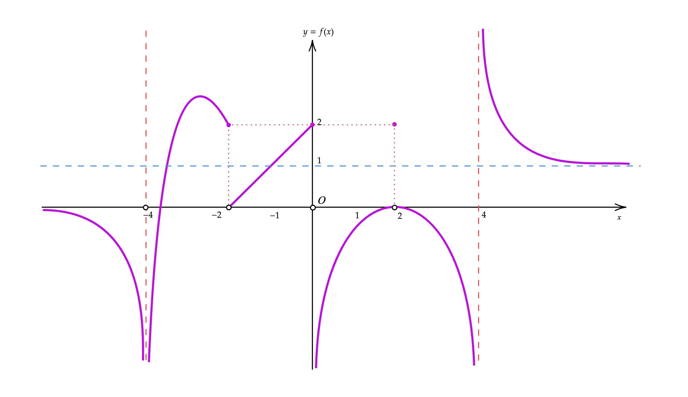
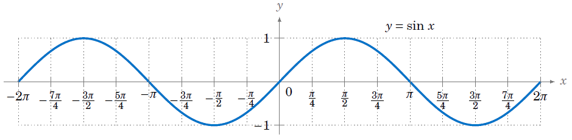
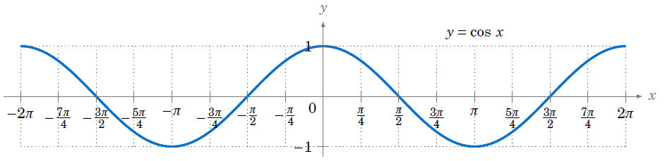
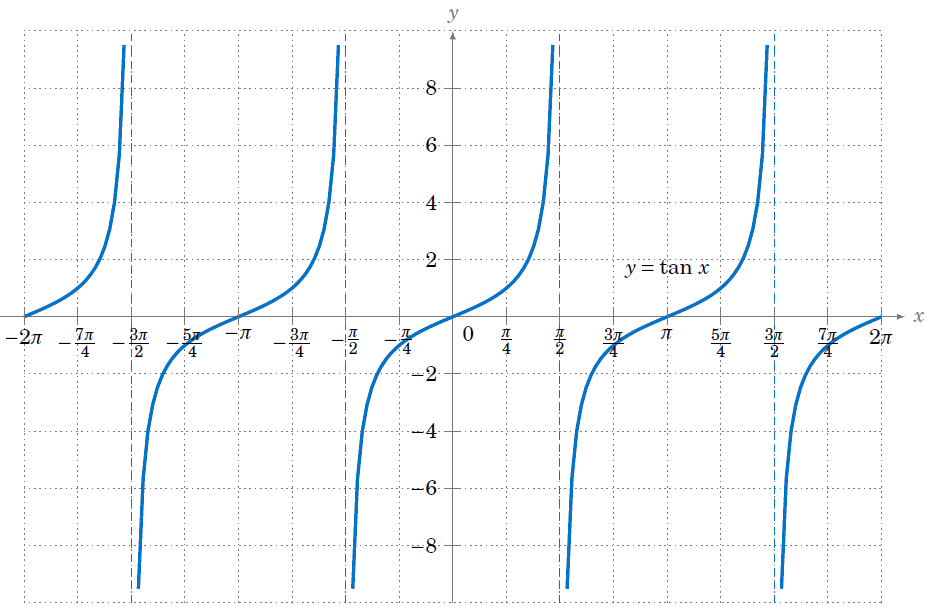

<section class="mot-hero" data-transition="zoom">
  

    <svg width="140" height="50" viewBox="0 0 140 50" aria-hidden="true">
      <defs>
        <filter id="hero-goo" x="-30" y="-30" width="200" height="110" filterUnits="userSpaceOnUse">
          <feGaussianBlur in="SourceGraphic" stdDeviation="4" result="blur" />
          <feColorMatrix in="blur" mode="matrix"
            values="1 0 0 0 0
                    0 1 0 0 0
                    0 0 1 0 0
                    0 0 0 20 -9" result="goo" />
          <feComposite in="SourceGraphic" in2="goo" operator="atop" />
        </filter>
      </defs>
      <g filter="url(#hero-goo)" fill="currentColor">
        <circle cx="70" cy="25" r="16" />
        <circle id="hero-icon-ball" cx="70" cy="25" r="6.5" />
      </g>
    </svg>
  

  
  
matematica per il biennio

  <h1>Relazioni e Funzioni</h1>
  
di variabile <em>reale</em>

  
prof. Diego Fantinelli &mdash; <a href="https://mathofthings.netlify.app/" target="_blank" class="mono">The Math of Things</a>

</section>

---

<section data-background-image="book_bkg.jpg" data-background-opacity="0.15">
  <blockquote class="mot-quote">
    In fisica e in matematica &egrave; impressionante la sproporzione tra lo sforzo per capire una cosa nuova per la prima volta e la semplicit&agrave; e naturalezza del risultato una volta che i vari passaggi sono stati compiuti.
    Nel prodotto finito, nelle scienze come in poesia, non c'&egrave; traccia della fatica del processo creativo e dei dubbi e delle esitazioni che lo accompagnano.
    &mdash; Giorgio Parisi, "In un volo di storni" (2021)
  </blockquote>
</section>

---

<section class="mot-divider" data-transition="zoom">
  <h1 class="r-fit-text">RELAZIONI</h1>
</section>

<section>
  
definizione

  <h2>La relazione $\mathscr{R}$</h2>
  
Dati due insiemi non vuoti $A$ e $B$, si dice <b>relazione</b> tra $A$ e $B$ &mdash; e si indica con $\mathscr{R}$ &mdash; una <b>legge</b> che associa elementi dell'insieme $A$ a elementi dell'insieme $B$.

  <dl class="mot-rows fragment">
    <dt>notazione</dt><dd>$\mathscr{R}: A \longrightarrow B$</dd>
    <dt>per elementi</dt><dd>$\mathscr{R}: a \in A \longrightarrow b \in B$</dd>
    <dt>caso particolare</dt><dd>se $\mathscr{R}$ opera tra $A$ e se stesso, si dice relazione <em>nell'insieme</em> $A$</dd>
  </dl>
  
come i social network, ma qui i collegamenti hanno una logica

</section>

<section>
  
definizioni

  <h2>Dominio e codominio</h2>
  
<b>Dominio</b> di $\mathscr{R}$: l'insieme degli elementi di $A$ associati ad <b>almeno un</b> elemento di $B$.

  
<b>Codominio</b> di $\mathscr{R}$: l'insieme degli elementi di $B$ associati ad <b>almeno un</b> elemento di $A$.

</section>

<section>
  
definizioni

  <h2>Immagine e controimmagine</h2>
  
Se $a \,\mathscr{R}\, b$, l'elemento $b$ si dice <b>immagine</b> di $a$ nella relazione $\mathscr{R}$.

  
L'elemento $a$ si dice <b>controimmagine</b> di $b$.

  
Quindi: il dominio &egrave; l'insieme degli elementi di $A$ che hanno <em>almeno una immagine</em> in $B$; il codominio &egrave; l'insieme degli elementi di $B$ che hanno <em>almeno una controimmagine</em> in $A$.

</section>

---

<section class="mot-divider" data-transition="zoom">
  <h1 class="r-fit-text">FUNZIONI</h1>
</section>

<section>
  
definizione

  <h2>La funzione $f: X \longrightarrow Y$</h2>
  
Dati due insiemi non vuoti $X$ e $Y$, si dice <b>funzione</b> da $X$ a $Y$ una <b>legge</b> che associa <b>a ogni</b> elemento $x$ di $X$ <b>uno e un solo</b> elemento $y$ di $Y$.

  
in forma compatta:

  
$$y = f(x)$$

  
a ogni x uno e un solo y: la monogamia, matematicamente

</section>

<section>
  
lessico

  <h2>Le parole delle funzioni</h2>
  <dl class="mot-rows">
    <dt class="fragment">dominio</dt><dd class="fragment">l'insieme $X$ di partenza: i valori per cui $f$ &egrave; definita</dd>
    <dt class="fragment">codominio</dt><dd class="fragment">l'insieme $Y$ di arrivo</dd>
    <dt class="fragment">immagine</dt><dd class="fragment">l'insieme dei valori $y \in Y$ tali che $y = f(x)$ per almeno un $x \in X$</dd>
    <dt class="fragment">controimmagine</dt><dd class="fragment">dato $y \in Y$, l'insieme degli $x \in X$ tali che $f(x) = y$</dd>
  </dl>
</section>

<section>
  
propriet&agrave;

  <h2>Tre famiglie <em>notevoli</em></h2>
  

    

      <h3>Iniettiva</h3>
      
elementi distinti hanno immagini distinte:

      
$x_1 \neq x_2 \Rightarrow f(x_1) \neq f(x_2)$

    

    

      <h3>Suriettiva</h3>
      
ogni elemento di $Y$ &egrave; immagine di almeno un $x$:

      
$\mathrm{Im}\,f = Y$

    

    

      <h3>Biunivoca</h3>
      
iniettiva e suriettiva insieme: esiste la funzione <em>inversa</em>

      
$f^{-1}: Y \longrightarrow X$

    

  

  
biunivoca: quando ogni y ha trovato la sua x, e viceversa

</section>

---

<section class="mot-divider" data-transition="zoom">
  <h1 class="r-fit-text">CLASSIFICAZIONE</h1>
</section>

<section>
  
dividere il lavoro

  <h2>Come riconosciamo una funzione</h2>
  <ul>
    <li class="fragment" style="margin-bottom:0.5em;">Lo studio di una funzione è il percorso che va da un'equazione matematica al suo <b>grafico</b></li>
    <li class="fragment" style="margin-bottom:0.5em;">Per affrontarlo con metodo, prima classifichiamo la funzione: sapere che cosa stiamo cercando facilita la ricerca</li>
    <li class="fragment" style="margin-bottom:0;">La classificazione risponde a una semplice domanda, <em>che tipo di operazioni contiene?</em> Una funzione può essere <b>algebrica</b> (solo operazioni algebriche) oppure <b>trascendente</b> (esponenziali, logaritmi, trigonometria)</li>
  </ul>
</section>

<section>
  
funzioni algebriche

  <h2>Razionali <em>vs</em> irrazionali</h2>
  <dl class="mot-rows">
    <dt class="fragment">razionali intere</dt><dd class="fragment">$y = P(x)$ — polinomi: $y = 2x^3 - 5x^2 + 3x - 1$. Dominio: $\mathbb{R}$.</dd>
    <dt class="fragment">razionali fratte</dt><dd class="fragment">$y = \dfrac{P(x)}{Q(x)}$ — rapporto di polinomi. Escludi gli zeri del denominatore.</dd>
    <dt class="fragment">irrazionali intere</dt><dd class="fragment">$y = \sqrt[n]{g(x)}$ — radici: $y = \sqrt{x^2 - 9}$. Attenzione al dominio (radicando $\geq 0$ se $n$ pari).</dd>
    <dt class="fragment">irrazionali fratte</dt><dd class="fragment">Radice al numeratore, polinomio al denominatore: combina i vincoli di entrambe.</dd>
  </dl>
  
le razionali vivono ovunque; le irrazionali hanno un senso critico sul loro dominio

</section>

<section>
  
funzioni trascendenti

  <h2>Quelle che non si calcano con le mani</h2>
  <dl class="mot-rows">
    <dt class="fragment">esponenziali</dt><dd class="fragment">$y = a^x$ (con $a \gt 0, a \neq 1$), oppure $y = a^{g(x)}$. Esempio: $y = 2^x$, $y = e^{x^2-1}$. Dominio: $\mathbb{R}$.</dd>
    <dt class="fragment">logaritmiche</dt><dd class="fragment">$y = \log_a(x)$ o $y = \log_a(g(x))$. Vincolo: $g(x) \gt 0$. Esempi: $y = \ln(x)$, $y = \log_2(x^2-4)$.</dd>
    <dt class="fragment">goniometriche</dt><dd class="fragment">Seno, coseno ($\mathbb{R}$), tangente (escludendo $\frac{\pi}{2}+k\pi$). Anche arcsin, arccos, arctan.</dd>
  </dl>
  
le trascendenti amano i limiti e gli infiniti: il loro grafico spesso "scappa"

</section>

---

<section>
  
il perché

  <h2>Lo studio di <em>funzione</em></h2>
  <ul>
    <li class="fragment" style="margin-bottom:0.5em;">Partire da un'equazione — magari complicata — e arrivare a un grafico è il cuore dell'analisi: vedere la forma della curva è capire il comportamento della funzione</li>
    <li class="fragment" style="margin-bottom:0.5em;">Chiediti sempre: dove cresce? Dove decresce? Ha simmetrie? Ha asintoti? Che cosa accade agli estremi del dominio? La risposta a queste domande è il <b>disegno del grafico</b></li>
    <li class="fragment" style="margin-bottom:0;">E il disegno, a sua volta, è lo strumento che <em>spiega</em> la realtà: modelli di popolazione, curve di raffreddamento, ondate di prezzo — tutto ciò che oscilla, cresce, decresce o tende a un limite ha una funzione dietro</li>
  </ul>
</section>

<section>
  
il metodo

  <h2>I sei passi dello studio</h2>
  

    <ol style="flex:1; text-align:left; font-size:0.65em; line-height:1.3; list-style-position:outside; padding-left:1.4em;">
      <li class="fragment" style="margin-bottom:0.5em;">
        Dominio
        quale è l'insieme di valori per cui la funzione è definita? Cerca limitazioni (radici, logaritmi, denominatori).
      </li>
      <li class="fragment" style="margin-bottom:0.5em;">
        Intersezione con gli assi
        dove il grafico taglia l'asse $x$ (zeri: $f(x)=0$) e l'asse $y$ ($f(0)$).
      </li>
      <li class="fragment" style="margin-bottom:0;">
        Simmetrie
        è una funzione pari ($f(-x)=f(x)$, simmetrica rispetto a $y$) o dispari ($f(-x)=-f(x)$, rispetto all'origine)?
      </li>
    </ol>
    <ol start="4" style="flex:1; text-align:left; font-size:0.65em; line-height:1.3; list-style-position:outside; padding-left:1.4em;">
      <li class="fragment" style="margin-bottom:0.5em;">
        Studio del segno
        dove è positiva ($f(x) \gt 0$) e dove negativa ($f(x) \lt 0$)? Questo separa il piano in zone.
      </li>
      <li class="fragment" style="margin-bottom:0.5em;">
        Studio dei limiti
        che cosa accade agli estremi del dominio? C'è un asintoto orizzontale, verticale, obliquo?
      </li>
      <li class="fragment" style="margin-bottom:0;">
        Grafico probabile
        unisci tutto ciò che hai scoperto e disegna la curva. È il momento della verità.
      </li>
    </ol>
  

  
sei passi, uno schema, un grafico: è geometria che nasce dall'algebra

</section>

<section>
  
il calcolo

  <h2>I sei passi <em>avanzati</em></h2>
  

    <ol start="7" style="flex:1; text-align:left; font-size:0.65em; line-height:1.3; list-style-position:outside; padding-left:1.4em;">
      <li class="fragment" style="margin-bottom:0.5em;">
        Derivata prima
        $f'(x)$ misura la pendenza della curva — dove cresce ($f' \gt 0$) e dove decresce ($f' \lt 0$).
      </li>
      <li class="fragment" style="margin-bottom:0.5em;">
        Crescenza e decrescenza
        dove $f'(x) \gt 0$ la funzione sale; dove $f'(x) \lt 0$ scende. I punti dove $f'(x) = 0$ sono candidati a massimi/minimi.
      </li>
      <li class="fragment" style="margin-bottom:0;">
        Massimi e minimi relativi
        picchi e valli della curva. Usa il test della derivata prima (o seconda) per distinguerli dai flessi.
      </li>
    </ol>
    <ol start="10" style="flex:1; text-align:left; font-size:0.65em; line-height:1.3; list-style-position:outside; padding-left:1.4em;">
      <li class="fragment" style="margin-bottom:0.5em;">
        Derivata seconda
        $f''(x)$ misura la curvatura — se la funzione è concava ($f'' \lt 0$) o convessa ($f'' \gt 0$).
      </li>
      <li class="fragment" style="margin-bottom:0.5em;">
        Concavità e convessità
        la curva piega verso il basso (concava) o verso l'alto (convessa). Dove $f''(x) = 0$ ci sono i flessi.
      </li>
      <li class="fragment" style="margin-bottom:0;">
        Grafico definitivo
        unisci tutto — asintoti, zeri, segno, crescenza, concavità — e disegna con precisione. È il capolavoro finale.
      </li>
    </ol>
  

  
dalla carta al calcolo: è qui che la funzione rivela i suoi segreti

</section>

---

<section data-transition="zoom">
  <h2>Grafico <em>finale</em></h2>
  
dal primo passo all'ultimo: l'equazione diventa immagine, l'astratto diventa visibile

  
Unendo tutti i dodici passi — dominio, zeri, simmetrie, segno, limiti, derivate, concavità — otteniamo il grafico completo e preciso. Ogni curva, ogni asintoto, ogni cambio di direzione racconta la storia della funzione.

  
</section>

---

<section class="mot-divider" data-transition="zoom">
  <h1 class="r-fit-text">GRAFICI</h1>
</section>

<section>
  
funzioni notevoli

  <h2>Le proporzionalit&agrave;</h2>
  <dl class="mot-rows">
    <dt class="fragment">diretta</dt><dd class="fragment">$y = kx$ &mdash; una retta per l'origine</dd>
    <dt class="fragment">quadratica</dt><dd class="fragment">$y = kx^2$ &mdash; una parabola con vertice nell'origine</dd>
    <dt class="fragment">inversa</dt><dd class="fragment">$y = \dfrac{k}{x}$ &mdash; un'iperbole equilatera</dd>
  </dl>
  
k fa tutto il lavoro, ma il merito va sempre a x

</section>

<section>
  
funzioni goniometriche

  <h2>La funzione <em>seno</em></h2>
  

    

      
$y = \sin x$

      
periodica di periodo $2\pi$, limitata: $-1 \leq \sin x \leq 1$

    

    

  

</section>

<section>
  
funzioni goniometriche

  <h2>La funzione <em>coseno</em></h2>
  

    

      
$y = \cos x$

      
stessa onda del seno, sfasata di $\dfrac{\pi}{2}$

    

    

  

</section>

<section>
  
funzioni goniometriche

  <h2>La funzione <em>tangente</em></h2>
  

    

      
$y = \tan x$

      
periodica di periodo $\pi$, non definita per $x = \dfrac{\pi}{2} + k\pi$

      
anche le funzioni hanno i loro limiti

    

    

  

</section>

---

<section class="mot-divider" data-background-image="heart_01.gif" data-background-opacity="0.4" data-transition="zoom">
  <h1 class="r-fit-text">VITA REALE</h1>
  
le funzioni intorno a <em>noi</em>

</section>

<section data-background-image="heart_01.gif" data-background-opacity="0.12">
  
esempio

  <h2>L'elettrocardiogramma</h2>
  
L'<b>ECG</b> registra e rappresenta graficamente l'attivit&agrave; elettrica del cuore: dalla lettura del grafico il cardiologo ottiene indicazioni sullo stato del cuore.

  
&Egrave; una funzione del tempo: a ogni istante $t$ corrisponde <em>uno e un solo</em> valore del potenziale elettrico.

  
$$V = f(t)$$

  
l'unica funzione che tifiamo resti periodica

</section>

<section data-background-image="heart_01.gif" data-background-opacity="0.12">
  
le variabili in gioco

  <h2>Leggere il tracciato</h2>
  <dl class="mot-rows">
    <dt class="fragment">onda P</dt><dd class="fragment">depolarizzazione atriale: piccola onda positiva</dd>
    <dt class="fragment">complesso QRS</dt><dd class="fragment">depolarizzazione ventricolare: il picco che riconosciamo tutti</dd>
    <dt class="fragment">onda T</dt><dd class="fragment">ripolarizzazione ventricolare: il ritorno alle condizioni di base</dd>
    <dt class="fragment">intervallo QT</dt><dd class="fragment">l'intera attivit&agrave; elettrica ventricolare</dd>
  </dl>
</section>

<section data-background-image="heart_01.gif" data-background-opacity="0.12">
  
matematicamente

  <h2>Riconoscere il battito</h2>
  
Il riconoscimento automatico del complesso QRS usa il <em>filtraggio digitale</em>: una trasformazione lineare che al segnale $x_t$ associa un segnale $y_t$

  
$$y_{t}=\sum_{k=1}^{n} f(k)\, y_{t-k}+\sum_{i=1}^{m} g(i)\, x_{t-i}$$

  
approfondimento: <a href="https://mathofthings.netlify.app/lezioni/studio-funzione-razionale/" target="_blank" class="mono">Studio completo di funzioni razionali</a>

</section>

---

<section>
  
un altro esempio

  <h2>La funzione <em>Happiness</em></h2>
  
$$\text{Happiness}(t)=w_{0}+w_{1}\sum_{j=1}^{t} \gamma^{t-j} CR_{j}+w_{2}\sum_{j=1}^{t} \gamma^{t-j} EV_{j}+w_{3}\sum_{j=1}^{t} \gamma^{t-j} RPE_{j}$$

  <dl class="mot-rows fragment" style="font-size:0.55em">
    <dt>$w_0 \dots w_3$</dt><dd>costanti: il peso dei diversi tipi di evento</dd>
    <dt>$\gamma$</dt><dd><em>forgetting factor</em>: gli eventi recenti contano di pi&ugrave;</dd>
    <dt>$CR_j$</dt><dd>gratificazione ottenuta dalla scelta $j$</dd>
    <dt>$EV_j$</dt><dd>valutazione del rischio sulla scelta $j$</dd>
    <dt>$RPE_j$</dt><dd>differenza tra ricompensa attesa e ottenuta</dd>
  </dl>
  
s&igrave;, qualcuno ha davvero provato a mettere la felicit&agrave; in formula

</section>

---

<section class="mot-divider" data-background-image="numbers.gif" data-background-opacity="0.25" data-transition="zoom">
  <h1 class="r-fit-text">DOMANDE?</h1>
  
le domande stupide non esistono. Le risposte, qualche volta.

</section>

---

<section class="mot-hero" data-transition="zoom">
  
grazie dell'attenzione

  <h1>The Math of <em>Things</em></h1>
  
<a href="https://mathofthings.netlify.app/" target="_blank" class="mono">mathofthings.netlify.app</a>

</section>
