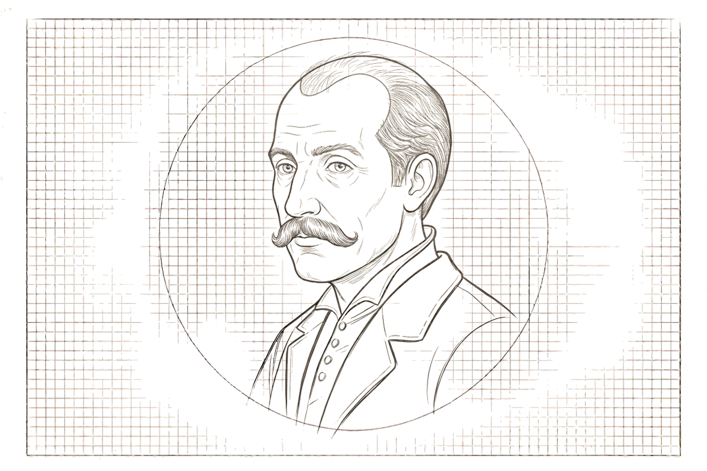
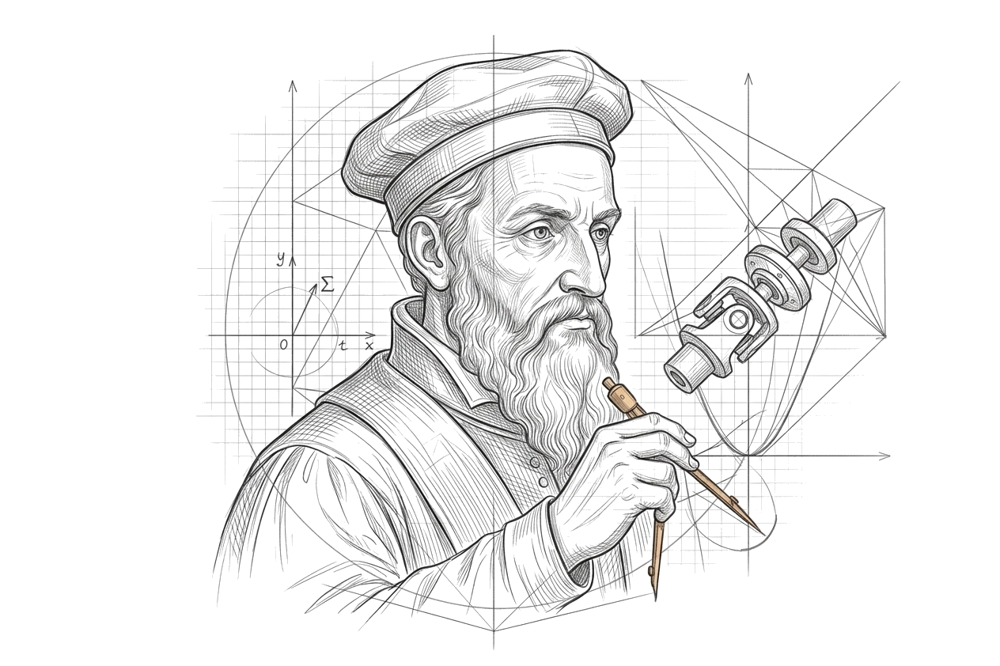
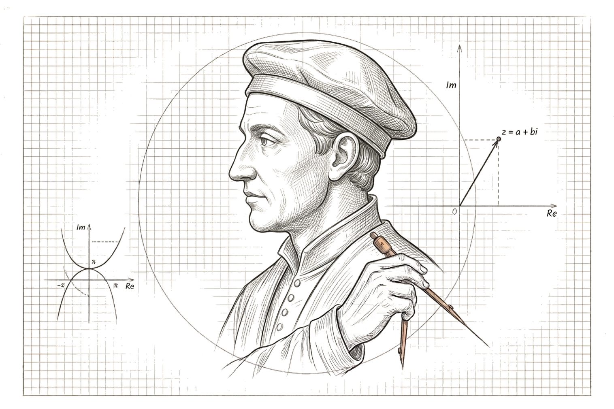
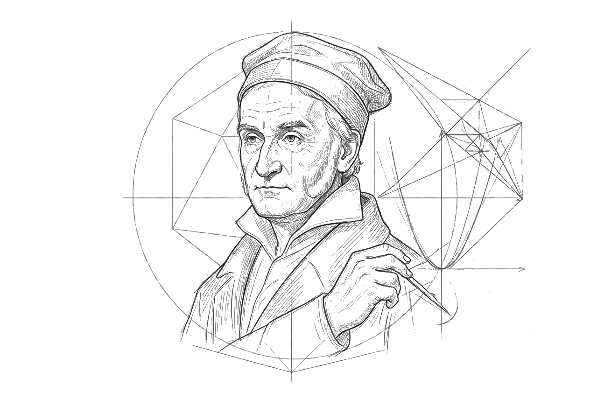

<section class="mot-hero" data-transition="zoom">
  
una storia di tradimenti e segreti

  <h1>The Complex Case</h1>
  
dalla scoperta dei numeri complessi al 1800

  
prof. Diego Fantinelli &mdash; The Math of Things

</section>

---

<section data-background-image="book_bkg.jpg" data-background-opacity="0.15">
  <blockquote class="mot-quote">
    La matematica è la poesia della logica. E come la poesia, a volte rivela verità che la realtà nega.
    &mdash; Parafrasando David Hilbert
  </blockquote>
</section>

---

<section class="mot-divider" data-transition="zoom">
  <h1 class="r-fit-text">ATTO I</h1>
  
L'enigma

</section>

<section>
  
Bologna, 1520

  <h2>Il Segreto di Dal Ferro</h2>
  
Un matematico bolognese, <b>Scipione Dal Ferro</b>, scopre come risolvere le equazioni cubiche della forma $x^3 + px = q$.

  
I Greci hanno risolto le equazioni di secondo grado duemila anni prima. Ma le <b>cubiche</b>? Ancora un mistero.

  
Dal Ferro scopre il metodo. Poi — e qui comincia la storia — <b>non lo pubblica</b>. Lo trasmette segretamente al suo allievo <b>Antonio Maria Fior</b>.

</section>

<section>
  
contesto storico

  <h2>L'Italia del Cinquecento</h2>
  
Una vera e propria <b>scuola di algebristi</b> italiani che si sfidano pubblicamente. Non per gloria scientifica: per <b>soldi</b>.

  <dl class="mot-rows fragment" style="font-size:0.75em">
    <dt>Chi vince</dt><dd>ottiene fama, cattedre prestigiose, compensi dagli astrologhi</dd>
    <dt>Il contesto</dt><dd>non esiste ancora un sistema di pubblicazione scientifico. Vale il "vincolo del segreto professionale"</dd>
    <dt>L'ironia</dt><dd>UFC mediaevale della matematica: il combattimento avviene via problemi, non via libri</dd>
  </dl>
</section>

<section>
  
il colpo di scena

  <h2>Perché le cubiche?</h2>
  
Le equazioni di terzo grado non sono un capriccio accademico.

  
Gli eserciti le usano per <b>calcolare le traiettorie delle catapulte</b>. Nel Rinascimento, il controllo militare passa per la matematica.

  
Chi possiede la formula ha un vantaggio strategico. Da Ferro lo sa. Per questo la protegge.

</section>

---

<section class="mot-divider" data-transition="zoom">
  <h1 class="r-fit-text">ATTO II</h1>
  
La sfida

</section>

<section>
  
Venezia, 1535

  <h2>Tartaglia vs Fior</h2>
  
<b>Niccolò Tartaglia</b> riceve una sfida pubblica: risolvere trenta problemi cubici proposti da Antonio Maria Fior.

  
  

    

      

        Il nome significa letteralmente "chi balbetta" — una ferita ricevuta nel Sacco di Brescia del 1512.
      

      
Tartaglia scopre il metodo pochi giorni prima. Per non dimenticarlo, lo codifica in una poesia criptica.

    

    

      
    

  

</section>

<section>
  
il risultato

  <h2>La Vittoria Assoluta</h2>
  
Tartaglia vince tutte e trenta le sfide.

  
Fior? Zero su trenta. La matematica ha il suo vincitore.

  
Ma Tartaglia, con una saggezza che contrassegnerà tutta la sua vita, <b>non pubblica la formula</b>. La tiene per sé — per ora.

</section>

<section>
  
la poesia criptica

  <h2>Tartaglia Codifica la Soluzione</h2>
  

    <em>"Quando che'l cubo con le cose appresso 
    Se agguaglia à qualche numero discreto, 
    Trovan dui altri differenti in esso; 
    Dapoi terrai questo per consueto, 
    Che'l loro prodotto sempre sia eguale 
    Al terzo cubo delle cose nette."</em>
  

  
Una specie di <b>SMS criptato del 1500</b>. Solo chi conosce la chiave può decodificare il metodo.

</section>

---

<section class="mot-divider" data-transition="zoom">
  <h1 class="r-fit-text">ATTO III</h1>
  
Il tradimento

</section>

<section>
  
Milano, 1545

  <h2>Gerolamo Cardano e l'Ars Magna</h2>
  
Gerolamo Cardano, matematico e astrologo, ottiene da Tartaglia la formula <b>con una promessa solenne</b>: non divulgarla.

  
  

    

      
Pochi anni dopo, Cardano pubblica l'<em>Ars Magna</em> — "La Grande Arte" — e <b>include la formula</b>.

      
Attribuisce parte del merito a Tartaglia (gratitudine relativa).

      
Tartaglia sarà ricordato come "quello che l'ha rivelata a Cardano".

    

    

      
    

  

</section>

<section>
  
chi era Cardano

  <h2>Un Uomo dalle Mille Facce</h2>
  <dl class="mot-rows" style="font-size:0.8em;">
    <dt class="fragment">Medico</dt><dd class="fragment">rinomato, forse il migliore d'Italia</dd>
    <dt class="fragment">Astrologo</dt><dd class="fragment">consulente pagato profumatamente</dd>
    <dt class="fragment">Matematico</dt><dd class="fragment">autore dell'Ars Magna</dd>
    <dt class="fragment">Giocatore d'azzardo</dt><dd class="fragment">usava la matematica per barare ai giochi</dd>
  </dl>
  
Nel 1570, il Papa lo fa arrestare per eresia. L'accusa principale? Aver scritto l'oroscopo di Gesù Cristo. Muore povero e dimenticato.

</section>

<section>
  
la formula di Cardano

  <h2>La Soluzione Esplicita</h2>
  
Per un'equazione $x^3 + px + q = 0$:

  
$$x = \sqrt[3]{-\frac{q}{2} + \sqrt{\left(\frac{q}{2}\right)^2 + \left(\frac{p}{3}\right)^3}} + \sqrt[3]{-\frac{q}{2} - \sqrt{\left(\frac{q}{2}\right)^2 + \left(\frac{p}{3}\right)^3}}$$

  
Ora il metodo è pubblico. Perfetto, no?

  
<b>No.</b> C'è un problema molto serio che nessuno aveva ancora affrontato.

</section>

---

<section class="mot-divider" data-transition="zoom">
  <h1 class="r-fit-text">ATTO IV</h1>
  
L'anomalia irriducibile

</section>

<section>
  
il paradosso

  <h2>L'Equazione Maledetta</h2>
  
Considerare l'equazione: $x^3 = 15x + 4$

  
Si sa con <b>certezza</b> che una soluzione è $x = 4$.

  
(Verifica: $4^3 = 64$ e $15 \cdot 4 + 4 = 64$. Uguale.)

  
$$x = \sqrt[3]{2 + \sqrt{-121}} + \sqrt[3]{2 - \sqrt{-121}}$$

  
Ma aspetta. $\sqrt{-121}$ non esiste nei numeri reali.

</section>

<section>
  
il colpo di scena

  <h2>Il Tunnel Buio</h2>
  
La formula contiene <b>radici quadrate di numeri negativi</b>.

  
Eppure, l'equazione ha una soluzione reale: $x = 4$.

  
È come se la formula passasse per un tunnel buio e imperscrutabile, e ne uscisse con la risposta corretta.

  
Un'anomalia nel codice della realtà.

</section>

<section>
  
il discriminante

  <h2>Il Caso Irriducibile</h2>
  
Il termine critico è il <b>discriminante</b>:

  
$$\Delta = \frac{q^2}{4} - \frac{p^3}{27}$$

  <dl class="mot-rows" style="font-size:0.8em; margin-top:1.5em;">
    <dt class="fragment">Se $\Delta > 0$</dt><dd class="fragment">tutto ok, niente strane</dd>
    <dt class="fragment">Se $\Delta < 0$</dt><dd class="fragment">il caso irriducibile — radici di numeri negativi</dd>
  </dl>
  
Nel nostro esempio: $\Delta = 4 - 125 = -121$ (negativo). Anomalia confermata.

</section>

---

<section class="mot-divider" data-transition="zoom">
  <h1 class="r-fit-text">ATTO V</h1>
  
La rivelazione

</section>

<section>
  
Bologna, 1560

  <h2>Rafael Bombelli e l'Illuminazione</h2>
  
Rafael Bombelli studia il caso irriducibile con ossessione scientifica.

  
  

    

      
Decide di <b>osare l'impossibile</b>: e se le radici di numeri negativi <b>esistessero davvero</b>? Non come numeri reali, ma come una nuova categoria?

    

    

      
    

  

</section>

<section>
  
l'idea geniale

  <h2>Più di Meno e Meno di Meno</h2>
  
Bombelli introduce nuove notazioni:

  <dl class="mot-rows" style="font-size:0.85em;">
    <dt class="fragment">"Più di meno"</dt><dd class="fragment">abbreviato $p.d.m$, rappresenta $+i$</dd>
    <dt class="fragment">"Meno di meno"</dt><dd class="fragment">abbreviato $m.d.m$, rappresenta $-i$</dd>
  </dl>
  
Dove $i$ è l'<b>unità immaginaria</b>: $i = \sqrt{-1}$

  
Sembrerebbe pazzo. <b>Ma funziona.</b>

</section>

<section>
  
il calcolo miracoloso

  <h2>Da Bombelli ai Numeri Complessi</h2>
  
Bombelli scopre (con tentativi pazientissimi):

  
$$(2 + i)^3 = 2 + 11i$$

  
$$(2 - i)^3 = 2 - 11i$$

  
Quindi:

  
$\sqrt[3]{2 + \sqrt{-121}} + \sqrt[3]{2 - \sqrt{-121}} = (2+i) + (2-i) = 4$

  
La risposta reale emerge dal caos immaginario.

</section>

<section>
  
la conseguenza

  <h2>Il Reale e l'Immaginario sono Intrecciati</h2>
  
Bombelli riconosce una verità profonda: i numeri complessi non sono invenzioni. Sono strumenti per scoprire verità nascoste.

  
Ma il mondo scientifico rimane scettico. Cartesio chiama questi numeri "immaginari" con tono dispregiativo. Significa: "Figmenti dell'immaginazione, non veri numeri".

</section>

---

<section class="mot-divider" data-transition="zoom">
  <h1 class="r-fit-text">ATTO VI</h1>
  
Gli alleati

</section>

<section>
  
1702 — Abraham de Moivre

  <h2>Il Legame con la Trigonometria</h2>
  
De Moivre scopre il legame fondamentale tra numeri complessi e trigonometria:

  
$$z^n = r^n (\cos(n\theta) + i\sin(n\theta))$$

  
Questa formula semplifica il calcolo delle potenze di numeri complessi e getta le basi per lo studio delle radici complesse.

  
Aneddoto: De Moivre calcolò la sua data di morte stimando quanto dormiva ogni giorno. Morì il giorno previsto.

</section>

<section>
  
1748 — Leonhard Euler

  <h2>La Formula più Bella della Matematica</h2>
  
Euler formalizza il legame sublime tra numeri complessi, esponenziali e trigonometria:

  
$$e^{ix} = \cos x + i\sin x$$

  
Dal caso particolare $x = \pi$:

  
$$e^{i\pi} + 1 = 0$$

</section>

<section>
  
perché è bellissima

  <h2>Cinque Costanti in Una Formula</h2>
  

    

      <h3>e</h3>
      
La base dei logaritmi naturali

    

    

      <h3>i</h3>
      
L'unità immaginaria

    

    

      <h3>π</h3>
      
La costante del cerchio

    

    

      <h3>1</h3>
      
L'identità moltiplicativa

    

    

      <h3>0</h3>
      
L'identità additiva

    

  

  
Cinque delle costanti più importanti della matematica in un'unica equazione elegantissima.

</section>

---

<section class="mot-divider" data-transition="zoom">
  <h1 class="r-fit-text">ATTO VII</h1>
  
La conclusione

</section>

<section>
  
1797-1799 — Carl Friedrich Gauss

  <h2>Il Piano Complesso</h2>
  

    

      
Gauss riconosce i numeri complessi come <b>veri e propri numeri</b>. Conia il termine "numeri complessi".

      
Introduce la rappresentazione <b>geometrica</b>: il piano complesso. Parte reale sull'asse x, parte immaginaria sull'asse y.

    

    

      
    

  

</section>

<section>
  
la geometria

  <h2>Il Piano Complesso di Gauss</h2>
  
Un numero complesso $z = a + bi$ è rappresentato come un punto $(a, b)$ nel piano.

  
$$|z| = \sqrt{a^2 + b^2}$$

  
Il <b>modulo</b> (o norma) è la distanza dall'origine.

  
Questa rappresentazione trasforma l'astratto in visibile e permette di applicare la geometria all'algebra.

</section>

<section>
  
la critica

  <h2>Gauss Difende i Numeri Complessi</h2>
  
Gauss criticava aspramente chi chiamava i numeri complessi "impossibili".

  

    "Sono essenziali per una matematica più profonda. Chi ancora li rifiuta non ha capito nulla della struttura della realtà matematica."
  

  
E aveva assolutamente ragione.

</section>

---

<section class="mot-divider" data-background-image="numbers.gif" data-background-opacity="0.15" data-transition="zoom">
  <h1 class="r-fit-text">EPILOGO</h1>
  
L'eredità nel mondo reale

</section>

<section>
  
1890s — Charles Steinmetz

  <h2>L'Ingegnere che Produsse Elettricità</h2>
  
Charles Steinmetz, ingegnere elettrotecnico tedesco, scopre che i numeri complessi descrivono <b>perfettamente</b> il comportamento delle correnti alternate.

  
Ingegneri e fisici iniziano a usarli per analizzare circuiti, onde, trasformatori.

  

    "Ha prodotto elettricità tramite i numeri complessi."
  

  
Una frase che cattura l'ironia perfetta: i "numeri impossibili" di Cardano guidano la tecnologia moderna.

</section>

<section>
  
applicazioni moderne

  <h2>Dove Vivono i Numeri Complessi Oggi</h2>
  <dl class="mot-rows" style="font-size:0.8em;">
    <dt class="fragment">Ingegneria elettrica</dt><dd class="fragment">Analisi dei circuiti AC, impedenze, trasformatori</dd>
    <dt class="fragment">Fisica</dt><dd class="fragment">Meccanica quantistica, teoria dei campi, relatività</dd>
    <dt class="fragment">Processamento del segnale</dt><dd class="fragment">Trasformate di Fourier, compressione audio e immagini</dd>
    <dt class="fragment">Grafica 3D</dt><dd class="fragment">Rotazioni, trasformazioni, animazioni</dd>
    <dt class="fragment">Aerodinamica</dt><dd class="fragment">Flusso di fluidi, profili alari</dd>
  </dl>
</section>

---

<section>
  
la trama completa

  <h2>Dal Mistero alla Scoperta</h2>
  

    

      <h3>Dal Ferro (1520)</h3>
      
Scopre il segreto

    

    

      <h3>Tartaglia (1535)</h3>
      
Lo generalizza, lo codifica

    

    

      <h3>Cardano (1545)</h3>
      
Lo tradisce, lo pubblica

    

    

      <h3>Bombelli (1560)</h3>
      
Scopre il nemico vero: i numeri impossibili

    

    

      <h3>De Moivre, Euler (1700s)</h3>
      
Lo capiscono, lo formalizzano

    

    

      <h3>Gauss (1799)</h3>
      
Lo legittima matematicamente

    

  

</section>

<section>
  
la lezione

  <h2>Quello che I Numeri Complessi Insegnano</h2>
  
La matematica non <b>inventa</b> nuovi numeri per capriccio.

  
Li <b>scopre</b> quando ha bisogno di loro.

  
Spesso, quello che sembra "impossibile" è semplicemente una prospettiva che ancora non abbiamo.

  

    "Non conosciamo, perché non abbiamo imparato a cercare nel posto giusto." — Carl Friedrich Gauss
  

</section>

---

<section class="mot-divider" data-background-image="numbers.gif" data-background-opacity="0.25" data-transition="zoom">
  <h1 class="r-fit-text">DOMANDE?</h1>
  
la storia non è finita

</section>

---

<section class="mot-hero" data-transition="zoom">
  
grazie dell'attenzione

  <h1>The Math of <em>Things</em></h1>
  
<a href="https://mathofthings.netlify.app/" target="_blank" class="mono">mathofthings.netlify.app</a>

</section>
