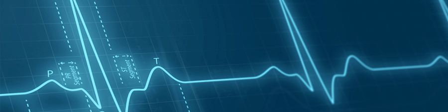

<section data-background-image="book_bkg.jpg" data-background-opacity="0.6" data-transition="convex">
  <h2 style="color:#3B2F2F">CORSO DI</h2>

  <h1 class="r-fit-text" style="color:#3B2F2F">MATEMATICA</h1>
  <h2 style="color:#3B2F2F">per le Classi Quinte</h2>
  <h2 style="color:#3B2F2F">SERALE </h2>
    
  <!-- <h3 style="color:#3B2F2F"><em>esercizi e ripasso</em></h3> -->
  
  <h5 style="color:#8A4117"><em>prof. diego fantinelli</em></h5>
  <h5 style="color:#8A4117">IIS "A. Remondini" - Bassano del Grappa</h5>
</section>

<section data-transition="convex" data-background-image="book_bkg.jpg" data-background-opacity="0.5">
    
  # OBIETTIVI
  ## DEL CORSO

  <a style="color:#1d91de" href="https://2023-mathofthings.netlify.app/docs/math_se/">programmazione completa </a><i class="fa-solid fa-arrow-up-right-from-square"></i>

</section>

<section data-background-image="book_bkg.jpg" data-background-opacity="0.6">

## Tema 0 - Ripasso
>periodo: **Settembre**

</section>

<section>

### conoscenze:

- Disequazioni numeriche di $2^{\circ}$ grado intere e fratte (risoluzione grafica).
- Sistemi di disequazioni di $2^{\circ}$ grado intere e fratte.

</section>

<section>

### abilità

- Acquisire le tecniche per la risoluzione grafica di disequazioni di $2^{\circ}$ grado.
- Acquisire tecniche di risoluzione di sistemi di disequazioni di $2^{\circ}$ grado.

</section>

<section data-background-image="book_bkg.jpg" data-background-opacity="0.6">

## Tema 1 - Equazioni esponenziali e logaritmiche
>periodo: **Ottobre**

</section>

<section>

### conoscenze:

- Equazioni esponenziali.
- Definizione di logaritmo.
- Equazioni logaritmiche

</section>

<section>

### abilità

- Acquisire le tecniche per risolvere semplici equazioni esponenziali e logaritmiche
- Aver chiaro il concetto di logaritmo.

</section>

<section data-background-image="book_bkg.jpg" data-background-opacity="0.6">

## Tema 2 - Funzioni reali di variabile reale
>periodo: **Novembre-dicembre**
>
> link: <a style="color:#1d91de" href="sdf.pdf"> schema studio di funzione </a><i class="fa-solid fa-arrow-up-right-from-square"></i>

</section>

<section data-background-image="book_bkg.gif" data-background-opacity="0.9">

  <!-- <h3 class="fragment" style="background-color:powderblue;">matematicamente</h3> -->
  

</section>

<section>

### conoscenze:

- Definizione e classificazione di funzione.
- Definizioni di: dominio, codominio, f. crescenti, f. decrescenti, f. pari, f. dispari, f. limitate massimo-minimo relativi e assoluti.
- Definizione di grafico di una funzione.
- Lettura di dominio e codominio e segno della funzione da grafico. 
- Calcolo algebrico del dominio (di f. razionali e irrazionali intere e fratte).
- Studio algebrico del segno, simmetrie e intersezioni con gli assi (di funzioni razionali fratte).
- Studio delle funzioni: costante, lineare, quadratica, esponenziale e definita *a tratti*.

</section>

<section>

### abilità

- Aver chiaro il concetto di funzione in una variabile.
- Saper classificare le funzioni matematiche.
- Aver chiari i concetti di dominio e di codominio di una funzione.
- Saper determinare graficamente dominio, codominio, gli intervalli di positività e di negatività, di crescenza e decrescenza di una funzione.
- Saper stabilire se una funzione è pari o dispari.
- Aver chiaro il concetto di funzione limitata.
- Aver chiari i concetti di massimo e minimo relativi e assoluti.
- Saper determinare algebricamente dominio, codominio, gli intervalli di positività e di negatività, simmetrie e intersezioni assi di una funzione.
- Saper rappresentare graficamente le funzioni: costante, lineare, quadratica, definita *a tratti*, esponenziale.

</section>

<section data-background-image="book_bkg.jpg" data-background-opacity="0.6">

## Tema 3 - I Limiti
>periodo: **gennaio**

</section>

<section>

### conoscenze:

- Concetto intuitivo da grafico di:
  - limite finito di una funzione per $x$ che tende a un valore finito 
  - limite destro e sinistro 
  - limite finito di una funzione per $x$ che tende all’infinito
  - limite infinito di una funzione per $x$ che tende a un valore finito
  - limite infinito di una funzione per $x$ che tende all’infinito. 
- Asintoti verticali e orizzontali.

</section>

<section>

### abilità

- Saper leggere semplici limiti dal grafico di una funzione.
- Saper riconoscere gli asintoti dal grafico di una funzione.

</section>

<section data-background-image="book_bkg.jpg" data-background-opacity="0.6">

## Tema 4 - Le funzioni continue e l'Algebra dei limiti 
>periodo: **febbraio-marzo**

</section>

<section>

### conoscenze:

- Definizione di funzione continua.
- Algebra dei limiti: 
  - regole di calcolo (somme, prodotti, quozienti) nel caso di limiti finiti;
  - regole di calcolo (somme, prodotti, quozienti)nel caso in cui qualcuno dei limiti sia infinito e non si presentino forme di indecisione.

</section>

<section>

### abilità

- Aver chiaro il concetto di funzione in una variabile e saperla  studiare analizzandone il grafico.
- Acquisire le tecniche per calcolare limiti finiti e infiniti di funzioni.

</section>

<section data-background-image="book_bkg.jpg" data-background-opacity="0.6">

## Tema 5 - Il calcolo differenziale e lo studio di funzione
>periodo: **aprile-maggio**

</section>

<section>

### conoscenze:

- Il concetto di derivata:
  - rapporto incrementale;
  - definizione di derivata e suo significato geometrico;
  - le derivate fondamentali: della funzione costante, della funzione f(x)=x;
  - i teoremi sul calcolo delle derivate:
  - la derivata della somma di funzioni;
  - la derivata del prodotto di funzioni;
  - la derivata della potenza di una funzione;
  - la derivata del quoziente di due funzioni;
  - derivata seconda.

---

- Definizione di
  - massimi e minimi relativi e assoluti.
- Definizione di
  - funzioni crescenti e decrescenti in un intervallo.
     Definizione di 
  - flesso di una funzione
- Definizione di 
  - funzioni concave e convesse in un intervallo.
- Criterio di monotonia per le funzioni derivabili.
  - Ricerca di massimi e minimi relativi di una funzione derivabile.
  - Ricerca dei flessi di funzioni intere e semplici funzioni frazionarie.
- Studio del grafico di una funzione.

</section>

<section>

### abilità

- Conoscere la definizione e il significato  geometrico di derivata.
- Saper calcolare le derivate.
- Saper effettuare il grafico di una funzione individuandone le caratteristiche (dominio, intersezioni con gli assi, simmetrie, asintoti, studio del segno, crescenza e decrescenza, massimi e minimi, concavità, flessi).

</section>

<section style="font-size:70%" data-background-image="calm_bkg.jpg" data-background-opacity="0.6">

### OBIETTIVO FINALE: COMPETENZE

- Saper utilizzare le tecniche per risolvere semplici equazioni esponenziali e logaritmiche. 
- Conoscere il concetto di funzione
- Saper studiare algebricamente e graficamente una funzione.
- Saper leggere semplici limiti dal grafico di una funzione.
- Saper definire e calcolare i limiti di una funzione.
- Saper calcolare la derivata di una funzione razionale fratta
- Utilizzare le tecniche di analisi matematica per tracciare il grafico di una funzione.

</section>

---

<section data-background-image="calm_bkg.jpg" data-background-opacity="0.6">

# materiali didattici

</section>

<section data-background-image="class3.jpeg" data-background-opacity="0.9">

---

## Google Classroom

- link: [Google Classroom corsi](https://classroom.google.com/c/NTQ2MTA4NzUwMjcw?cjc=wnllzfj)

<h2 class="fragment fade-in-then-out" style="color:#aa0008"><b>5QA: &nbsp;</b><code>uyy24pn</code></h2>
<h2 class="fragment fade-in-then-out" style="color:#aa0008"><b>5QES: &nbsp;</b><code>yqnawpk</code></h2>

  - comunicazioni **non ufficiali**, ma non per questo frivole...
  - assegnazione compiti (eventualmente anche sul Registro El.)
  - post di varia natura
  - **materiale didattico**: dispense, video, esercizi, dispense, pdf, etc.

</section>

<section>

## Registro elettronico: 
### Classeviva Spaggiari:

  - comunicazioni **ufficiali**: 
    - verifiche e interrogazioni
    - voti
    - Circolari

</section>

---

<section data-transition="concave" data-background-image="book5.png" data-background-opacity="0.8">
</section>

<section data-transition="concave" data-background-image="book5.png" data-background-opacity="0.1">

## Libro di testo: 
#### COLORI DELLA MATEMATICA edizione BIANCA Vol.2 - Petrini, Sasso, Fragni - ed. Petrini

  - non strettamente indispensabile in classe... pesa $780g$
  - versione digitale su iPad? 
    - *parliamone*...

</section>

<section data-background-image="calm_bkg.jpg" data-background-opacity="0.6">

## Appunti dalle lezioni
### ...non ne vado pazzo

</section>

---

<section data-transition="concave" data-background-image="book_bkg.jpg" data-background-opacity="0.4">

<h3>Mind Mapping</h3>

</section>

---

<section data-transition="concave" data-background-color="#EDEDED">
  

<h2 class="fragment" >The End</h2>
</section>

---

<section data-background-image="numbers.gif" data-background-opacity="0.8">

  <h2 style="color:#ffffff" class="r-fit-text">DOMANDE?</h2>

</section>

</section>