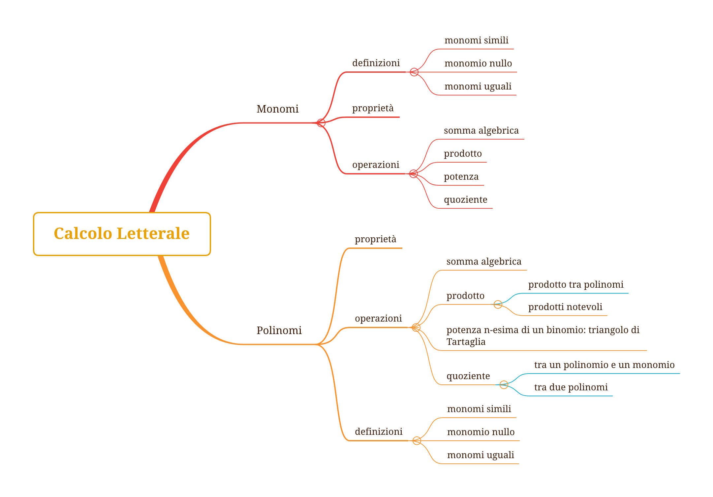

<section data-background-image="book_bkg.jpg" data-background-opacity="0.6" data-transition="convex">
  <h2 style="color:#3B2F2F">CORSO DI</h2>

  <h1 class="r-fit-text" style="color:#3B2F2F">MATEMATICA</h1>
  <h2 style="color:#3B2F2F">per le Classi Quinte</h2>
  <h2 style="color:#3B2F2F">SERALE</h2>

  <!-- <h3 style="color:#3B2F2F"><em>esercizi e ripasso</em></h3> -->
   
  <h5 style="color:#8A4117"><em>prof. diego fantinelli</em></h5>
  <h5 style="color:#8A4117">IIS "A. Remondini" - Bassano del Grappa</h5>
</section>

<section data-transition="convex" data-background-image="book_bkg.jpg" data-background-opacity="0.5">

<section>
    
  # OBIETTIVI
  ## DEL CORSO
  

  <a style="color:#1d91de" href="https://2023-mathofthings.netlify.app/docs/math_se/">programmazione completa </a><i class="fa-solid fa-arrow-up-right-from-square"></i>

</section>

---

<section>
  <h2 style="color:#3B2F2F">CORSO DI</h2>

  <h1 class="r-fit-text" style="color:#3B2F2F">MATEMATICA</h1>
  <h2 style="color:#3B2F2F">per le Classi Terze</h2>
  <h2 style="color:#3B2F2F">SERALE</h2>
</section>

</section>

---

<section data-background-image="calm_bkg.jpg" data-background-opacity="0.6">

# materiali didattici

---

## Google Classroom

- link: [Google Classroom corsi](https://classroom.google.com/c/NTQ2MTA4NzUwMjcw?cjc=wnllzfj)

<h2 class="fragment fade-in-then-out" style="color:#aa0008"><b>5QA: &nbsp;</b><code>uyy24pn</code></h2>
<h2 class="fragment fade-in-then-out" style="color:#aa0008"><b>5QES: &nbsp;</b><code>yqnawpk</code></h2>

  - comunicazioni **non ufficiali**, ma non per questo frivole...
  - assegnazione compiti (eventualmente anche sul Registro El.)
  - post di varia natura
  - **materiale didattico**: dispense, video, esercizi, dispense, pdf, etc.

---

## Registro elettronico: 
### Classeviva Spaggiari:

  - comunicazioni **ufficiali**: 
    - verifiche e interrogazioni
    - voti
    - Circolari

</section>

---

<section data-transition="concave" data-background-image="book1.png" data-background-opacity="0.8">
</section>

<section data-transition="concave" data-background-image="book1.png" data-background-opacity="0.1">

## Libro di testo: 
#### COLORI DELLA MATEMATICA edizione BIANCA Vol.2 - Petrini, Sasso, Fragni - ed. Petrini

  - non strettamente indispensabile in classe... pesa $780g$
  - versione digitale su iPad? 
    - *parliamone*...

</section>

<section data-background-image="calm_bkg.jpg" data-background-opacity="0.6">

## Appunti dalle lezioni
### ...non ne vado pazzo

</section>

---

<section data-transition="concave" data-background-image="book_bkg.jpg" data-background-opacity="0.4">

<h3>Mind Mapping</h3>

</section>

---

<section data-transition="concave" data-background-color="#EDEDED">
  

<h1 class="fragment" >The End</h1>
</section>

---

<section data-background-image="numbers.gif" data-background-opacity="0.8">

  <h2 style="color:#ffffff" class="r-fit-text">DOMANDE?</h2>

</section>

</section>